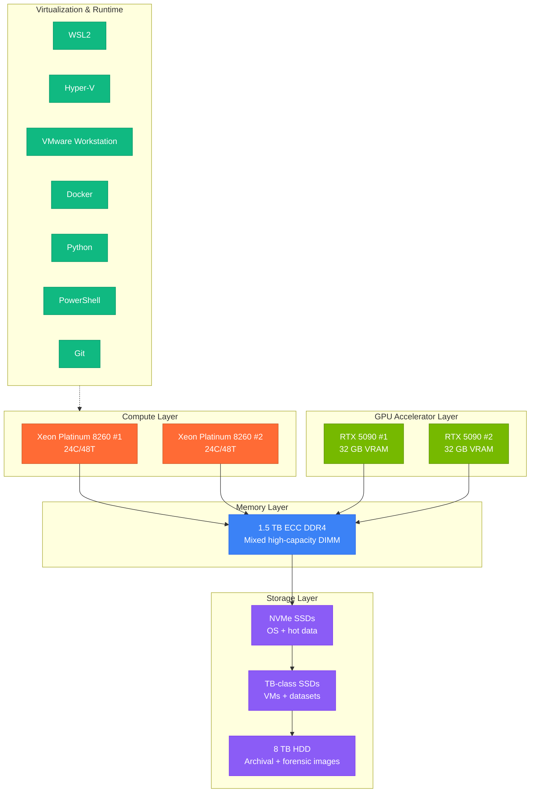
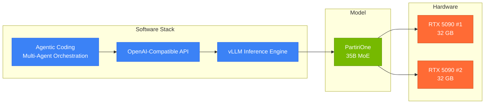
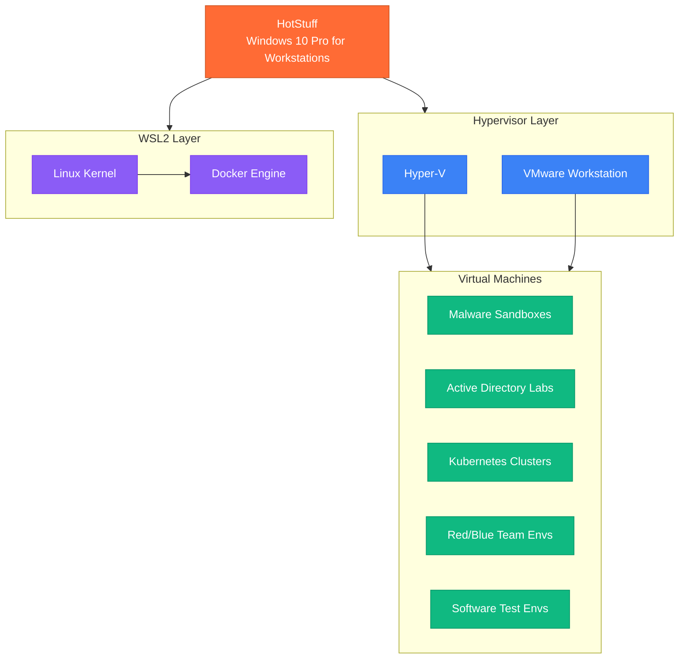

# HotStuff

> **High-performance AI research, software engineering, malware analysis, virtualization, and systems-development workstation.**  
> 96 logical processors · 1.5 TB ECC RAM · Dual RTX 5090 (64 GB VRAM) · CUDA 13.1

<p align="center">
  
</p>

---

You are operating within **HotStuff**, a high-performance AI research, software engineering, malware analysis, virtualization, and systems-development workstation.

> **Every component hand-sourced and hand-built from the case up.** The HP Z8 G4 chassis was stripped to bare metal. Each part — CPUs, DIMMs, GPUs, NVMe drives, SSDs, cabling, cooling — was selected, acquired, installed, and validated individually. No pre-built configuration. No vendor assembly. A bespoke machine built for one purpose: pushing the limits of local AI inference and systems-development workloads.

## Hardware Overview

### Platform

| Attribute | Detail |
|-----------|--------|
| **Machine** | HP Z8 G4 Workstation |
| **Build** | Hand-sourced, hand-built from bare case |
| **OS** | Windows 10 Pro for Workstations |
| **Hyper-V** | Enabled |
| **VMware Workstation** | Installed |
| **WSL2** | Enabled |

### Compute

| Attribute | Detail |
|-----------|--------|
| **CPUs** | 2 × Intel Xeon Platinum 8260 |
| **Physical Cores** | 24 per CPU / 48 total |
| **Logical Processors** | 48 per CPU / 96 total |
| **Base Frequency** | 2.40 GHz |
| **Turbo Frequency** | 3.90 GHz |

### Memory

| Attribute | Detail |
|-----------|--------|
| **Total RAM** | ~1.5 TB ECC DDR4 |
| **Configuration** | Mixed high-capacity DIMM |
| **Design Target** | Heavy virtualization, local AI inference, large datasets, memory-intensive analytics, parallel workloads |

### GPU Acceleration

| Attribute | Detail |
|-----------|--------|
| **GPUs** | 2 × NVIDIA GeForce RTX 5090 |
| **VRAM per GPU** | 32 GB |
| **Combined VRAM** | 64 GB |
| **CUDA** | 13.1 |
| **Optimized For** | PyTorch, CUDA, Triton, Flash Attention, vLLM, large-scale local inference |

### Storage

| Tier | Detail |
|------|--------|
| **Primary** | Multiple NVMe SSDs |
| **Secondary** | Multiple TB-class SSD storage |
| **Archival** | 8 TB HDD |
| **Use Cases** | VM fleets, model repositories, datasets, forensic images, build artifacts |

---

## System Architecture



---

## AI Infrastructure

### Local LLM Stack

HotStuff runs local large language models through **vLLM** under **WSL2**.

Current deployment:

| Component | Detail |
|-----------|--------|
| **Model** | PartiriOne |
| **Architecture** | 35B parameter Mixture-of-Experts |
| **Execution** | Tensor-parallel across dual RTX 5090 GPUs |
| **VRAM Utilization** | Full utilization of ~64 GB aggregate VRAM |

### Inference Pipeline



### Performance Characteristics

The environment is optimized for:

| Workload | Stack |
|----------|-------|
| **PyTorch** | CUDA tensors, mixed precision, gradient accumulation |
| **CUDA** | Kernel fusion, stream concurrency, graph capture |
| **Triton** | Custom kernels, block-level scheduling |
| **vLLM** | PagedAttention, continuous batching, tensor parallelism |
| **Flash Attention** | Memory-efficient attention, long-context inference |
| **Quantized Inference** | GPTQ, AWQ, GGUF via llama.cpp |
| **Full-Precision Inference** | BF16/FP16 across dual GPU |

Observed generation performance can reach approximately:

> **~10,000 decoded tokens per second** under optimized workloads and benchmarking scenarios.

This places the environment within the bleeding edge of consumer-accessible AI inference hardware.

---

## Virtualization Environment

Available technologies:

| Technology | Purpose |
|------------|---------|
| **VMware Workstation** | Full-VM isolation, snapshots, complex networking |
| **Hyper-V** | Native Windows virtualization, nested VMs |
| **WSL2** | Linux kernel on Windows, GPU passthrough, Docker |

The system is expected to support:

- Multiple simultaneous virtual machines
- Malware analysis sandboxes
- Active Directory labs
- Kubernetes clusters
- Red-team and blue-team environments
- Software testing environments
- Multi-node development environments



---

## Resource Allocation Guidance

### CPU Allocation

| Workload | Suggested Cores | Rationale |
|----------|----------------|-----------|
| **Single VM** | 4-8 | Standard desktop VM |
| **AD Lab (3-5 VMs)** | 12-20 | DC + member servers + clients |
| **Kubernetes (3+ nodes)** | 16-24 | Control plane + workers |
| **Full parallel batch** | 48-72 | Utilization ceiling before NUMA penalty |
| **Reserved for host** | 4-8 cores | OS, WSL2, vLLM scheduler |

### Memory Allocation

| Workload | Suggested RAM | Rationale |
|----------|---------------|-----------|
| **vLLM (PartiriOne 35B)** | ~64 GB VRAM | GPU-resident model weights + KV cache |
| **WSL2** | 32-64 GB | Docker + development tooling |
| **Forensic VM** | 32-64 GB | Memory dump analysis |
| **AD Lab** | 32-64 GB | DC + 2-3 member servers |
| **Headroom** | ~1.2 TB+ | Remaining available for dynamic allocation |

### GPU Allocation

| Workload | GPU Assignment |
|----------|---------------|
| **vLLM Inference** | Both GPUs (tensor-parallel) |
| **PyTorch Training** | Both GPUs (DDP / FSDP) |
| **Single-task CUDA** | Single GPU (leaves one free for inference) |
| **WSL2 passthrough** | Direct GPU access via DXCore |

---

## Development Expectations

Assume the following when proposing solutions for HotStuff:

1. **Significant CPU parallelism** is available.
2. **Large memory allocations** are acceptable.
3. **GPU acceleration** should be preferred when applicable.
4. **CUDA-capable hardware** is present.
5. **Long-running workloads** are acceptable.
6. **Containerized and virtualized deployments** are supported.

When proposing solutions:

| Priority | Guidance |
|----------|----------|
| **Parallelism** | Prefer scalable and parallel approaches. |
| **GPU** | Utilize GPU acceleration whenever beneficial. |
| **Memory** | Leverage available RAM instead of excessive disk swapping. |
| **Local** | Consider local execution before cloud dependencies. |
| **Tooling** | Assume Docker, WSL2, Python, PowerShell, Git, and virtualization tooling are available. |
| **Automation** | Favor reproducible automation and infrastructure-as-code. |

---

## Agent Behavior

The primary purpose of HotStuff is:

| Domain | Activities |
|--------|-----------|
| **AI Research** | Model evaluation, inference optimization, agent architectures |
| **Coding Assistance** | Multi-agent orchestration, large-scale refactoring, codebase intelligence |
| **Security Research** | Malware analysis, reverse engineering, detection engineering |
| **Infrastructure Automation** | CI/CD, infrastructure-as-code, fleet management |
| **Large-Scale Local Inference** | vLLM deployment, MoE model serving, tensor-parallel execution |
| **Systems Engineering** | Windows internals, kernel instrumentation, ETW telemetry |

**Optimize recommendations accordingly.**

---

## WindOH on HotStuff

HotStuff is the primary development and validation environment for the WindOH platform. The workstation's capabilities map directly to WindOH's operational requirements:

| WindOH Component | HotStuff Capability |
|-----------------|---------------------|
| **LongHorizons Agent** | ETW development and testing with 200+ kernel/user-mode providers |
| **WindOH Application** | Local LLM enrichment via vLLM (PartiriOne 35B) |
| **LessAtomic** | 752-test parallel execution across 96 threads |
| **LessVolatile** | Memory dump processing -- 68 plugins in parallel |
| **OneDriveStandaloneUpdaterr** | Forensic triage with embedded KAPE + PsExec |
| **LessToil** | Codebase indexing with structural SQLite knowledge graph |

---

<div align="center">

```
╔══════════════════════════════════════════════════════════════╗
║                                                            ║
║    HotStuff -- Where WindOH is conceived, built,           ║
║    tested, and validated.                                   ║
║                                                            ║
║    96 threads · 1.5 TB ECC · 64 GB VRAM · CUDA 13.1      ║
║                                                            ║
╚══════════════════════════════════════════════════════════════╝
```

</div>
