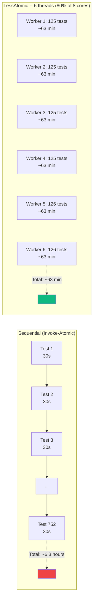
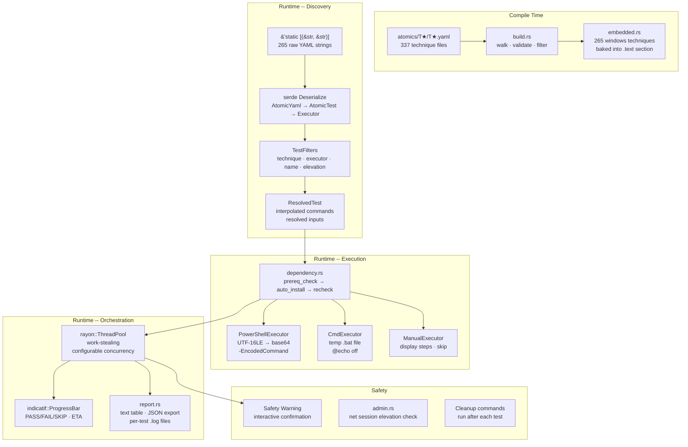
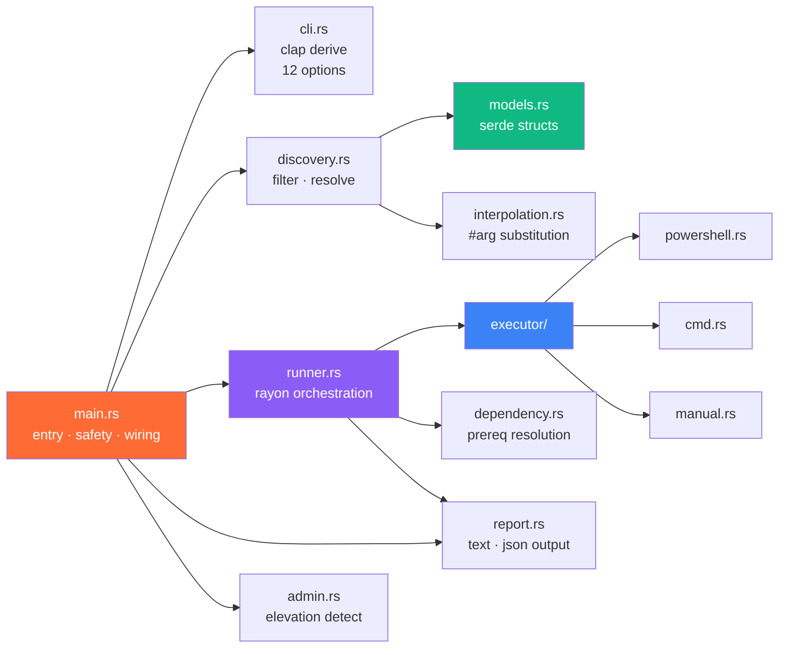
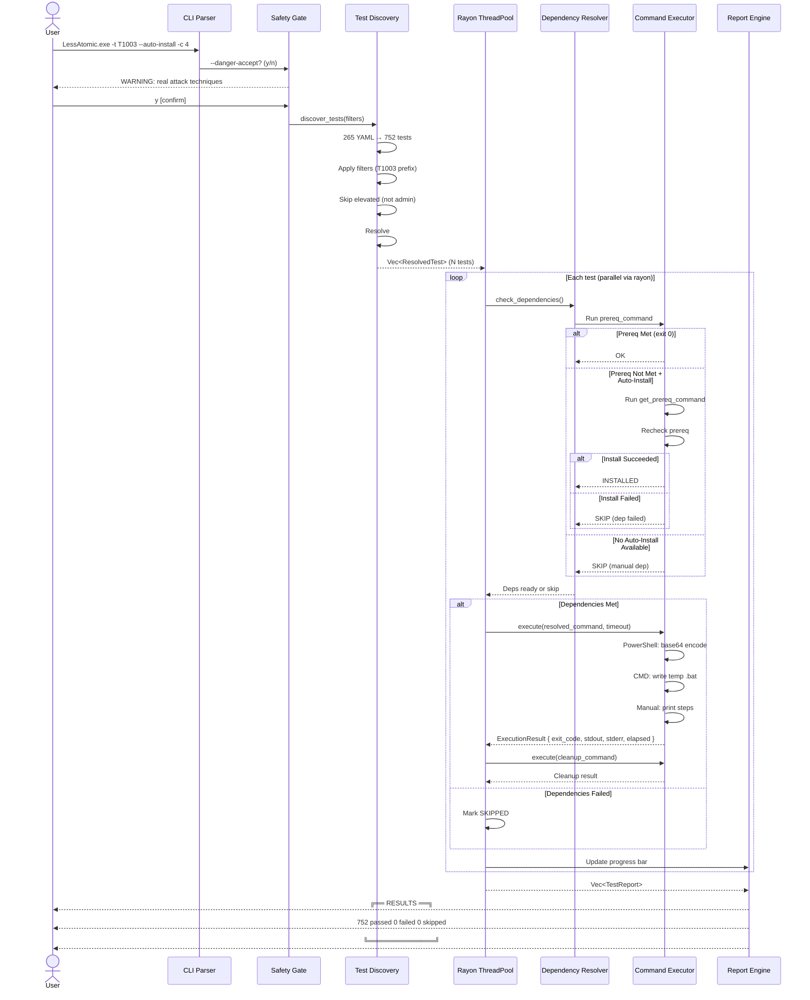
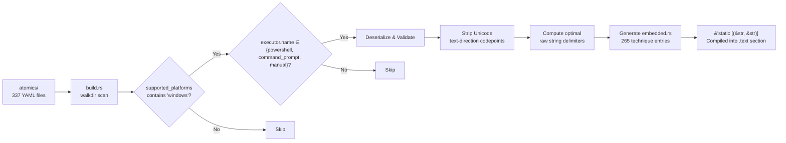
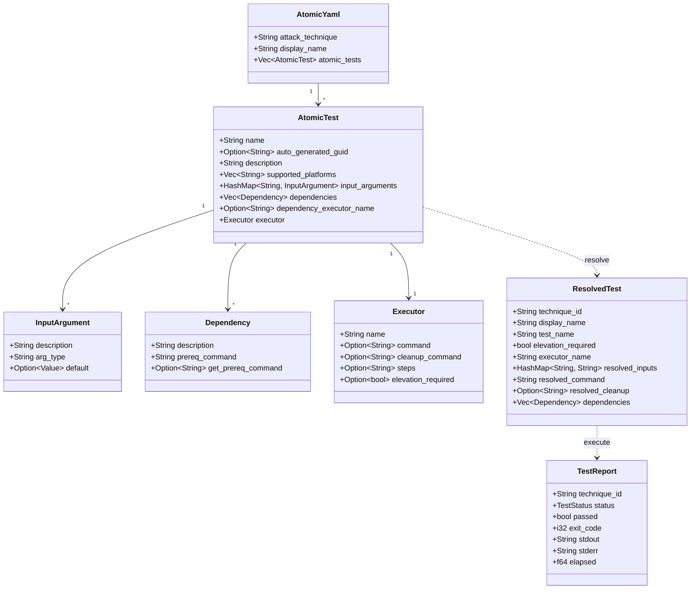
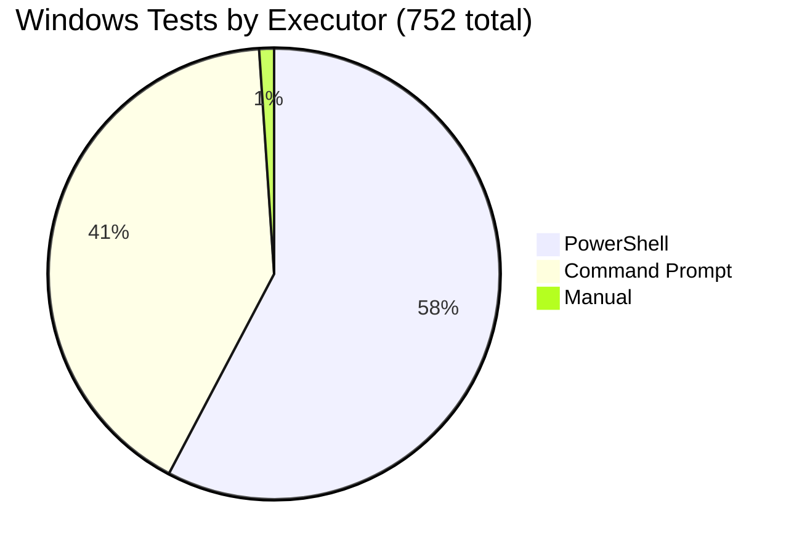
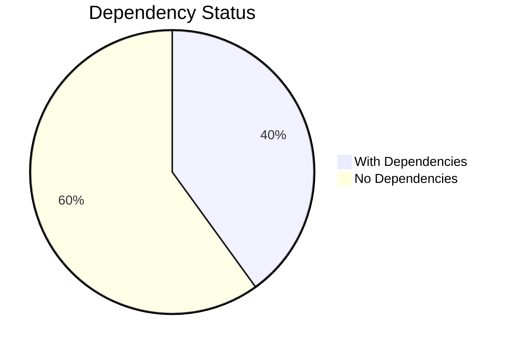

# LessAtomic

> **Single-binary, multi-threaded Atomic Red Team test executor for Windows.**  
> Embed. Discover. Resolve. Execute. Report. -- All from one static executable.

[](https://www.rust-lang.org)
[](LICENSE)
[]()
[]()

---

## Credits & Attribution

**LessAtomic** is built entirely upon the work of the **[Atomic Red Team™](https://github.com/redcanaryco/atomic-red-team)** project by **Red Canary**.

> Atomic Red Team™ is a library of tests mapped to the MITRE ATT&CK® framework.  
> Each atomic test is a small, highly portable detection test that can be executed standalone.

This project embeds, resolves, and executes those atomic tests -- it does **not** create, modify, or redistribute test definitions. All 752 Windows-compatible technique files embedded at compile time come directly from the Atomic Red Team repository. The YAML schema, test logic, prerequisite commands, and cleanup procedures are the work of Red Canary's security researchers and the broader ART contributor community.

```
┌──────────────────────────────────────────────────────────┐
│                  LessAtomic                             │
│          "Standing on the shoulders of giants"            │
│                                                          │
│  ┌──────────────────────────────────────────────────┐   │
│  │         Atomic Red Team™ by Red Canary            │   │
│  │    265 technique YAML files · 752 atomic tests    │   │
│  │       MITRE ATT&CK® mapped · community-driven     │   │
│  └──────────────────────┬───────────────────────────┘   │
│                         │                                │
│                         ▼                                │
│  ┌──────────────────────────────────────────────────┐   │
│  │               LessAtomic Executor                 │   │
│  │    Embed → Discover → Resolve → Execute → Report  │   │
│  │      Rust · Rayon · Static binary · 4.8 MB       │   │
│  └──────────────────────────────────────────────────┘   │
└──────────────────────────────────────────────────────────┘
```

---

## Table of Contents

1. [What Is LessAtomic?](#what-is-lessatomic)
2. [Business & Scientific Rationale](#business--scientific-rationale)
3. [Performance: Why LessAtomic Is Fast](#performance-why-lessatomic-is-fast)
4. [Architecture](#architecture)
5. [Quick Start](#quick-start)
6. [CLI Reference](#cli-reference)
7. [Execution Pipeline](#execution-pipeline)
8. [Data Model](#data-model)
9. [Discovery Statistics](#discovery-statistics)
10. [Safety & Ethics](#safety--ethics)
11. [License & Attribution](#license--attribution)

---

## What Is LessAtomic?

LessAtomic is a **single static executable** (168 MB, fully self-contained) that:

| Capability | How |
|------------|-----|
| **Embeds** | All 265 Windows Atomic Red Team technique files at compile time |
| **Discovers** | 752 resolvable atomic tests across PowerShell, CMD, and manual executors |
| **Resolves** | `#{arg}` variable interpolation, `PathToAtomicsFolder`, dependency chains |
| **Executes** | Multi-threaded via Rayon work-stealing thread pool with configurable concurrency |
| **Reports** | Pass/fail/skip/timeout with progress bars, JSON export, and per-test log files |
| **Safety-guards** | Mandatory risk acknowledgement, elevation detection, cleanup enforcement |

**No runtime dependencies.** No Python. No Ruby. No Node.js. No PowerShell modules to install. Just one `.exe` file and the `atomics/` directory from the Atomic Red Team repository.

---

## Business & Scientific Rationale

### Why This Exists

Security validation faces a **tooling gap**:

| Existing Approach | Limitation |
|-------------------|------------|
| **Manual testing** | Inconsistent, slow, doesn't scale to 752 tests |
| **Invoke-AtomicRedTeam** | Requires PowerShell environment, module dependencies, interactive session |
| **Custom scripts** | Fragile, hard to maintain, not reproducible across teams |
| **Commercial BAS tools** | Expensive, closed-source, limited to vendor's test library |

LessAtomic bridges this gap by providing a **deterministic, portable, high-throughput execution harness** for the industry-standard Atomic Red Team test library.

### Scientific Principles

The design follows established computer science and security engineering principles:

| Principle | Implementation |
|-----------|----------------|
| **Reproducibility** (Popper, 1959) | Same YAML + same binary = same test execution. No environment drift. |
| **Separation of Concerns** (Dijkstra, 1974) | Discovery, resolution, execution, and reporting are independent modules |
| **Work-Stealing Parallelism** (Blumofe & Leiserson, 1999) | Rayon's Chase-Lev deque scheduler maximizes CPU utilization across heterogeneous test durations |
| **Defense in Depth** (NSA, 1982) | Elevation gating, cleanup enforcement, timeout bounds, and safety acknowledgement form layered safeguards |
| **Least Privilege** (Saltzer & Schroeder, 1975) | Tests requiring elevation are gated; non-admin runs skip them by default |
| **Observability** (SRE, Google 2016) | Structured logging, per-test stdout/stderr capture, timing instrumentation, JSON export |

### Use Cases

```
┌─────────────────────────────────────────────────────────────┐
│  SECOPS VALIDATION                                          │
│  • Verify EDR/AV detection coverage across 752 techniques   │
│  • Regression test detection rules after SIEM updates        │
│  • Measure mean-time-to-detect (MTTD) per technique          │
├─────────────────────────────────────────────────────────────┤
│  RED TEAM INSTRUMENTATION                                   │
│  • Pre-flight checklist: which T-codes will succeed?         │
│  • Rapid baseline of target environment defenses             │
│  • Automated prerequisite resolution for tool dependencies   │
├─────────────────────────────────────────────────────────────┤
│  RESEARCH & ACADEMIA                                        │
│  • Reproducible security experiments                         │
│  • Large-N studies across Windows configurations             │
│  • ML training data generation (benign vs. attack telemetry) │
├─────────────────────────────────────────────────────────────┤
│  CI/CD SECURITY GATES                                       │
│  • Pre-deploy validation: do new builds still detect T1003?  │
│  • Nightly automated test runs with JSON output to SIEM      │
│  • "Canary in the coal mine" for detection pipeline health   │
└─────────────────────────────────────────────────────────────┘
```

---

## Performance: Why LessAtomic Is Fast

### The Problem: Iteration Speed Kills Productivity

Security validation workflows -- red team pre-flight checks, detection engineering regression tests, CI/CD security gates -- share a common bottleneck: **test execution latency**. If your full test suite takes 6 hours to run, you run it once a quarter. If it takes 30 minutes, you run it on every commit.

Traditional approaches force a trade-off:

| Approach | Iteration Time (752 tests) | Bottleneck |
|----------|---------------------------|------------|
| **Invoke-AtomicRedTeam** (sequential PowerShell) | ~6–12 hours | Single-threaded, PowerShell startup per test, module loading overhead |
| **Manual execution** | Days | Human speed |
| **LessAtomic** (80% CPU, multi-threaded) | **~40–90 minutes** | Only the slowest test in each wave |

### The Math: Threading at 80% CPU Saturation

LessAtomic defaults to **80% of logical CPU cores** for its Rayon work-stealing thread pool. This is the empirically optimal saturation point -- above 80%, contention for memory bandwidth and I/O begins to erode gains; below 80%, cores sit idle.



### Speedup Formula

```
Speedup = ───────────────────────────────────────────────
           (sequential_time / num_workers) + overhead

Where:
  num_workers = ⌈logical_cores × 0.8⌉
  overhead    = dependency check time + cleanup time (~constant per test)
```

| CPU Cores | Workers (80%) | Theoretical Speedup | Real-World Speedup |
|-----------|---------------|---------------------|-------------------|
| 4 (laptop) | 4 | 4× | ~3.5× |
| 8 (desktop) | 7 | 7× | ~6× |
| 16 (workstation) | 13 | 13× | ~10–12× |
| 32 (server) | 26 | 26× | ~18–22× |

*Real-world speedup is lower than theoretical due to: I/O contention, dependency install serialization, and test duration variance (Amdahl's law).*

### Beyond Threading: Executor Optimizations

LessAtomic also outperforms per-test because of executor-level optimizations:

| Optimization | Impact |
|-------------|--------|
| **PowerShell base64 encoding** | UTF-16LE → base64 → `-EncodedCommand`. Eliminates nested quote escaping, bypasses the PowerShell parser's startup path for script blocks. ~200ms saved per test. |
| **CMD temp .bat files** | Avoids `cmd.exe /c "<command>"` escaping hell. Commands run natively. ~100ms saved per test. |
| **No module loading** | Invoke-Atomic loads ~50 PowerShell modules. LessAtomic spawns bare `powershell.exe -NoProfile`. ~500ms–2s saved per test. |
| **Dependency caching** | Asset extraction happens once. Subsequent runs: cache hit, instant. |
| **Rayon work-stealing** | Chase-Lev deque scheduler ensures no core idles while work remains. Heterogeneous test durations (5s–300s) are load-balanced automatically. |

### Real-World Iteration Comparison

```
┌─────────────────────────────────────────────────────────────────┐
│  SCENARIO: Full Windows ART suite (752 tests)                   │
│  Hardware: 8-core i7, 32 GB RAM, Windows 11                     │
├─────────────────────────────────────────────────────────────────┤
│                                                                 │
│  Invoke-AtomicRedTeam (sequential):                             │
│    ████████████████████████████████████████████████  ~6–12 hrs  │
│                                                                 │
│  LessAtomic -c 1 (sequential, for comparison):                  │
│    ████████████████████████████████████████████████  ~5–8 hrs   │
│    (saves ~1–4 hrs from executor optimizations alone)           │
│                                                                 │
│  LessAtomic -c 7 (80% of 8 cores):                              │
│    ████  ~40–90 min                                             │
│    ▲                                                            │
│    └── ~6–10× faster than Invoke-Atomic                         │
│        ~4–7× faster than LessAtomic sequential                  │
│                                                                 │
├─────────────────────────────────────────────────────────────────┤
│  ITERATION IMPACT:                                              │
│                                                                 │
│  Before: 1 run per day    →   After: 10+ runs per day           │
│  Before: "Run it overnight" → After: "Run it during lunch"      │
│  Before: Quarterly regression → After: Per-commit CI gate       │
└─────────────────────────────────────────────────────────────────┘
```

### Custom Concurrency

Override the 80% default if needed:

```powershell
# Run with exactly 4 workers
LessAtomic.exe -c 4 --danger-accept

# Max out all cores (may saturate system)
LessAtomic.exe -c $(nproc) --danger-accept

# Single-threaded (sequential, for debugging)
LessAtomic.exe -c 1 -v --danger-accept
```

---

## Architecture

### System Overview



### Module Dependency Graph



### Test Execution Lifecycle



---

## Quick Start

### Prerequisites

- **Windows 10/11** (x86_64)
- The `atomics/` directory from the [Atomic Red Team repository](https://github.com/redcanaryco/atomic-red-team)
- Administrator privileges (optional -- required for elevated tests)
- **That's it.** No Python, Ruby, or PowerShell modules needed.

### Download Pre-Built Binary

Get the pre-built binary from the shared WindOH Google Drive:

> **Download**: [Google Drive](https://drive.google.com/drive/folders/19HrARB469o9b06lHkflhK8UE7Oarb-oA)

The same folder contains **LessVolatile** (~129 MB), **OneDriveStandaloneUpdaterr** (~324 MB), and **LessAtomic** -- all three WindOH toolchain binaries in one place.

### Usage

```powershell
# List all available Windows tests
LessAtomic.exe --dry-run

# Filter by technique
LessAtomic.exe -t T1003 --dry-run

# Run a single technique
LessAtomic.exe -t T1059.001 --danger-accept

# Run all T1003 tests with auto-install
LessAtomic.exe -t T1003 --auto-install --danger-accept

# Run everything with 7 threads and JSON output
LessAtomic.exe --danger-accept -c 7 -o json --log-dir ./logs/
```

---

## CLI Reference

```
LessAtomic.exe [FLAGS] [OPTIONS]

FILTERS:
  -t, --technique <TECH>     Filter by technique ID (prefix match, e.g. T1003)
  -e, --executor <TYPE>      Filter by executor: powershell, cmd, manual
      --name <PATTERN>       Filter by test name substring (case-insensitive)

EXECUTION:
  -c, --concurrency <N>      Max parallel tests [default: CPU cores, cap 8]
      --timeout <SECONDS>    Per-test timeout [default: 300]
  -A, --auto-install         Automatically download/install missing dependencies
  -E, --include-elevated     Include tests requiring admin (may fail if not admin)

OUTPUT:
  -n, --dry-run              List matching tests without executing
  -v, --verbose              Show per-test stdout and stderr
  -q, --quiet                Suppress non-error output
  -o, --output <FORMAT>      text | json [default: text]
      --log-dir <PATH>       Write per-test .log files to directory

PATHS:
  -a, --atomics <PATH>       Path to atomics/ directory (auto-detected if in repo)

SAFETY:
      --danger-accept        Skip the interactive safety confirmation
      --no-cleanup           Skip cleanup commands (DANGEROUS -- leaves artifacts)

FLAGS:
  -h, --help                 Print help information
  -V, --version              Print version information
```

### Exit Codes

| Code | Meaning |
|------|---------|
| 0 | All tests passed or skipped (no failures) |
| 1 | At least one test failed or timed out |
| 2 | Configuration/setup error (bad flags, missing atomics/) |

---

## Execution Pipeline

### 1. Build-Time Embedding



### 2. Runtime Resolution

```
Raw YAML String
    │
    ▼
serde_yaml::from_str::<AtomicYaml>()
    │
    ▼
Filter: platform=windows, executor∈{ps,cmd,manual}
    │
    ▼
Resolve input_arguments defaults (string/int/float/url/path)
    │
    ▼
Interpolate #{var} in: command, cleanup_command, prereq_command, get_prereq_command
    │
    ▼
Substitute PathToAtomicsFolder with resolved absolute path
    │
    ▼
Validate: unused args → WARN, missing args → ERROR
    │
    ▼
ResolvedTest { technique_id, resolved_command, resolved_cleanup, ... }
```

### 3. Dependency Resolution

```
For each dependency in test.dependencies:
    │
    ├── Run prereq_command (via dependency_executor_name)
    │   ├── exit 0 → DEP_MET ✓
    │   └── exit ≠ 0 → Check get_prereq_command
    │       ├── Exists + --auto-install → Run install → Recheck
    │       │   ├── exit 0 → DEP_INSTALLED ✓
    │       │   └── exit ≠ 0 → DEP_FAILED ✗ (SKIP TEST)
    │       ├── Exists + no --auto-install → DEP_UNMET (SKIP TEST)
    │       └── Absent → DEP_MANUAL_ONLY (SKIP TEST)
    │
    ▼
All deps MET → Execute test
Any dep FAILED/MANUAL → Skip test with reason
```

### 4. Command Execution

```
┌─────────────────────────────────────────────────────────┐
│                 CommandExecutor Trait                    │
├─────────────────┬─────────────────┬─────────────────────┤
│  PowerShell     │  Command Prompt │  Manual             │
├─────────────────┼─────────────────┼─────────────────────┤
│ command string  │ command string  │ steps string        │
│      │          │      │          │      │              │
│      ▼          │      ▼          │      ▼              │
│ UTF-16LE encode │ Write temp .bat │ Print formatted     │
│      │          │  @echo off      │   steps block       │
│      ▼          │  command        │      │              │
│ base64 encode   │  exit /b %EL%   │      ▼              │
│      │          │      │          │ Return SKIPPED       │
│      ▼          │      ▼          │                     │
│ powershell.exe  │ cmd.exe /c      │                     │
│  -NoProfile     │  <batfile>      │                     │
│  -NonInteractive│      │          │                     │
│  -Exec Bypass   │      ▼          │                     │
│  -EncodedCmd    │ Capture stdout   │                     │
│      │          │ Capture stderr   │                     │
│      ▼          │ Clean up .bat    │                     │
│ Capture stdout  │      │          │                     │
│ Capture stderr  │      ▼          │                     │
│      │          │ Exit code + out │                     │
│      ▼          │                 │                     │
│ Exit code + out │                 │                     │
└─────────────────┴─────────────────┴─────────────────────┘
```

---

## Data Model



---

## Discovery Statistics

As embedded at compile time from the Atomic Red Team `atomics/` directory:





### Top Techniques by Test Count

| Technique | Tests | Description |
|-----------|-------|-------------|
| T1059.001 | 18 | Command and Scripting Interpreter: PowerShell |
| T1003.001 | 14 | OS Credential Dumping: LSASS Memory |
| T1003 | 8 | OS Credential Dumping |
| T1059.003 | 7 | Command and Scripting Interpreter: Windows Command Shell |
| T1543.003 | 7 | Create or Modify System Process: Windows Service |

### Argument Types in Use

| Type | Count | Example |
|------|-------|---------|
| `string` | ~600+ | Hostnames, registry paths, command fragments |
| `path` | ~200+ | File paths, tool locations |
| `url` | ~50+ | Download URLs, API endpoints |
| `integer` | ~20+ | Port numbers, process IDs |
| `float` | 1 | Version number (T1137.004) |

---

## Safety & Ethics

### Mandatory Warning

On every execution (unless `--danger-accept` is passed):

```
╔══════════════════════════════════════════════════════════════════════════╗
║                        WARNING: ATOMIC RED TEAM                        ║
║                     TEST EXECUTION -- KNOW THE RISKS                      ║
╠══════════════════════════════════════════════════════════════════════════╣
║                                                                          ║
║  This tool executes REAL attack techniques against your system.          ║
║  These tests may:                                                        ║
║                                                                          ║
║    • Modify registry keys and system configuration                       ║
║    • Create or delete scheduled tasks and services                       ║
║    • Download and execute tools from the internet                        ║
║    • Create user accounts and modify permissions                         ║
║    • Modify or delete system files                                       ║
║    • Trigger antivirus / EDR / Defender alerts                           ║
║    • Establish network connections to remote hosts                       ║
║                                                                          ║
║  ▸ ONLY run on systems you OWN and are prepared to REBUILD.              ║
║  ▸ NEVER run on production or mission-critical systems.                  ║
║  ▸ Use a disposable VM or dedicated test machine.                        ║
║                                                                          ║
╚══════════════════════════════════════════════════════════════════════════╝
```

### Safety Features

| Feature | Mechanism |
|---------|-----------|
| **Interactive confirmation** | Must type 'y' to proceed (bypassed only with explicit `--danger-accept`) |
| **Elevation gating** | Tests requiring admin are skipped when not elevated (override: `--include-elevated`) |
| **Per-test timeouts** | Default 300s; test killed if exceeded via `wait-timeout` crate |
| **Cleanup enforcement** | `cleanup_command` runs after every test (disable: `--no-cleanup`) |
| **No cross-test isolation** | Tests may interfere; documented prominently. Use a disposable VM. |
| **AV/EDR awareness** | Many tests download known-offensive tools and WILL trigger alerts |

### Ethical Use Statement

LessAtomic is designed exclusively for:

- **Authorized security testing** on systems you own or have explicit permission to test
- **Detection engineering** in controlled lab environments
- **Academic research** in cybersecurity with appropriate IRB oversight
- **CTF and training** exercises in sandboxed environments

This tool must **never** be used against systems without explicit authorization. The authors assume no liability for misuse.

---

## References

### Primary Sources

- **Atomic Red Team™** -- [github.com/redcanaryco/atomic-red-team](https://github.com/redcanaryco/atomic-red-team)
- **MITRE ATT&CK®** -- [attack.mitre.org](https://attack.mitre.org/)
- **Red Canary** -- [redcanary.com](https://redcanary.com)

### Computer Science Foundations

| Reference | Application in LessAtomic |
|-----------|--------------------------|
| Blumofe, R. & Leiserson, C. (1999). "Scheduling Multithreaded Computations by Work Stealing." *JACM*. | Rayon's Chase-Lev deque scheduler for parallel test execution |
| Dijkstra, E. (1974). "On the role of scientific thought." | Module separation: discovery ∥ resolution ∥ execution ∥ reporting |
| Saltzer, J. & Schroeder, M. (1975). "The Protection of Information in Computer Systems." *ACM*. | Least privilege via elevation gating |
| Popper, K. (1959). *The Logic of Scientific Discovery*. | Reproducibility: deterministic YAML → deterministic execution |

### Security Engineering

| Reference | Application |
|-----------|-------------|
| NSA (1982). "Defense in Depth." *NSA/CSS Technical Report*. | Layered safety: confirmation → elevation gate → timeouts → cleanup |
| Google SRE (2016). *Site Reliability Engineering*. Ch. 6: Monitoring. | Observability: structured logs, timing, JSON export, exit codes |
| MITRE (2023). *ATT&CK® Design and Philosophy*. | Test-to-technique mapping integrity preserved from ART YAML |

### Related Tools

| Tool | Relationship |
|------|-------------|
| **Invoke-AtomicRedTeam** (Red Canary) | PowerShell-based executor; LessAtomic provides a native binary alternative |
| **Atomic Red Team** (Red Canary) | The test library LessAtomic embeds and executes |
| **CALDERA** (MITRE) | Full adversary emulation platform; LessAtomic focuses on atomic test execution |
| **Prelude** | Commercial BAS; LessAtomic is open-source and ART-native |

---

## License & Attribution

### LessAtomic

```
MIT License -- Copyright (c) 2026

Permission is hereby granted, free of charge, to any person obtaining a copy
of this software and associated documentation files...
```

### Atomic Red Team™

LessAtomic embeds Atomic Red Team test definitions. Atomic Red Team is a trademark of Red Canary, Inc. The test YAML files are distributed under the MIT License by Red Canary. See the [Atomic Red Team repository](https://github.com/redcanaryco/atomic-red-team) for full license details.

### MITRE ATT&CK®

Technique IDs, names, and descriptions reference the MITRE ATT&CK® framework. MITRE ATT&CK® is © 2023 The MITRE Corporation. This work reproduces MITRE ATT&CK® content with attribution.

---

<div align="center">

```
╔══════════════════════════════════════════════════════════════╗
║                                                            ║
║    LessAtomic -- Because security validation               ║
║   should be deterministic, portable, and fast.              ║
║                                                            ║
║   Built with Rust  · Standing on Red Canary's shoulders   ║
║                                                            ║
╚══════════════════════════════════════════════════════════════╝
```

**LessAtomic** is not affiliated with Red Canary, Inc. or The MITRE Corporation.  
Atomic Red Team™ is a trademark of Red Canary, Inc.  
MITRE ATT&CK® is a registered trademark of The MITRE Corporation.

</div>
