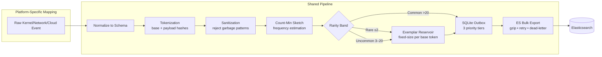
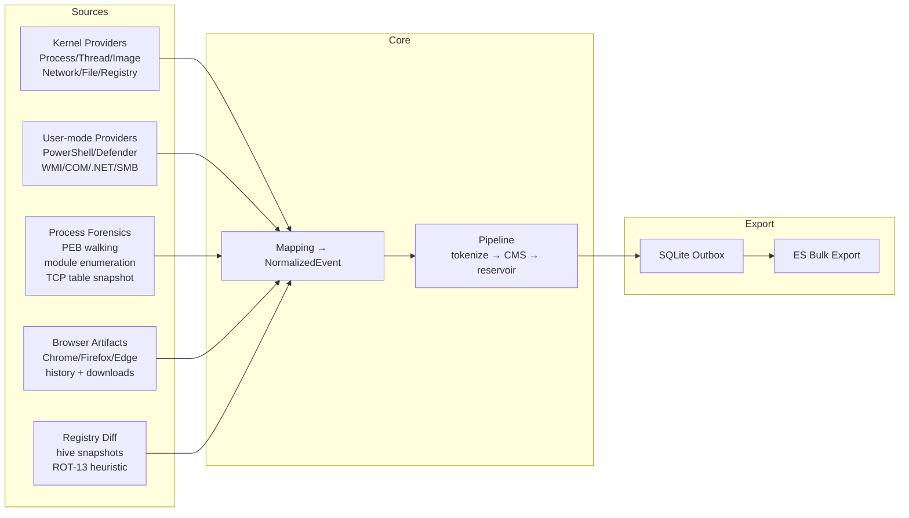
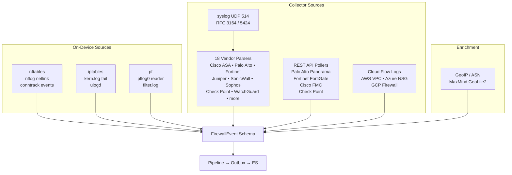
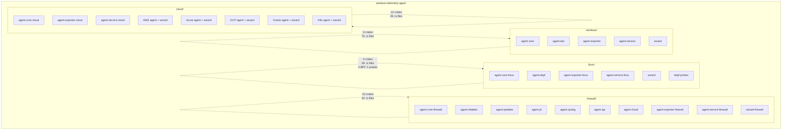

# Architecture

## System Context

```mermaid
graph TB
    ES[("Elasticsearch<br/>events · exemplars<br/>patterns · diagnostics<br/>health")]

    subgraph Windows
        ETW[ETW Kernel + User Providers]
        TDH[TDH Parser]
        PE[PE Metadata]
        PF[Process Forensics]
    end

    subgraph Linux
        eBPF[eBPF CO-RE Probes]
        AUDIT[auditd]
        FAN[fanotify]
        PROC[/proc Polling]
    end

    subgraph Firewall
        NF[nftables/nflog]
        SYS[syslog UDP 514]
        API[REST API Pollers]
        CLD[Cloud Flow Logs]
    end

    subgraph Cloud
        AWS[AWS 9 services]
        AZURE[Azure 6 services]
        GCP[GCP 5 services]
        OCI[Oracle 4 services]
        K8S[Kubernetes 4 services]
    end

    ETW & TDH & PE & PF --> ES
    eBPF & AUDIT & FAN & PROC --> ES
    NF & SYS & API & CLD --> ES
    AWS & AZURE & GCP & OCI & K8S --> ES
```

## Shared Pipeline

Every platform feeds into the same ingestion pipeline. The platform-specific work is the mapping layer. Everything downstream is shared logic.



### Tokenization

Each event produces two SHA-256 hashes:

**Base token** (structural identity). Fields that describe *what* happened: process image name, directory class, parent process, destination port, protocol, IP class. Two hosts running `bash` from `/usr/bin/` produce the same base hash regardless of hostname, timestamp, or command-line arguments.

**Payload token** (instance data). Fields that describe *this specific occurrence*: full command line, source/destination IP, file path, user, session. Same base, different payload = same behavior, different instance.

Token sanitization runs before hashing. Strings that match garbage patterns are rejected rather than hashed: base64 artifacts that decode to null bytes (`AAA=`), hex pointers (`0xffffe084d6d5bc70`), pure numeric IDs over 6 digits, Unicode replacement characters, control characters. This prevents TDH/eBPF decoding artifacts from creating spurious unique patterns.

### Count-Min Sketch

Four independent hash functions estimate the frequency of each base token. Memory cost is constant regardless of unique token count (16,384 × 4 × 8 bytes = 512 KB per CMS instance).

Rarity bands:
- **Rare** (≤2 estimated occurrences) — event exported immediately as an exemplar
- **Uncommon** (3–20) — periodic pattern document with top-k payload variants
- **Common** (>20) — aggregate pattern only, individual events sampled

### Exemplar Reservoir

Each base token maintains a fixed-size reservoir (default: 3 events). When a new event arrives, it may replace an existing exemplar based on richness score. The reservoir guarantees that exemplar export always has a representative event to attach, even if the event that triggered the "new base" detection was itself sampled out.

### SQLite Outbox

Three priority tiers drain to Elasticsearch via background workers:

| Priority | Tier | Examples |
|----------|------|----------|
| 0 | Exemplars | Rare events, boundary crosses, new payloads |
| 1 | Patterns | Daily aggregate with top-k payload variants |
| 2 | Events | All events (count threshold = 1) |

Each outbox row has a dedup key. Within the dedup window (default: 30 days), the same base+payload hash writes once. Workers retry with exponential backoff. Rows that exceed max retries move to a dead-letter queue and are logged to diagnostics.

### Stringify JSON Values

A recursive function walks every JSON value before ES indexing. Numbers and booleans become strings. Objects and arrays recurse. The result: no field in the ES mapping ever sees conflicting types across documents. A single 400 error from a type conflict stops an entire bulk request — this prevents that class of failure entirely.

## Per-Platform Architecture

### Windows — ETW



**Crates:**
- `agent-core` — NormalizedEvent schema, pipeline, tokenization, CMS, reservoir, SQLite, crypto, PE parsing, process forensics, browser artifact scanner, registry snapshot diff
- `agent-etw` — ETW session lifecycle, TDH event property resolution, kernel/user provider registry (40+ entries with GUID/flag mapping), provider discovery (200+ auto-discovered), semantic event name resolution
- `agent-exporter` — Outbox worker, ES bulk client with gzip, retry, dead-letter, health/diagnostics workers
- `agent-service` — Windows service wrapper (SCM), config hot-reload via file watcher, stall detection with ETW session restart recovery, embedded config mode (PE overlay trailer)

**Key Windows-specific features:**
- PEB walking for command-line extraction (NtQueryInformationProcess class 33, fallback to VM_READ)
- PE metadata: compile timestamp, section count, import table entropy, debug/PDB path
- PowerShell obfuscation analysis: caret escaping, base64 -enc, IEX, download cradle, string splitting
- Registry ROT-13 heuristic for obfuscated key names
- Browser database scanning (Chrome, Firefox, Edge history and downloads)

### Linux — eBPF Adaptive Ladder

```mermaid
flowchart TB
    PROBE[System Probe<br/>~50ms at startup]
    PROBE --> TIER{Select Best Tier}

    TIER -->|"Kernel 5.4+<br/>BTF present<br/>CAP_BPF"| CORE[eBPF CO-RE<br/>12 probes<br/>lowest overhead]
    TIER -->|"Kernel 4.x<br/>no BTF<br/>eBPF available"| LEGACY[eBPF Legacy<br/>precompiled .o<br/>known kernels]
    TIER -->|"Kernel 3.x+<br/>no eBPF"| AUDIT[auditd + fanotify<br/>process/security<br/>file events]
    TIER -->|"Kernel 2.6.x+"| NETLINK[netlink + inotify<br/>cn_proc<br/>per-dir watches]
    TIER -->|"Any kernel<br/>container<br/>no privileges"| POLL[/proc Polling<br/>1s resolution<br/>universal fallback]

    CORE & LEGACY & AUDIT & NETLINK & POLL --> MAP[NormalizedEvent]
    MAP --> PIPE[Pipeline → Outbox → ES]
```

**Crates:**
- `agent-core-linux` — NormalizedEvent schema, pipeline, tokenization, ELF metadata parsing, host identity via /etc/machine-id
- `agent-ebpf` — SystemProfile probe (kernel, BTF, eBPF, auditd, fanotify, container, init system, security module, capabilities), 5-tier TelemetrySource trait, 12 eBPF CO-RE probes, auditd netlink + log tail coexistence, fanotify whole-filesystem monitor, /proc polling with TCP connection diffing
- `agent-exporter-linux` — ES bulk export (platform-agnostic)
- `agent-service-linux` — CLI, systemd/OpenRC/sysvinit/runit service install and detection

**Capability ladder (auto-selected at startup, ~50ms probe):**

| Tier | Requirements | Event Sources |
|------|-------------|---------------|
| eBPF CO-RE | Kernel 5.4+, BTF, CAP_BPF | 12 probes: exec, exit, fork, execve, tcp_connect, tcp_accept, dns, file_open, file_write, file_delete, module_load, capability, mount |
| auditd + fanotify | Kernel 3.x+ | Process/security via netlink, file events via fanotify |
| netlink + inotify | Kernel 2.6.x+ | Process events via cn_proc, file events per-directory |
| /proc polling | Any kernel | Process table diff, TCP connection table parse, 1-second resolution |

**12 eBPF probes:**

| Probe | Tracepoint/kprobe | Event Type |
|-------|-------------------|------------|
| `trace_exec` | sched:sched_process_exec | process_start |
| `trace_exit` | sched:sched_process_exit | process_end |
| `trace_fork` | sched:sched_process_fork | process_fork |
| `trace_execve` | syscalls:sys_enter_execve | process_start (with argv) |
| `trace_tcp_connect` | kprobe:tcp_v4_connect | network_connect |
| `trace_tcp_accept` | kprobe:inet_csk_accept | network_accept |
| `trace_dns_query` | kprobe:udp_sendmsg (port 53 filter) | dns_query |
| `trace_file_open` | syscalls:sys_enter_openat | file_open |
| `trace_file_write` | syscalls:sys_enter_write | file_write |
| `trace_file_delete` | syscalls:sys_enter_unlinkat | file_delete |
| `trace_module_load` | module:module_load | module_load |
| `trace_mount` | syscalls:sys_enter_mount | mount |
| `trace_capability` | kprobe:cap_capable | capability_check (non-root only) |

### Firewall — Multi-Source Collector



**Crates:**
- `agent-core-firewall` — FirewallEvent schema (connection 5-tuple, NAT translation, rule identity, threat/IPS, application/user, session bytes), config, GeoIP enrichment
- `agent-nftables` — nflog netlink reader (multicast groups), conntrack event reader (NEW/UPDATE/DESTROY), netfilter attribute parser
- `agent-iptables` — kern.log/syslog/ulogd tail, iptables LOG format parser (IN=/OUT=/SRC=/DST=/PROTO=/SPT=/DPT=)
- `agent-pf` — /dev/pflog0 reader (binary pfloghdr), filter.log text parser for pfSense/OPNsense
- `agent-syslog` — UDP 514 listener (RFC 3164/5424), 18 vendor auto-detection patterns, per-vendor parsers
- `agent-api` — REST API pollers (Palo Alto Panorama, Fortinet FortiGate, Cisco FMC, Check Point)
- `agent-cloud` — VPC Flow Logs (AWS S3/CloudWatch), NSG Flow Logs (Azure Blob), Firewall Rules Logging (GCP Cloud Logging)
- `agent-exporter-firewall` — ES bulk export
- `agent-service-firewall` — CLI, 3 operating modes (on-device, collector, hybrid), systemd/OpenRC/sysvinit/runit install

### Cloud — Multi-Provider API Polling

```mermaid
flowchart TB
    subgraph AWS["AWS (9 services)"]
        CT[CloudTrail]
        VPC[VPC Flow Logs]
        GD[GuardDuty]
        SH[Security Hub]
        S3[S3 Access]
        WAF[WAF Logs]
        R53[Route53]
        ELB[ELB Logs]
        CFG[Config Rules]
    end

    subgraph Azure["Azure (6 services)"]
        AL[Activity Log]
        NSG[NSG Flow Logs]
        SEN[Sentinel]
        AD[AD Sign-in]
        KV[Key Vault]
        AP[Azure Policy]
    end

    subgraph GCP["GCP (5 services)"]
        CAL[Cloud Audit Logs]
        VPC2[VPC Flow Logs]
        SCC[Security Command Center]
        CL[Cloud Logging]
        AT[Access Transparency]
    end

    subgraph Oracle["Oracle (4 services)"]
        OCI_A[Audit Logs]
        VCN[VCN Flow Logs]
        CG[Cloud Guard]
        EVT[Events]
    end

    subgraph K8S["Kubernetes (4 services)"]
        KAL[Audit Logs]
        PS[Pod Security]
        ADM[Admission Reviews]
        NP[Network Policies]
    end

    CT & VPC & GD & SH & S3 & WAF & R53 & ELB & CFG --> CE[CloudEvent Schema]
    AL & NSG & SEN & AD & KV & AP --> CE
    CAL & VPC2 & SCC & CL & AT --> CE
    OCI_A & VCN & CG & EVT --> CE
    KAL & PS & ADM & NP --> CE
    CE --> PIPE[Pipeline → Outbox → ES]
```



**CloudEvent schema fields:**

| Category | Fields |
|----------|--------|
| Actor | principal ARN/ObjectID, type (IAMUser/AssumedRole/ServiceAccount/ManagedIdentity), access key, MFA, source IP, user agent, invoked by |
| Resource | ARN/URI, type, name, region, account/subscription/project, zone, tags |
| Network | 5-tuple, VPC/subnet, security group, direction, ACCEPT/REJECT, bytes, packets |
| API | service, action, category (Read/Write/Management/Data), status, error code, request ID |
| Authorization | Allow/Deny/ImplicitDeny, policy name/ID, permissions used, permissions missing, condition keys |
| Threat | finding ID, type, severity (0.0–10.0), title, description, MITRE ATT&CK tactic/technique, indicator type/value, compromised resource |
| Compliance | framework (CIS/PCI/HIPAA/SOC2/NIST), control ID, status, remediation |
| IP Context | is_aws_service, is_azure_service, is_gcp_service, TOR exit node, anonymous proxy, GeoIP country/city/ASN |

**Per-provider coverage:**

| Provider | Services |
|----------|----------|
| AWS (9) | CloudTrail, VPC Flow Logs, GuardDuty, Security Hub, S3 Access Logs, WAF Logs, Route53 Resolver, ELB Access Logs, AWS Config Rules |
| Azure (6) | Activity Log, NSG Flow Logs, Sentinel Alerts, AD Sign-in Logs, Key Vault Logs, Azure Policy |
| GCP (5) | Cloud Audit Logs (Admin + Data Access), VPC Flow Logs, Security Command Center, Cloud Logging, Access Transparency |
| Oracle (4) | OCI Audit Logs, VCN Flow Logs, Cloud Guard, Events Service |
| Kubernetes (4) | API Server Audit Logs, Pod Security Contexts, Admission Reviews, Network Policy Events |

**Crates:**
- `agent-core-cloud` — CloudEvent schema, config, tokenization, pipeline
- `agent-aws` — 9 service pollers with AWS SDK credential chain (env → instance profile → ~/.aws/credentials)
- `agent-azure` — 6 service pollers with DefaultAzureCredential (env → managed identity → CLI)
- `agent-gcp` — 5 service pollers with service account key / Application Default Credentials
- `agent-oracle` — 4 service pollers with API signing key + fingerprint
- `agent-k8s` — 4 service pollers with in-cluster ServiceAccount or kubeconfig
- `agent-exporter-cloud` — ES bulk export
- `agent-service-cloud` — Unified CLI, runs all configured providers concurrently

## Repository Structure



Each platform is a self-contained Cargo workspace. Path dependencies stay within the workspace. No crate is shared across platforms — the schema and pipeline are re-implemented per platform in the idioms of that platform's telemetry source. This sacrifices DRY for isolation: a breaking change in the Linux eBPF loader cannot affect the Windows ETW session manager.

## Extending to New Platforms

A new platform requires:

1. **A `TelemetrySource` trait implementation** (or equivalent) that produces platform events into a crossbeam channel
2. **A mapping layer** converting raw platform events → the normalized schema
3. **A config section** for platform-specific settings (with serde defaults so minimal config works)
4. **A wizard binary** for install/uninstall/update (`wizard install config.toml` pattern)
5. **Deploy artifacts** — systemd unit (or equivalent), init scripts, example config

Platforms that map naturally to this model:
- **macOS** — EndpointSecurity framework (ESF) + unified logging
- **Android** — SELinux audit + binder transactions + logcat
- **iOS** — MDM logs + network extension framework
- **OT/IoT** — Modbus, BACnet, MQTT protocol monitoring
- **SaaS** — Office 365 Management API, Salesforce Event Monitoring, GitHub Audit Log
