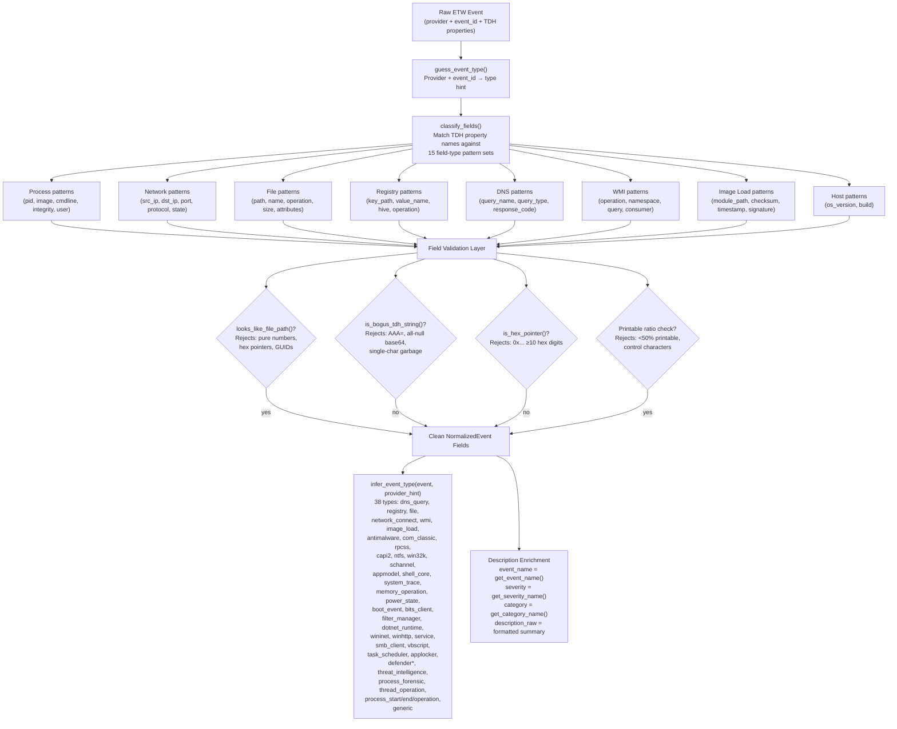
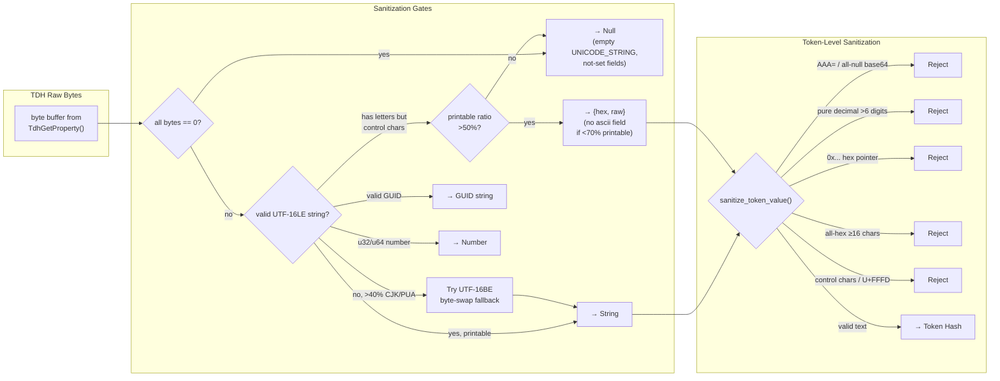
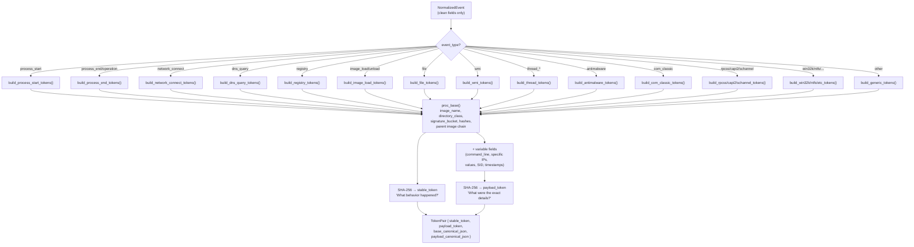
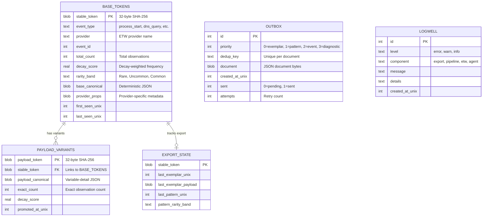
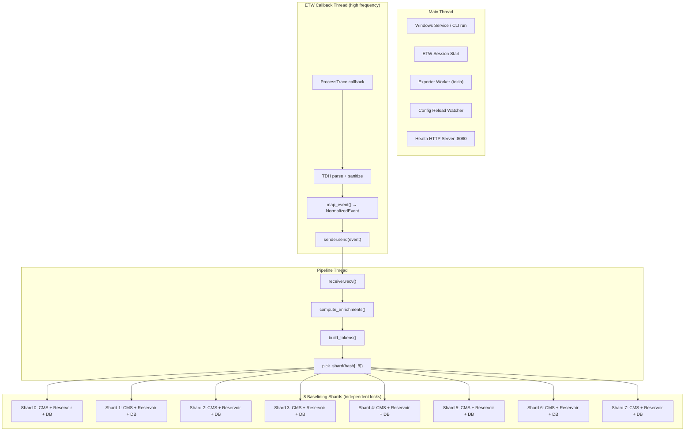
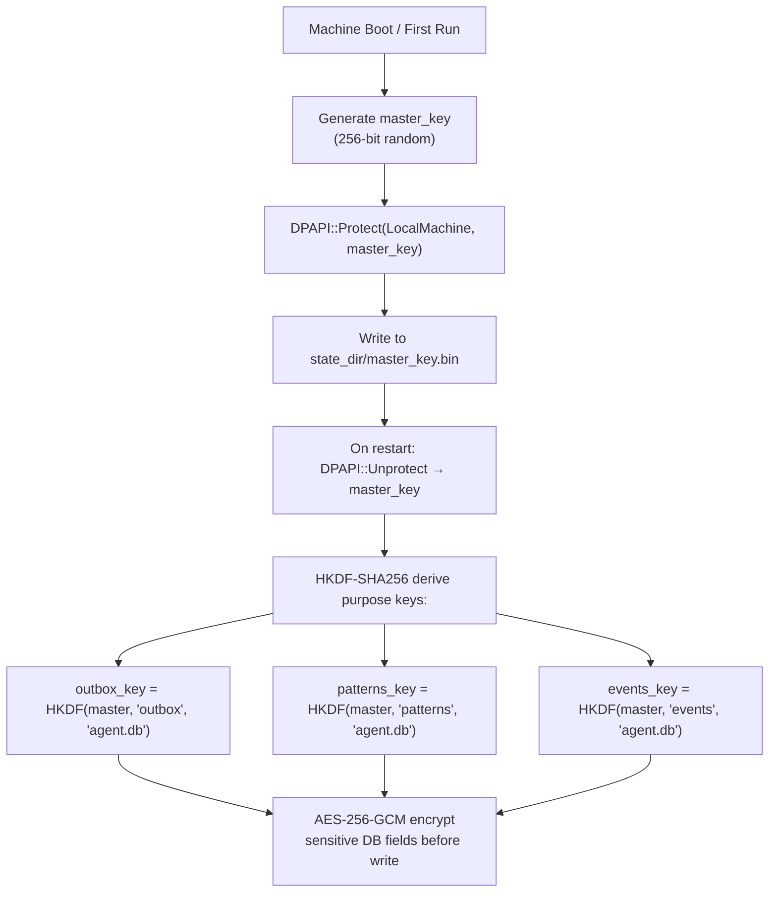

# Architecture — LongHorizons Telemetry Agent

## Crate Dependency Graph

```mermaid
graph TB
    subgraph Binary["agent-service (binary)"]
        main["main.rs — CLI + Windows Service"]
        health["health.rs — HTTP health endpoint"]
        diagnostic["diagnostic.rs — self-monitoring"]
    end

    subgraph ETW["agent-etw — ETW Capture & Parsing"]
        session["session.rs — StartTraceW, EnableTraceEx2, ProcessTrace"]
        mapping["mapping.rs — Raw event → NormalizedEvent"]
        tdh["tdh.rs — TDH property parsing, BOM-aware UTF-16 decode"]
        semantic["semantic.rs — Provider-agnostic field classifier"]
        ntstatus["ntstatus.rs — 500+ NTSTATUS/HRESULT/DNS error codes"]
        event_desc["event_descriptions.rs — Provider/event_id → human-readable names"]
        discovery["discovery.rs — Provider auto-detection"]
        provider_f["provider_fields.rs + provider_registry.rs"]
    end

    subgraph Core["agent-core — Normalization & Baselining"]
        models["models.rs — NormalizedEvent (200+ fields, 15 structs)"]
        normalization["normalization.rs — SID/IP/path/guid normalization"]
        tokenization["tokenization.rs — Deterministic base/payload token hashing"]
        pipeline["pipeline.rs — BaseliningPipeline, process cache, ES doc builder"]
        sharded["sharded_pipeline.rs — 8-way hash-sharded ingest"]
        cms["cms.rs — Count-Min Sketch"]
        reservoir["reservoir.rs — Exemplar reservoir sampling"]
        db["db.rs — SQLite WAL, AES-256-GCM encrypted blobs"]
        crypto["crypto.rs — HKDF-SHA256 key derivation"]
        process_f["process_forensics.rs — PEB command-line reader"]
        terms["terms.rs — Search term extraction"]
    end

    subgraph Export["agent-exporter — Elasticsearch Export"]
        bulk["bulk.rs — ES _bulk API, gzip, retry, mapping conflict detection"]
        worker["worker.rs — Outbox poller"]
    end

    Binary --> ETW
    Binary --> Core
    Binary --> Export
    ETW --> Core
    Core --> Export
```

---

## Event Lifecycle

```mermaid
flowchart LR
    subgraph Phase1["Phase 1: ETW Capture"]
        A["Windows Kernel"] -->|"EVENT_RECORD"| B["ProcessTrace callback"]
        B --> C["TdhGetEventInformation()"]
        C --> D["TdhGetProperty() × N"]
        D --> E["bytes_to_json_value()"]
    end

    subgraph Phase2["Phase 2: Data Sanitization"]
        E --> F{"All-zero bytes?"}
        F -->|yes| NULL1["→ Null"]
        F -->|no| G{"UTF-16 LE decode"}
        G -->|"printable?"| H["→ String"]
        G -->|"CJK/PUA >40%?"| I["UTF-16 BE fallback"]
        I --> H
        G -->|"garbage"| J{"printable ratio >50%?"}
        J -->|yes| K["→ {hex, raw}"]
        J -->|no| NULL2["→ Null"]
    end

    subgraph Phase3["Phase 3: Semantic Classification"]
        H --> L["classify_fields() — pattern match on TDH property names"]
        K --> L
        L --> M["infer_event_type() — provider-aware type inference"]
        M --> N["38 event types recognized"]
    end

    subgraph Phase4["Phase 4: Enrichment"]
        N --> O["PEB command-line backfill"]
        O --> P["NTSTATUS → human-readable"]
        P --> Q["DNS codes → names"]
        Q --> R["Integrity → name resolution"]
        R --> S["File attributes → decoded"]
        S --> T["IP class + port service names"]
        T --> U["Parent/grandparent cache backfill"]
    end

    subgraph Phase5["Phase 5: Tokenization"]
        U --> V["build_tokens() — 38 type-specific builders"]
        V --> W["sanitize_token_value() — reject AAA=, hex pointers, numeric IDs"]
        W --> X["stable_token = SHA-256(behavior skeleton)"]
        W --> Y["payload_token = SHA-256(behavior + details)"]
    end

    subgraph Phase6["Phase 6: Baselining"]
        X --> Z["CMS frequency estimation"]
        Y --> Z
        Z --> AA["Decay-weighted rarity scoring"]
        AA --> AB["Reservoir sampling for exemplars"]
        AB --> AC["Write to outbox tables"]
    end

    subgraph Phase7["Phase 7: Export"]
        AC --> AD["Bulk assembly (gzip)"]
        AD --> AE["POST /_bulk"]
        AE -->|success| AF["Mark sent"]
        AE -->|"400 mapping conflict"| AG["Log field name + reason"]
        AE -->|"429/5xx"| AH["Retry with backoff"]
    end
```

---

## Semantic Classification Pipeline

---

## Data Sanitization — Garbage Detection

---

## Token Construction

---

## Database Schema

---

## Concurrency Model

**Key decisions:**
- `parking_lot::Mutex` everywhere — no async locks in the hot path
- 8 shards → 8 independent locks → minimal contention
- Shared caches (process identity, enrichment state) are locked briefly for read/write then released
- SQLite WAL mode handles concurrent readers + single writer

---

## Security Model

---

## Config Defaults

The agent ships with **maximum data collection** defaults:

| Setting | Default | Notes |
|---------|---------|-------|
| Provider mode | `all` | Auto-discovers every registered ETW provider |
| Semantic mode | `true` | Provider-agnostic field classification |
| Allow raw fields | `true` | Include raw TDH properties in ES documents |
| Gzip | `true` | Compress _bulk requests |
| Decay half-life | 30 days | Recency weighting for rarity scoring |
| Reservoir size | 100 per stable token | Exemplar samples retained |
| Shard count | 8 | Independent baselining pipelines |
| Process cache size | 2,000 | PID → identity lookups |
| Promoted payload cache | 100,000 | Exact counting threshold |

---

*Document updated 2026-05-29 — Reflects v0.1.0 architecture with data quality overhaul*
