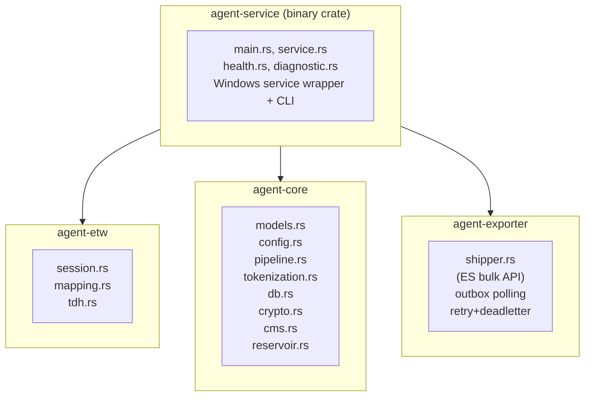
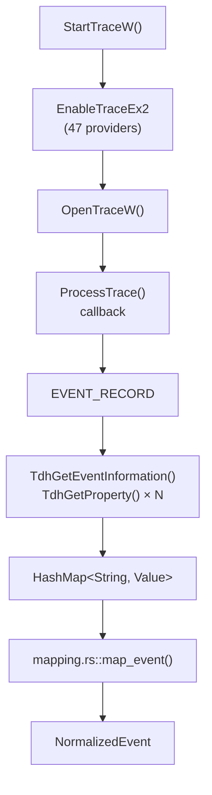
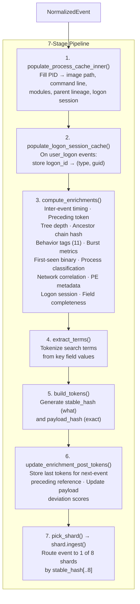
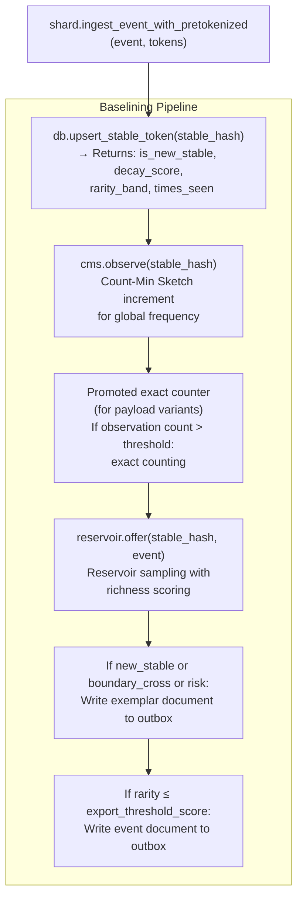
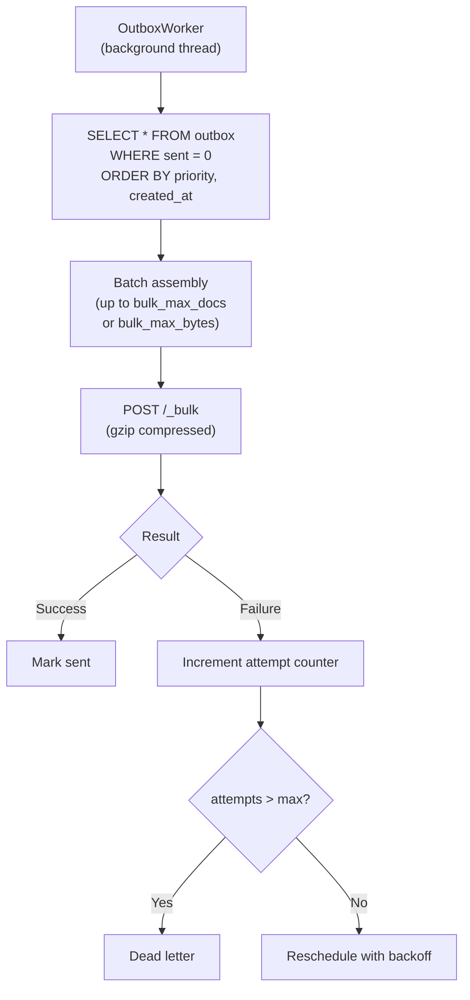
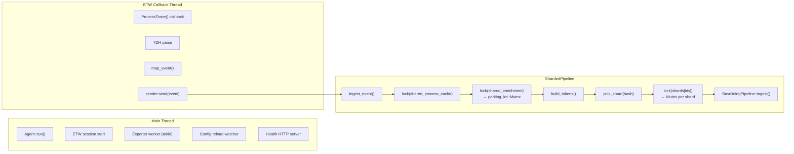
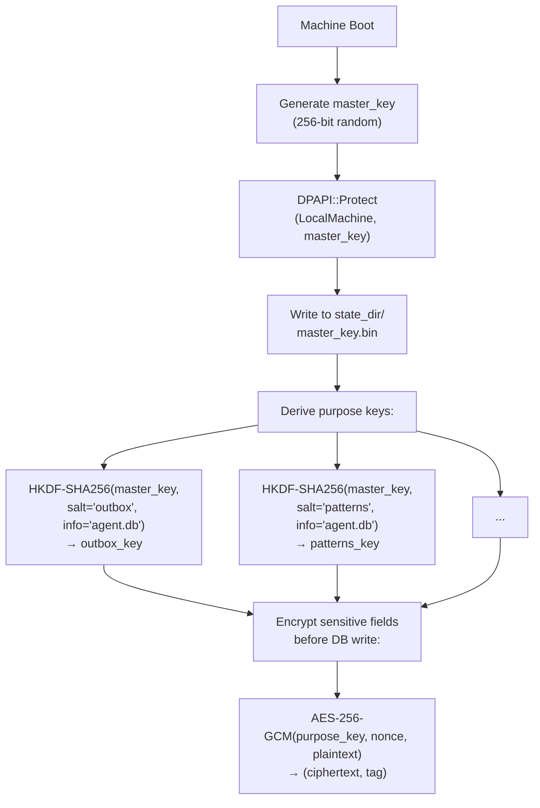

# Architecture — LongHorizons Telemetry Agent

## Crate Map



---

## Event Lifecycle

### Phase 1: ETW Capture (`agent-etw`)



**Key decisions:**
- Real-time session (EVENT_RECORD, not log-file mode)
- All 47 providers enabled in a single kernel session (where applicable) + user-mode sessions
- TDH parses provider manifests to resolve property names and types
- Semantic mapping uses event IDs and opcodes to classify events into types (`process_start`, `network_connect`, `dns_query`, etc.)

### Phase 2: Normalization & Enrichment (`agent-core/sharded_pipeline.rs`)



**Why 8 shards:** Lock contention elimination. Each shard has its own CMS, reservoir, and process cache. Tokenization runs once; the stable hash deterministically routes to one shard.

**Token determinism guarantee:** All new enrichment fields use `#[serde(skip_serializing_if = "Option::is_none")]` and are NOT added to token builders. The stable_hash and payload_hash are computed from a controlled subset of NormalizedEvent fields only.

### Phase 3: Baselining (`agent-core/pipeline.rs`)



**Decay scoring:**
```
score = base_count × e^(-λ × days_since_last_seen)
λ = ln(2) / decay_half_life_days
```

Rarity bands are computed from the decay score against `rare_threshold` and `common_threshold`.

### Phase 4: Export (`agent-exporter`)



---

## Database Schema (`agent.db`)

| Table | Purpose |
|---|---|
| `stable_tokens` | Decay scores, rarity bands, observation counts per stable hash |
| `payload_variants` | Exact counters for promoted payload hashes |
| `exemplar_outbox` | Queued exemplar documents awaiting export |
| `event_outbox` | Queued event documents awaiting export |
| `pattern_outbox` | Queued pattern/aggregation documents |
| `diagnostic_outbox` | Queued diagnostic documents |
| `process_cache` | Recently seen process identities (PID → metadata) |

All sensitive columns (`api_key`, `sealed_blob`) are AES-256-GCM encrypted with per-purpose HKDF-derived keys.

---

## Config Defaults Philosophy

The agent ships with **maximum data collection** defaults:

- **All 47 ETW providers enabled** — omit any in config to suppress
- **Provider mode "all"** — auto-discovers every registered ETW provider
- **All 4 export pipelines enabled** — exemplars, events, patterns, diagnostics
- **Fixed index names** — `longhorizons-events`, `longhorizons-exemplars`, `longhorizons-patterns`, `longhorizons-diagnostics`

To reduce data volume, explicitly set providers to `false` and adjust `baselining.export_threshold_score` lower.

---

## Concurrency Model



**Key design decisions:**
- `parking_lot::Mutex` everywhere — no async locks in the hot path
- 8 shards → 8 independent locks → minimal contention
- Shared caches (process identity, enrichment state) are locked briefly for read/write then released
- Database connection pool not needed — SQLite WAL mode handles concurrent readers + single writer

---

## Security Model



On subsequent starts, the master key is decrypted from DPAPI and purpose keys are re-derived.

**TLS pinning** (optional): per-endpoint `tls_pins_sha256` list validates server certificate fingerprints before any data is sent.
