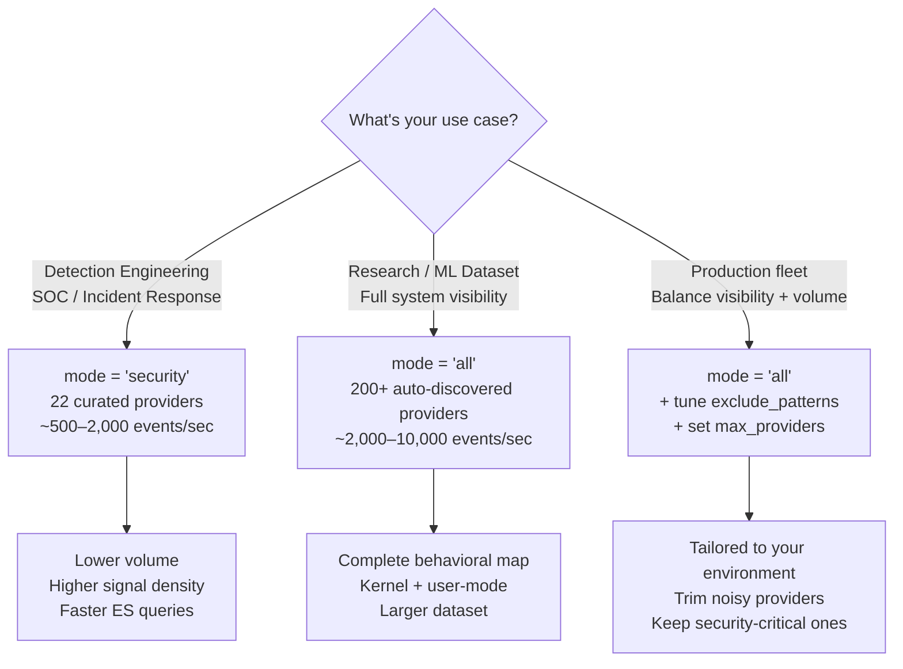

# Configuration Guide — LongHorizons Telemetry Agent

This walks you through editing `config.toml` step by step. Open the file side-by-side with this guide. Every field you need to change is marked **CHANGEME** in the template.

---

## Quick Start (60 seconds)

You only need to change **3 things** to get the agent running:

| # | Field | Where | Example |
|---|-------|-------|---------|
| 1 | `agent.id` | `[agent]` section | `"WIN10-LAB-01"` |
| 2 | `export.events.endpoint` | `[export.events]` section | `"http://192.168.0.50:9200"` |
| 3 | `export.events.api_key` | `[export.events]` section | `"your-base64-api-key"` |

Search the file for **CHANGEME** — there are ~10 of them across all export sections.

---

## Section-by-Section Walkthrough

### `[agent]` — Who You Are

```toml
[agent]
id = "CHANGEME"                 # ← CHANGE THIS — hostname or asset tag
service_name = "LongHorizonsTelemetryAgent"
eventlog_source = "LongHorizonsTelemetryAgent"
config_reload_seconds = 60
```

- **`id`**: Pick something unique per host. This shows up in every ES document as `host.id` so you can filter by machine. Good: `"WIN10-LAB-01"`, `"DC-SQL-03"`, `"workstation-east-17"`. Bad: `"default"`, `"test"`.
- **Everything else**: Leave as default unless you have a reason.

---

### `[paths]` — Where Data Lives

```toml
[paths]
db_path = "C:\\ProgramData\\LongHorizonsAgent\\state\\agent.db"
log_dir = "C:\\ProgramData\\LongHorizonsAgent\\logs"
state_dir = "C:\\ProgramData\\LongHorizonsAgent\\state"
```

- These are production defaults — leave them alone.
- The installer creates these directories automatically. The LocalSystem account needs write access (the installer handles this).
- **Note**: double backslashes in TOML on Windows (`\\`). Single forward slashes also work (`C:/ProgramData/...`).

---

### `[etw]` — What Windows Events to Capture

```toml
[etw]
session_name = "LongHorizonsTelemetry"
```

Every provider defaults to **enabled**. To turn something off, uncomment the line and set it to `false`:

```toml
# Turn off Hyper-V events (if this isn't a Hyper-V host):
enable_hyper_v = false
enable_hyper_v_vmms = false
enable_hyper_v_switch = false
enable_hyper_v_host = false

# Turn off high-volume kernel events:
enable_kernel_interrupts = false
enable_kernel_processor_power = false
```

**Common tuning suggestions:**

| If you see too much... | Turn off... |
|------------------------|-------------|
| Disk I/O noise | `enable_kernel_file`, `enable_ntfs`, `enable_filter_manager` |
| Hyper-V spam on a VM guest | All `enable_hyper_v_*` fields |
| Memory/CPU profiling noise | `enable_kernel_memory`, `enable_kernel_processor_power` |
| WinRM chat on managed servers | `enable_winrm` |

The ETW session name (`session_name`) must be **unique** on the system. If you get an "already exists" error, change it or stop the conflicting session.

---

### `[providers]` — ETW Provider Discovery



```toml
[providers]
mode = "all"                    # "all" or "security"
exclude_patterns = [...]        # Glob patterns to skip
max_providers = 0               # 0 = unlimited
```

- **`mode = "all"`**: Auto-discovers every registered ETW provider on the system (200+ typical). Uses `exclude_patterns` to filter out noisy system providers. Best for research, ML dataset generation, and forensic use cases where you want complete visibility.
- **`mode = "security"`**: Hardcoded set of ~29 security-critical providers. Lower volume (~500–2K events/sec), focused on detection engineering and SOC workflows. Best when you're alerting on threats rather than studying OS behavior.
- The default `exclude_patterns` already filter the worst offenders (heap, driver, storage traces). Add your own if specific providers cause trouble in your environment.
- **`max_providers = 0`** means unlimited. Set to a number (e.g. `50`) to cap provider count and control event volume on constrained systems.

---

### `[normalization]` — How Identifiers Are Handled

```toml
[normalization]
sid_handling = "map"            # "map" or "preserve"
ip_stable_handling = "map"     # "map" or "preserve"
allow_raw_fields = false
```

- **`"map"`**: Replace all SIDs/IPs with `<sid>` / `<ip>` placeholders. This means the same behavior from different users/from different IPs gets the **same base hash** — critical for cross-host hunting.
- **`"preserve"`**: Keep actual values. Use if you need per-user or per-IP baselines.
- **`allow_raw_fields`**: Set to `true` if you want the raw TDH property dump in ES documents. Adds ~2-5 KB per event. Usually leave `false` unless debugging.

---

### `[baselining]` — Rarity Scoring

```toml
[baselining]
decay_half_life_days = 30
rare_threshold = 10
common_threshold = 50
```

How rarity bands work:

| Score Range | Band | What Happens |
|-------------|------|--------------|
| 0–10 | **Rare** | Immediately exported as exemplar |
| 10–50 | **Uncommon** | Exported, sampled |
| 50+ | **Common** | Counter incremented, deduplicated |

- **`decay_half_life_days = 30`**: Score halves every 30 days. Events you haven't seen in a month become "more rare."
- Lower `rare_threshold` = fewer things flagged as rare = less noise.
- Higher `common_threshold` = more things considered common = more dedup = less storage.

**The rest of the baselining settings** (reservoir size, export thresholds) work well at defaults. Tune them only if you need to adjust storage or export volume.

---

### `[export.*]` — Elasticsearch Export Pipelines

The agent has **5 export pipelines**. Each sends to a different index:

| Pipeline | Index | What Goes There |
|----------|-------|-----------------|
| `export.events` | `telemetry-events` | Every individual event with full enrichment |
| `export.exemplars` | `telemetry-exemplars` | Representative rare/new event samples |
| `export.patterns` | `telemetry-patterns` | Aggregated behavioral pattern statistics |
| `export.diagnostics` | `telemetry-diagnostics` | Agent self-monitoring and error logs |
| `export.health` | `telemetry-health` | Periodic health reports and metrics |

Each pipeline needs its own `endpoint` and `api_key`. The template uses `CHANGEME` for each.

#### Typical Setup (all pipelines to the same ES cluster)

Fill in the same endpoint and API key for all 5 sections:

```toml
[export.events]
enable = true
endpoint = "http://192.168.0.50:9200"    # ← Your ES URL
api_key = "RElYVlI1N..."                 # ← Your base64 API key
index_pattern = "telemetry-events"
# ... rest stays at defaults

[export.exemplars]
enable = true
endpoint = "http://192.168.0.50:9200"    # ← Same ES
api_key = "RElYVlI1N..."                 # ← Same key
index_pattern = "telemetry-exemplars"
# ... rest stays at defaults

# Repeat for patterns, diagnostics, health...
```

#### Disabling a Pipeline

Set `enable = false` to turn off any pipeline:

```toml
[export.exemplars]
enable = false    # Don't export exemplars
```

#### API Key Format

The `api_key` is base64 of `id:api_key`:

```
Base64("my-agent-key-id:the-actual-secret-key-string")
```

Create API keys in Kibana → Stack Management → API Keys.

#### TLS Certificate Pinning

If you're connecting to Elastic Cloud or over HTTPS, set `tls_pins_sha256`:

```toml
tls_pins_sha256 = ["A4:B9:1F:2C:..."]
```

Leave empty (`[]`) for standard TLS validation.

---

## Index Names — Important Notes

All indexes use **flat names without date suffixes**:

- ✅ `telemetry-events` — single index, no date rotation
- ❌ `telemetry-events-2026.05.30` — not used

If you want date-based index rotation (one index per day), see the `time_series` and `index_pattern` options in the commented template — but the default is flat indexes. This keeps things simple and avoids index sprawl.

---

## Validation Checklist

Before starting the agent:

- [ ] `agent.id` is set to a unique host identifier (not `CHANGEME`, not `default`)
- [ ] All `endpoint` fields in `[export.*]` sections are set (not `CHANGEME`)
- [ ] All `api_key` fields are set (unless your ES has no auth)
- [ ] `db_path`, `log_dir`, `state_dir` directories exist and are writable
- [ ] No `CHANGEME` strings remain in the file
- [ ] The ETW `session_name` doesn't conflict with another running trace session

Quick grep for missed fields:

```powershell
Select-String "CHANGEME" config.toml
```

If nothing prints — you're ready.

---

## Testing Before Service Install

Run the agent in the foreground first to verify everything works:

```powershell
# From an Administrator PowerShell:
.\agent.exe run --config ".\config.toml"
```

You should see log output showing:
- ETW session starting
- Events flowing
- ES bulk exports succeeding (HTTP 200)

Press `Ctrl+C` to stop. If it runs clean for a minute, you're good to install as a service.

---

## Troubleshooting

| Symptom | Check |
|---------|-------|
| "ETW session already exists" | `logman stop LongHorizonsTelemetry -ets` then retry |
| ES returns 401/403 | Verify `api_key` is correct base64 format |
| ES returns 400 mapping conflict | Provider properties type clash — update your index template |
| Service won't start | Check `C:\ProgramData\LongHorizonsAgent\logs\` for errors |
| No events flowing | Run `agent.exe run` in foreground to see errors live |
| "Access denied" starting ETW | Must run as Administrator or LocalSystem |
| DB locked errors | SQLite WAL mode handles concurrent access; check that `state_dir` is on local SSD (not network drive) |

---

*Updated 2026-05-31 — Added provider mode decision tree, expanded guidance throughout*
