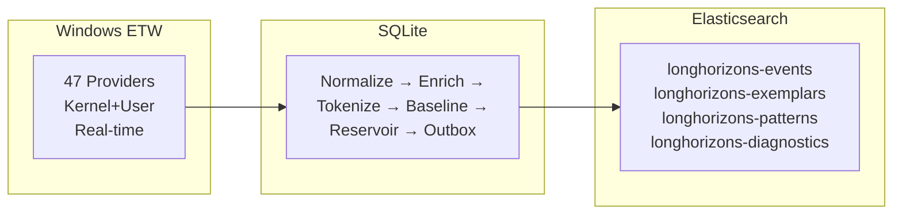
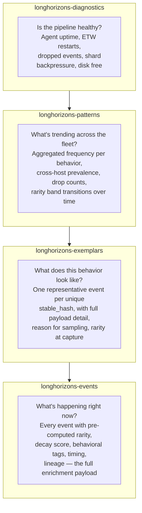

# LongHorizons Telemetry Agent

**Real-Time Windows Endpoint Visibility — Built for Security Operations, Threat Hunting, and AI-Driven Analytics**

A production-grade Windows telemetry agent that captures real-time ETW events from 47 kernel and user-mode providers, normalizes and tokenizes them into cryptographically stable behavioral identifiers, enriches with cross-event relational context, scores rarity via decay-weighted baselines, and exports to Elasticsearch for downstream security operations, threat hunting, and LLM dataset generation.

---

## Business Value

The LongHorizons Telemetry Agent transforms raw Windows event data into a queryable, deduplicated, and pre-scored behavioral dataset. It solves three problems that every security team faces at scale:

| Problem | Traditional Approach | LongHorizons Solution |
|---|---|---|
| **Storage cost** | 50–200 GB/day per 1,000 endpoints of raw log data | 90–99% reduction via cryptographic deduplication (same behavior = same hash = stored once) |
| **Analyst fatigue** | Every event looks unique; analysts re-triage the same benign behaviors daily | Pre-scored rarity bands (Rare/Uncommon/Common) let analysts focus only on novel signals |
| **Detection latency** | "Is this new?" requires hours of manual hunting through historical data | Instant: deterministic stable hash lookup answers "have we ever seen this behavior before?" in microseconds |

**For a 1,000-endpoint fleet**: 90–99% reduction in stored event volume, analysts spending time on genuinely novel signals, and a behavioral dataset immediately queryable for threat hunting and LLM training without weeks of preprocessing.

**For AI/LLM teams**: The agent produces pre-enriched event documents with inter-event timing, process lineage, behavioral tags, payload deviation scoring, burst detection, and cross-process correlation — eliminating the data engineering bottleneck that typically consumes 60–80% of ML project timelines.

---

## What It Does



- **Collects** from 47 ETW providers (kernel process/thread/network/file/registry, DNS, PowerShell, Defender, Schannel, RPC, WMI, Hyper-V, storage, and more)
- **Tokenizes** each event into a `stable_hash` (what happened) and `payload_hash` (exact details) — deterministic across hosts
- **Enriches** with: inter-event timing, process lineage/genealogy, PE metadata, logon session correlation, behavioral tags, burst detection, cross-process network correlation
- **Baselines** rarity with exponential decay scoring (Count-Min Sketch + exact promotion)
- **Exports** via durable outbox with retry, dead-letter, gzip compression, and deduplication

---

## Why This Approach — The Problem With Raw Telemetry

Organizations running Windows fleet telemetry face three compounding problems:

### The Storage Problem

A 1,000-endpoint fleet running traditional log forwarding generates 50–200 GB/day of raw Windows Event Log data. Most of it is identical noise — the same legitimate process events, the same DNS lookups, the same registry reads, repeated millions of times. Storing that in a SIEM or data lake costs money, and most teams solve it with aggressive retention windows that destroy the very evidence they'd need during an investigation.

### The Analyst Fatigue Problem

When every event looks like a unique snowflake, SOC analysts drown in alerts that are really just the same benign behavior wearing a different timestamp. A `cmd.exe` spawning `whoami.exe` at 9:05 AM looks like a new threat — but it's been happening every morning for 6 months. Without baselining, the analyst has no way to know that without manually hunting through historical data. Fatigue leads to missed signals.

### The Detection Gap

Signature-based detection (SIEM rules, IOCs, YARA) catches what you already know about. Behavioral detection requires understanding what's normal — and what's not. Raw telemetry pipelines don't compute normality; they just shovel data. The gap between "something happened" and "something unusual happened" is the most expensive distance in security operations.

### How Tokenization + Baselining Solves This

```
                Raw events                      Tokens + Baseline
              ─────────────                   ──────────────────
Volume:        100,000 / hour                    1,000 new / hour
                                              (99% deduplicated —
                                               same event, same hash,
                                               only the count changes)

Storage:       ~200 GB / day                     ~2 GB / day
                                              (event stored once;
                                               subsequent occurrences
                                               increment a counter)

Analyst view:  "cmd.exe started whoami.exe"      "cmd.exe → whoami.exe
               (for the 400th time today)         was seen 23,847 times
                                                  across 847 hosts this
                                                  month. Rarity: COMMON.
                                                  Freq: 0.0% anomalous."

Detection:     "Is this new?"                   "This stable token has
               (can't answer without             never been seen before
                weeks of historical              on any host — RARE,
                search)                          immediate exemplar
                                                  exported."
```

**Stable tokens** (SHA-256 of the _behavioral skeleton_ of an event — process lineage + operation type + normalized fields) collapse identical events into the same hash. One hash = one behavior. The first time a behavior appears, the full event is exported as an exemplar. After that, only the count increments and pattern statistics update.

**Payload tokens** track _what changed_ within a behavior — different command lines, different IPs, different registry keys. Rare payloads within common behaviors surface immediately.

**Decay-weighted baselining** means frequency isn't just a count — it's recency-aware. A behavior that happened 10,000 times last year but zero times this month has a lower score than one that happened 100 times this week. The baseline continuously self-calibrates.

### Idempotency Across the Fleet: Same Behavior, Same Token, Everywhere

The tokenization design solves a problem most SIEM pipelines don't even acknowledge: **event identity is not behavioral identity**. A process start event on Host A at 9:05 AM and the same logical operation on Host B at 3:22 PM are one behavior — but raw telemetry pipelines store them as two unrelated rows.

LongHorizons collapses them into one token. Here's how.

**Volatile field stripping.** Before hashing, every field that could differ between two instances of the same behavior is removed:

| Stripped (volatile) | Retained (behavioral skeleton) |
|---|---|
| Process ID, Thread ID, Handle | Event type, Operation, Category |
| Timestamp, boot time | Process image path, Parent image path |
| Command-line arguments | Ancestor chain hash (SHA-256 of image lineage) |
| Source/destination IP addresses | Tree depth (parent → grandparent distance) |
| File paths, registry key paths | Signing status (signed/unsigned/Microsoft) |
| DNS query strings | Integrity level, Logon type |
| Session ID, logon GUID | Behavioral tags (11 boolean heuristics) |

The hash is computed over the behavioral skeleton — the *shape* of the activity, not the specific data that flowed through it. Two instances of `cmd.exe → whoami.exe` running as LocalSystem from `C:\Windows\System32` with the same ancestor chain produce the same `stable_hash` regardless of which host they ran on, which user triggered them, or when they occurred.

**What this enables:**

- **One enrichment, fleet-wide.** When WindOH enriches a `stable_hash` — generating a description, MITRE mappings, risk assessment, and investigation steps — that enrichment applies to every host that ever exhibits the behavior. The LLM runs once per behavior, not once per host or once per occurrence. For a 1,000-endpoint fleet, that's the difference between 1,000 LLM calls for the same behavior and exactly 1.

- **Cross-host comparison as a hash join.** "Show me every host that executed this behavioral pattern" is a single indexed lookup on `stable_hash`. No multi-field text queries across process names, command lines, and timestamps. No correlation rules to maintain. One hash, one query, instant results.

- **Rarity scored globally, not per host.** A behavior that appears once on one host is rare. A behavior that appears 50,000 times across 800 hosts is common. The Count-Min Sketch and decay scoring operate on the global frequency — not the per-host frequency. An attacker can't hide by spreading activity across many endpoints; the system sees the aggregate.

- **Deterministic and reproducible.** There is no training period, no model to drift, no threshold to tune. A `stable_hash` computed at 9:05 AM on Host A matches the same behavior at 3:22 PM on Host B — always, by construction. This is court-admissible: the hash is a mathematical identity, not a probabilistic inference.

**The deduplication ripple effect:**

```
                      Without idempotency          With idempotency
                      ──────────────────          ─────────────────
Storage:              Every event stored N times   Stored once; counter increments
Analyst triage:       Same behavior reviewed       Enrich once; cached for all
                      400 times across hosts       future occurrences
LLM enrichment:       Re-enriched per occurrence   Enriched once; cached permanently
Detection engineering: Rules written per pattern   One detection rule covers all
                      variant                      occurrences of the hash
Cross-host hunting:   Manual correlation across    Hash join across fleet
                      hostnames, PIDs, timestamps  in a single query
```

The result is not just storage reduction — it's that every downstream system (enrichment, detection, investigation, hunting, compliance) starts from the same deduplicated, pre-scored signal instead of redoing the deduplication work independently.

### The Bottom Line

| Metric | Raw Log Pipeline | LongHorizons Pipeline |
|---|---|---|
| **Daily storage per endpoint** | 5–20 GB | 50–200 MB |
| **Identical events stored** | Every single one | Once + counter |
| **Time to answer "is this new?"** | Hours of search | Instant (stable hash lookup) |
| **Time to answer "is this normal?"** | Requires manual hunting | Decay score + rarity band, precomputed |
| **Cross-host behavioral comparison** | Join on unstructured fields | Join on deterministic stable hash |
| **Investigation surface** | Every event | Rare + uncommon events only |
| **LLM enrichment ready** | No (no relational context) | Yes (timing, lineage, burst, behavior tags precomputed) |

For a 1,000-endpoint fleet, this means **90-99% reduction in stored event volume**, analysts spending time on genuinely novel signals instead of re-triaging the same behaviors, and a behavioral dataset that's immediately queryable for threat hunting and LLM training without weeks of preprocessing.

## Use Cases

**Security Operations Center (SOC)**: Surface genuinely novel process executions, network connections, and registry modifications. The agent's rarity scoring means Tier 1 analysts see only uncommon and rare events — not the 400th instance of `svchost.exe` starting a DNS lookup.

**Threat Hunting**: Query across all endpoints by stable behavioral hash. "Show me every host that executed a process with this exact lineage and operation pattern, regardless of process name or PID" — a single Elasticsearch query.

**Incident Response**: Reconstruct process trees with full command lines (captured from the PEB at event time, not from ETW payloads alone), inter-event timing deltas, and ancestor chain hashes for rapid lateral movement tracing.

**Compliance & Audit**: Continuous, tamper-evident behavioral baseline with cryptographic integrity. Demonstrate that all process executions, network connections, and registry modifications are captured and scored in real time.

**AI/ML Dataset Generation**: Pre-enriched, deduplicated event corpus with relational features already computed — behavioral tags, burst metrics, payload deviation scores, and cross-process correlation — ready for LLM fine-tuning, anomaly detection models, or security copilot training.

## Prerequisites

| Requirement | Details |
|---|---|
| **OS** | Windows 10 / Windows Server 2019+ |
| **Privileges** | Administrator or LocalSystem (required for ETW trace sessions) |
| **Binary** | Single ~8 MB self-contained `.exe` — no runtime dependencies |
| **Elasticsearch** | 7.x or 8.x with bulk API (optional — agent runs without it) |

## Quick Start

### 1. Get the binary

Extract the pre-built agent from `release.zip` (~3.6 MB) or download from [Google Drive](https://drive.google.com/drive/folders/19HrARB469o9b06lHkflhK8UE7Oarb-oA).

### 2. Create directories

```powershell
mkdir C:\ProgramData\LongHorizonsAgent\state
mkdir C:\ProgramData\LongHorizonsAgent\logs
```

### 3. Configure

Copy `config.toml` to `C:\ProgramData\LongHorizonsAgent\config.toml` and fill in:
- `agent.id` — unique host identifier
- `export.events.endpoint` — your Elasticsearch URL
- `export.events.api_key` — your ES API key (or leave empty for no auth)

### 4. Test run (foreground)

```powershell
.\agent.exe run --config "C:\ProgramData\LongHorizonsAgent\config.toml"
```

Watch for:
```
INFO  Agent starting...
INFO  Database initialized at ...
INFO  Pre-populated process cache with NNN entries
INFO  ShardedPipeline initialized with 8 shards
INFO  Events export enabled: true
INFO  ETW session started
INFO  NNN new records
```

### 5. Install as Windows service (recommended)

The agent ships with PowerShell installer/uninstaller scripts:

```powershell
# From an Administrator PowerShell prompt:
.\install.ps1

# Or with explicit paths:
.\install.ps1 -BinaryPath ".\agent.exe" -ConfigPath ".\config.toml"
```

The installer:
- Creates the Windows service running as `LocalSystem` (required for ETW kernel tracing)
- Sets automatic startup and failure recovery (restart after 60s, 3 retries)
- Copies binary and config to `C:\ProgramData\LongHorizonsAgent\`
- Starts the service and runs a health check

To uninstall:

```powershell
.\uninstall.ps1           # Remove service, keep data
.\uninstall.ps1 -RemoveData  # Remove service + all logs/state
```

### 6. Verify

```powershell
# Health check
Invoke-RestMethod http://127.0.0.1:8080/health

# Check ES indexes
Invoke-RestMethod http://your-es:9200/_cat/indices/longhorizons-*
```

## Multi-Tier Baselining: Four Indexes, One Picture of Normal

The agent doesn't just ship events — it ships a pre-computed baseline across four indexes, each serving a distinct purpose in answering "what's normal here?"

### The Four Indexes as a Baselining Stack



### What Each Index Tells You

**`longhorizons-events` — The detailed record.** Every event, enriched and scored. This is the source of truth for investigation and hunting. Key baselining fields on every document:

| Field | What it tells you |
|---|---|
| `rarity_band` | Rare / Uncommon / Common — pre-computed, no query needed |
| `decay_score` | Recency-weighted frequency (0.0 to unbounded) with configurable half-life |
| `behavior_tags` | Array of 11 boolean heuristics: `first_seen_binary`, `from_temp_dir`, `encoded_command`, `network_to_loopback`, etc. |
| `risk_score` | Composite: `(1 - normalization_weight) + (burst_factor × 0.3) + (rarity_factor × 0.4)` |
| `tokens.stable_hex` | The behavioral identity — join across hosts, indexes, and time ranges |
| `tokens.payload_hex` | The variant identity — what changed within the same behavioral pattern |

**`longhorizons-exemplars` — The reference gallery.** When a behavior is seen for the first time, or when a payload is a significant deviation from prior observations, the full event (with command lines, IPs, file paths) is exported as an exemplar. This gives analysts a concrete instance of each behavior without storing every occurrence. Reservoir sampling with richness scoring ensures the most information-dense event is kept as the exemplar, not just the first one seen.

**`longhorizons-patterns` — The trend layer.** Aggregated statistics documents emitted on a configurable interval (default: every 5 minutes or every N events). Track fleet-level behavioral drift:

| Metric | Use |
|---|---|
| `frequency_estimate` | How often this behavior occurs across all hosts (CMS estimate) |
| `dropped_count` | Events dropped due to backpressure — a spike here means the pipeline is saturated |
| `pattern_type` | Categorizes the pattern document: `frequency_update`, `rarity_transition`, `new_behavior`, `payload_deviation` |
| Cross-host count | How many distinct agent IDs have reported this behavior |
| Rarity band transitions | A behavior that moved from Common → Uncommon (dormant threat? cleanup completed?) |

**`longhorizons-diagnostics` — The meta-baseline.** The pipeline observing itself. Diagnostics documents are exported on a health-check interval and whenever a state transition occurs:

| Signal | Meaning |
|---|---|
| `etw_restart_count` | ETW session has been lost and recreated — possible tampering or provider conflict |
| `dropped_events` | Pipeline backpressure exceeded capacity — events were dropped |
| `shard_backpressure[N]` | Per-shard queue depth — hot shards indicate skewed behavior distribution |
| `disk_free_gb` | Available disk space on the agent host |
| `events_per_second` | Throughput — a sudden drop may indicate ETW provider failure or system load |
| `outbox_depth` / `dead_letter_depth` | Export health — growing outbox means ES is unreachable; dead-letter means data loss risk |

### Why This Matters Operationally

A SOC team running conventional log forwarding has to build all of this themselves — dashboards for pipeline health, queries for behavioral frequency, manual sampling for exemplars, threshold tuning for anomaly detection. LongHorizons ships it pre-computed:

- **Onboarding a new analyst:** Query `rarity_band:rare` across the events index. That's the investigation surface. No manual baseline building required.
- **Fleet health check:** Query the diagnostics index for `dropped_events > 0` or `etw_restart_count > 0` in the last 24 hours. Every host with a degraded pipeline surfaces immediately.
- **Behavioral drift detection:** Query the patterns index for `pattern_type:rarity_transition`. Behaviors that changed rarity bands in the last interval — a dormant threat waking up, or a cleanup operation completing — are surfaced without manual trend analysis.
- **Threat hunting at scale:** "Show me every host that has exhibited behavior X" is a single term query on `tokens.stable_hex` across the events index, even if X was first observed on a different host six months ago.

### ILM Retention Policy

Index Lifecycle Management keeps the storage footprint predictable:

| Phase | Duration | Action |
|---|---|---|
| Hot | 0–7 days | Active indexing, full replicas, 5s refresh |
| Warm | 7–30 days | Read-only, reduced replicas, force-merged to 1 segment |
| Cold | 30–90 days | Read-only, no replicas, mounted on searchable snapshots |
| Delete | 90+ days | Index deleted |

Patterns and diagnostics indexes retain for longer (365 days) to provide year-over-year behavioral trend comparison. Events and exemplars follow the 90-day cycle. See [ES-INDEX-TEMPLATES.md](ES-INDEX-TEMPLATES.md) for the full configuration.

## Architecture & Technology Stack

**Language**: Rust (zero runtime dependencies, single ~8 MB binary)
**Database**: SQLite with WAL mode, AES-256-GCM encrypted blobs
**Concurrency**: 8-way hash-sharded pipeline with parking_lot mutexes; lock-free Count-Min Sketch
**Export**: Durable outbox with gzip compression, retry with exponential backoff, dead-letter queue, optional TLS certificate pinning
**ETW Integration**: Native Windows Trace Data Helper (TDH) API for property resolution across 47 kernel and user-mode providers
**Cryptography**: Deterministic SHA-256 token generation, HKDF-SHA256 key derivation, DPAPI-protected master key (LocalMachine scope)

### Crate Map

```
agent-service     Windows service wrapper + CLI (install/run/test)
    │
agent-etw         ETW session management (StartTraceW, EnableTraceEx2,
    │             OpenTraceW, ProcessTrace) + TDH property parsing
    │
agent-core        ┌─ config.rs          — TOML configuration
    │             ├─ models.rs          — NormalizedEvent (200+ fields)
    │             ├─ normalization.rs   — SID/IP/directory normalization
    │             ├─ tokenization.rs    — Deterministic token builders
    │             ├─ pipeline.rs        — BaseliningPipeline (CMS, reservoir)
    │             ├─ sharded_pipeline.rs— 8-way sharded ingest
    │             ├─ cms.rs             — Count-Min Sketch
    │             ├─ reservoir.rs       — Exemplar reservoir sampling
    │             ├─ db.rs              — SQLite with WAL, encrypted blobs
    │             ├─ crypto.rs          — AES-256-GCM + HKDF-SHA256
    │             └─ sysinfo.rs         — Host/network enumeration
    │
agent-exporter    Outbox worker → Elasticsearch bulk API (gzip, retry,
                  dead-letter, TLS pinning)
```

### Data Flow

1. **ETW Session** receives real-time events from 47 registered providers
2. **TDH Parser** extracts typed properties from each event record
3. **Mapping** converts raw properties into a `NormalizedEvent` (200+ typed fields)
4. **ShardedPipeline** (8-way hash-sharded):
   - Populates process cache (PID → image path, command line, modules)
   - Computes enrichments: timing deltas, process trees, behavior tags, burst detection
   - Extracts search terms from key field values
   - Builds deterministic `stable_hash` and `payload_hash` tokens
   - Routes to one of 8 independent baselining shards
5. **BaseliningPipeline** (per shard):
   - Upserts stable token in SQLite → gets decay score and rarity band
   - Updates Count-Min Sketch and promoted exact counters
   - Manages exemplar reservoir (reservoir sampling with richness scoring)
   - Writes event, exemplar, and pattern documents to outbox tables
6. **Exporter** polls outbox tables, assembles bulk requests, ships to Elasticsearch

### Enrichment Features (in exported event documents)

| Feature | Description |
|---|---|
| Inter-event timing | `delta_ms_since_prev`, `delta_ms_since_process_start` — for timeline reasoning |
| Preceding token reference | `prev_stable_hex`, `prev_payload_hex` — what this process did last |
| Tree depth | Process ancestry depth (parent → grandparent → ...) |
| Payload deviation | Running hash distance from prior events for same PID |
| Ancestor chain hash | SHA-256 of "grandparent\|parent\|current" image paths |
| Threat intel | `vt_hash_match`, `abuseipdb_category`, `domain_registration_days`, `cert_valid` |
| Logon session | `logon_id`, `logon_type`, `logon_guid` — correlates to 4624 events |
| PE metadata | `compile_timestamp`, `section_count`, `import_table_entropy`, `debug_path` |
| Cross-process correlation | PIDs of other processes contacting the same network destination |
| Behavioral tags | `first_seen_binary`, `from_temp_dir`, `encoded_command`, `network_to_loopback`, etc. |
| Burst context | Events in last 5s/60s, total event count for this PID |
| Process classification | `system_signed`, `unsigned`, `unknown` |
| Field completeness | 0-1 score of how many fields are populated |

## Security

- **Encryption at rest**: Sensitive DB blobs encrypted with AES-256-GCM
- **Master key**: Auto-generated on first run, DPAPI-protected (LocalMachine scope)
- **Purpose keys**: Derived via HKDF-SHA256 per table/operation
- **API keys**: Can be stored as DPAPI-protected blobs in config or plaintext (then auto-sealed)
- **TLS pinning**: Optional SHA-256 certificate pinning per export endpoint

## Performance Notes

- **Memory**: ~150-300 MB under normal load (8 shards, process cache, enrichment state)
- **CPU**: Low single-digit % at idle; spikes during tokenization for high-volume providers
- **Disk**: SQLite WAL mode with bounded outbox retention (configurable, default 7 days)
- **Backpressure**: Bounded channels with dropped-event metrics; ETW restart counter tracked
- **Sharding**: 8 independent baselining shards eliminate lock contention on CMS/reservoir

## Troubleshooting

| Symptom | Check |
|---|---|
| Agent won't start | Must run as Administrator or LocalSystem |
| No events | ETW session name collision — change `etw.session_name` |
| ES export failing | Verify endpoint reachable, API key valid, index template exists |
| High CPU | Disable high-volume providers: `enable_kernel_interrupts = false`, `enable_kernel_threading = false` |
| Disk growing | Reduce `outbox_retention_seconds` or check ES connectivity |
| `Access Denied` on ES | Verify API key has `create_index` and `write` privileges on `longhorizons-*` |

## Managing

```powershell
# Service control
sc.exe start LongHorizonsTelemetryAgent
sc.exe stop LongHorizonsTelemetryAgent
sc.exe query LongHorizonsTelemetryAgent

# Health status
curl http://127.0.0.1:8080/health

# Uninstall
sc.exe stop LongHorizonsTelemetryAgent
.\agent.exe uninstall
```
