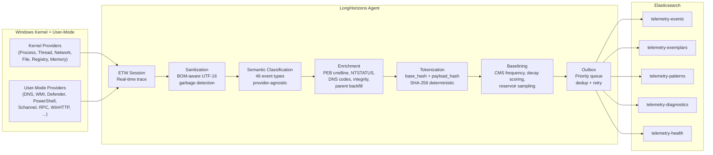
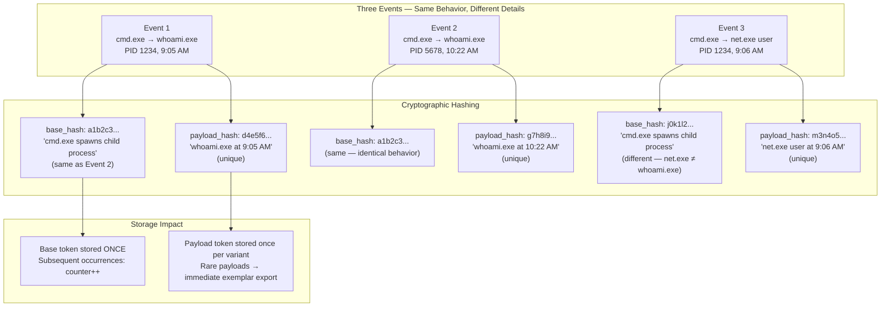
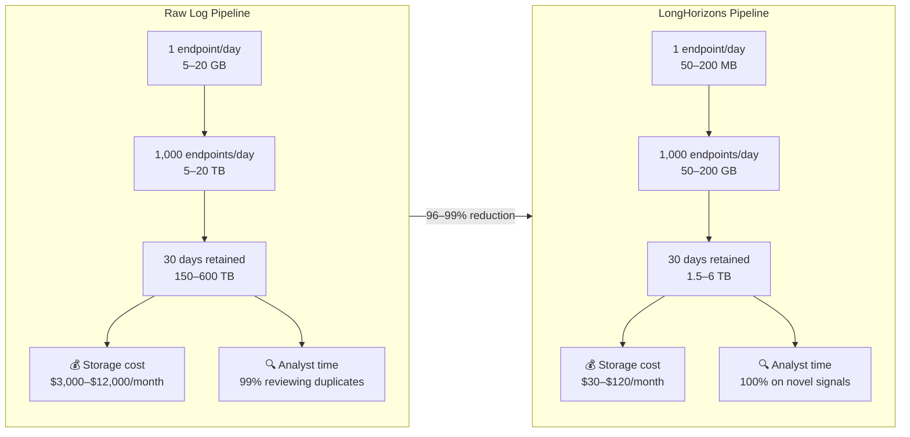
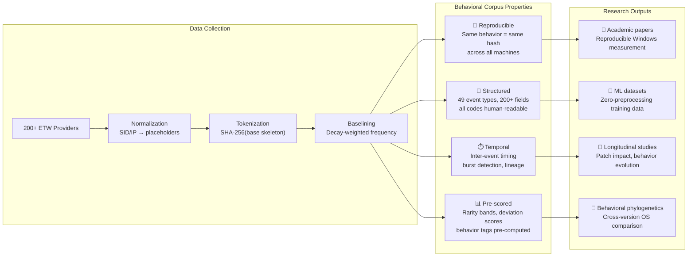
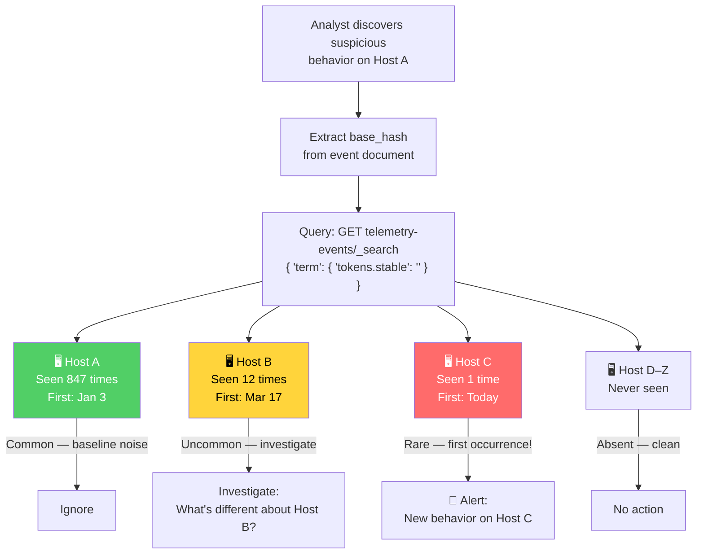
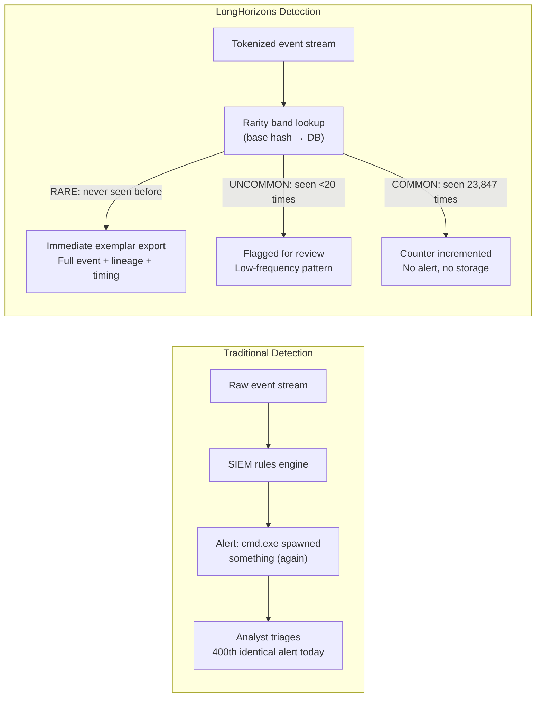
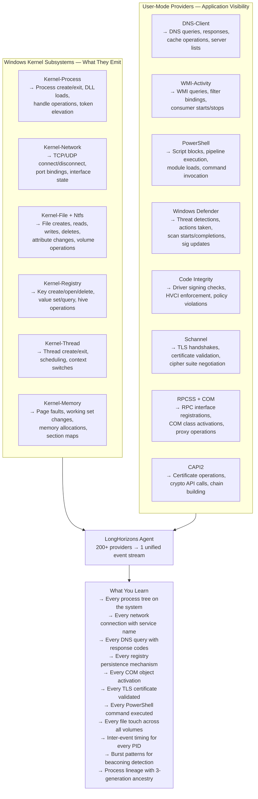

# LongHorizons Telemetry Agent

**Real-Time Windows Endpoint Visibility — Built for Security Operations, Threat Hunting, and AI-Driven Analytics**

A production-grade Windows telemetry agent that captures real-time ETW events from 200+ kernel and user-mode providers, normalizes and tokenizes them into cryptographically deterministic behavioral identifiers, enriches with cross-event relational context, scores rarity via decay-weighted baselines, and exports to Elasticsearch for downstream security operations, threat hunting, and LLM dataset generation.

---

## Data Flow Overview



---

## Tokenization: How Deduplication Works



**Base tokens** (SHA-256 of the behavioral skeleton — process lineage + operation type + normalized fields) collapse identical behaviors into the same hash. **Payload tokens** add the variable details (command lines, IPs, specific values). Same hash = same behavior = stored once.

---

## Data Quality Guarantees

```mermaid
flowchart TD
    subgraph Problems["Problems Detected & Fixed"]
        P1["AAA= base64 artifacts\n(all-null TDH buffers)"]
        P2["CJK mojibake\n(UTF-16 BE/LE confusion)"]
        P3["Numeric IDs as paths\n('279175954510' ≠ cmd.exe)"]
        P4["Hex pointers as names\n('0xffffe084d6d5bc70')"]
        P5["NTSTATUS raw numbers\n('3221225524' unreadable)"]
        P6["Garbled binary in text\n(control chars, U+FFFD)"]
        P7["Empty fields as objects\n({hex:'0000', raw:'0'})"]
        P8["Null GUIDs\n(GUID:00000000-...)"]
        P9["100% null descriptions\n(semantic_mode bug)"]
        P10["ES type conflicts\n(string vs number vs object)"]
        P11["Tokens contaminated\n(garbage in hashes)"]
    end

    subgraph Fixes["Fixes Applied"]
        F1["All-zero bytes → Null\n(in bytes_to_json_value)"]
        F2["BOM detection + BE fallback\n(wide_ptr_to_string_bounded)"]
        F3["looks_like_file_path()\n(rejects pure numbers, hex)"]
        F4["is_hex_pointer()\n(rejects kernel addresses)"]
        F5["ntstatus.rs: 500+ codes\n(STATUS_OBJECT_NAME_NOT_FOUND)"]
        F6["is_printable_text()\n(>60% printable, no controls)"]
        F7["extract_string filter\n(skip all-zero hex + raw '0')"]
        F8["All-zero hex → Null\n(in fallback encoder)"]
        F9["Semantic path enrichment\n(event_name, severity, category)"]
        F10["Stringify all pp values\n(consistent ES types)"]
        F11["sanitize_token_value()\n(rejects garbage pre-hash)"]
    end

    P1 --> F1
    P2 --> F2
    P3 --> F3
    P4 --> F4
    P5 --> F5
    P6 --> F6
    P7 --> F7
    P8 --> F8
    P9 --> F9
    P10 --> F10
    P11 --> F11
```



---

## Enrichment Features (in exported ES documents)

| Category | Fields | Description |
|----------|--------|-------------|
| **Event Identity** | `event_name`, `severity`, `category`, `description_raw` | Human-readable event descriptions resolved from provider + event_id |
| **Process Context** | `command_line_original`, `command_line_normalized`, `integrity_level`, `signature_bucket`, `user`, `user_domain` | Full process identity with PEB command-line fallback |
| **Parent Chain** | `parent.image_name`, `parent.image_path`, `grandparent_image_name`, `grandparent_image_path` | Process lineage backfilled from cache |
| **Image Load** | `module_path`, `image_checksum`, `time_date_stamp`, `section_count`, `signature_bucket`, `debug_path` | DLL/EXE load metadata |
| **Network** | `src_ip`, `dst_ip`, `src_port`, `dst_port`, `protocol` (normalized), `source_port_name`, `destination_port_name`, `ip_class` | Full network context with service names |
| **DNS** | `query_name`, `query_type` (translated), `response_code` (translated), `query_status` (NTSTATUS decoded) | Human-readable DNS telemetry |
| **Registry** | `key_path`, `value_name`, `value_type_name`, `details`, `details_raw`, `hive`, `ntstatus` | Registry operations with decoded types |
| **File System** | `path`, `name`, `extension`, `operation`, `attributes` (decoded), `file_attributes_decoded` | File operations with attribute decoding |
| **WMI** | `operation`, `namespace`, `query`, `consumer`, `status` (translated) | WMI activity monitoring |
| **Inter-event** | `delta_ms_since_prev`, `delta_ms_since_process_start`, `burst_count_5s`, `burst_count_60s` | Timing and burst context |
| **Behavioral** | `behavior_tags`, `process_classification`, `tree_depth`, `ancestor_chain_hash` | Heuristic tags + lineage |
| **Tokenization** | `tokens.stable`, `tokens.payload`, `tokens.base_canonical`, `tokens.payload_canonical` | Deterministic behavioral hashes |
| **Provider** | `provider_properties` | All TDH properties, stringified for ES type safety |


---

## Fleet Economics — The Storage Math



| Metric | Raw Log Pipeline | LongHorizons Pipeline | Reduction |
|---|---|---|---|
| **Daily storage per endpoint** | 5–20 GB | 50–200 MB | **99%** |
| **Monthly storage (1,000 hosts)** | 150–600 TB | 1.5–6 TB | **99%** |
| **Identical events stored** | Every single one | Once + counter | — |
| **Time to answer "is this new?"** | Hours of search | Instant (base hash lookup) | — |
| **Time to answer "is this normal?"** | Requires manual hunting | Decay score + rarity band, precomputed | — |
| **Cross-host behavioral comparison** | Join on unstructured fields | Join on deterministic base hash | — |
| **Investigation surface** | Every event | Rare + uncommon events only | **95%+** |
| **LLM enrichment ready** | No (no relational context) | Yes (timing, lineage, burst, behavior tags precomputed) | — |
| **Data cleanliness** | Raw, unvalidated | Sanitized: no AAA=, no mojibake, no hex pointers, all codes human-readable | — |

**For a 1,000-endpoint fleet with 30-day retention**: 96–99% storage reduction, analyst time focused on novel signals, pre-built behavioral dataset eliminating 60–80% of ML data engineering labor. At $0.02/GB/month for hot storage, that's **$2,970–$11,880 saved per month** on storage alone.

### Research — A Reproducible Windows Behavioral Corpus

The agent produces a **deterministic, deduplicated behavioral corpus** — every Windows kernel and user-mode operation from 200+ ETW providers, cryptographically indexed by behavioral identity.



**Key research properties:**

- **Reproducible by construction**: `base_hash` is deterministic — two researchers observing the same behavior on different machines get the same hash. No proprietary feature extraction, no black-box embeddings. Results are independently verifiable. This is the difference between "our model detected an anomaly" and "SHA-256 `a1b2c3...` is anomalous, and any researcher can verify this."
- **Cross-system behavioral phylogenetics**: Track how behaviors evolve across Windows versions, patch levels, and configurations. The same hash means the same behavior, regardless of hostname, PID, or timestamp. "How did process creation patterns change from Windows 10 22H2 to Windows 11 24H2?" — answerable by comparing base hash frequency distributions.
- **Kernel operation taxonomy**: Every NTFS file operation, every registry key touch, every network connection, every process creation — classified, counted, and rarity-scored. Build a complete behavioral map of Windows. The 49 event types provide a structured ontology for OS behavior.
- **Longitudinal studies**: Decay-weighted baselining with 30-day half-life means frequency scores self-calibrate. "What behaviors became more common after the May 2026 patch?" — answerable in one Elasticsearch aggregation query.
- **Zero-preprocessing ML datasets**: Pre-enriched documents with inter-event timing, process lineage, behavioral tags, burst detection, payload deviation scoring. Drop directly into LLM fine-tuning, anomaly detection models, or graph neural networks. The `base_hash` provides a natural label for behavioral clustering — no manual annotation required.
- **Publication-ready citation**: The cryptographic determinism means you can publish your dataset's hash distribution and other researchers can verify they're observing the same behaviors. Your appendix is a list of SHA-256 hashes, not a 500 GB `.pcap` file.

### Cross-Host Hunting — One Hash, Fleet-Wide Visibility



The `base_hash` is cryptographically deterministic — same behavior on any host produces the same hash. One Elasticsearch query tells you **everywhere** that behavior has occurred, **how often**, and **whether this time is different**. No JOINs, no string matching, no regex.

### Detection Engineering

Every detection use case benefits from pre-computed behavioral identity:



**Detection engineering workflows enabled:**

| Capability | How |
|------------|-----|
| **Novel behavior detection** | `rarity_band: "Rare"` — instant alert on first-seen behavioral patterns |
| **LOLBin hunting** | `behavior_tags: "unusual_parent"` — system host spawning shell, pre-tagged |
| **Persistence discovery** | `behavior_tags: "persistence_key"` — Run/RunOnce/Winlogon registry writes flagged |
| **C2 beaconing detection** | `burst_count_5s` + `dst_ip_class` — periodic outbound connections surfaced |
| **DLL side-loading** | `behavior_tags: "dll_side_load"` — signed process loading DLL from user-writable dir |
| **Process hollowing** | `process_start` + `command_line` mismatch — spawned vs. parent lineage anomalies |
| **Lateral movement** | `network_connect` + `source_image` — cross-process network correlation |
| **Token theft** | `logon_id` mismatch — process running under different logon session than parent |
| **Obfuscated execution** | `command_line_analysis.obfuscation_score` ≥ 2 — base64, caret escaping, string splitting |
| **Cross-host hunting** | `base_hash` lookup across all hosts — "show me everywhere this behavior occurred" |

### Understanding Windows — What the Kernel Tells You

ETW is Windows' introspection API. Every kernel subsystem emits structured telemetry. The agent surfaces what the kernel is saying:



**Kernel debugging without a debugger**: Each event carries the kernel's own structured data — thread IDs, IRQL, processor numbers, NTSTATUS codes, allocation sizes, IRP function codes. No kernel debugger required. The agent decodes every NTSTATUS, every file attribute, every registry value type, every DNS response code into human-readable form.

### Debugging Windows via ETW

The agent captures data that traditionally required WinDbg + kernel debugger:

| Debugging Task | Traditional Approach | ETW via LongHorizons |
|----------------|---------------------|----------------------|
| **Why did this process crash?** | Attach WinDbg, capture dump, analyze | `process_end` with `exit_code` + `process_state` + preceding events with inter-event timing |
| **What DLLs loaded in this process?** | `lm` in WinDbg, `!dlls` in livekd | `image_load` events for every DLL, with checksums, timestamps, and signatures |
| **What registry keys did this touch?** | `regmon` / Process Monitor | Every kernel registry operation with key path, value name, type, and status code |
| **What network connections are active?** | `netstat -ano`, `!tcp` in WinDbg | Every TCP/UDP connect/disconnect with source/destination IPs, ports, and service names |
| **Is this driver signed?** | `!lmi`, `sigcheck` | Code Integrity events with signature status, policy violations, and publisher info |
| **What's the process lineage?** | `!peb`, `!token`, manual parent walk | 3-generation ancestry from process cache with grandparent image paths |
| **Is someone injecting code?** | `!address`, manual VAD walk | Thread start in foreign process + image_load of suspicious DLL + burst detection |
| **What TLS ciphers are negotiated?** | Network capture + TLS inspection | Schannel events with protocol version, cipher suite, certificate details |
| **Why did this DNS query fail?** | `nslookup`, packet capture | DNS-Client events with query name, type, status (NTSTATUS decoded), and response codes |
| **What PowerShell ran on this box?** | Event log 4104 scraping | PowerShell script block logging with full script text, obfuscation scoring, and pipeline IDs |

---

## Use Cases

**SOC Triage**: Rare events surface immediately. Common events are pre-scored and deduplicated. Analysts spend time on novel signals, not the 400th `svchost.exe` DNS lookup.

**Threat Hunting**: Query across all endpoints by `base_hash`. "Show me every host where a System32 binary spawned a process from a temp directory with an encoded command line" — one query, instant results.

**Incident Response**: Reconstruct full process trees with command lines from the PEB, inter-event timing deltas, 3-generation ancestry, and cross-process network correlation.

**Compliance**: Continuous behavioral baseline with cryptographic integrity. Demonstrate complete process, network, registry, and file operation capture for audit.

**AI/ML Dataset Generation**: Pre-enriched, deduplicated corpus — drop directly into LLM fine-tuning, anomaly detection models, or graph-based behavioral analysis.

**Windows Internals Research**: Every kernel subsystem's operations, decoded and queryable. Build a behavioral taxonomy of Windows without a kernel debugger.

**Red Team / Purple Team**: Map Atomic Red Team tests against captured telemetry by `base_hash`. Measure detection coverage, identify gaps, validate SIEM rules.

**Forensics**: Event timeline with inter-event timing, process lineage, and full command lines. All codes decoded. All paths normalized. No raw hex values to decipher.

---


## Quick Start

### 1. Build

```powershell
cargo build --release
# Binary at: target\release\agent.exe (~8 MB)
```

### 2. Configure

Copy `Presentation/config.toml` to `C:\ProgramData\LongHorizonsAgent\config.toml` and set:
- `agent.id` — unique host identifier
- `export.events.endpoint` — Elasticsearch URL
- `export.events.api_key` — ES API key

### 3. Test run

```powershell
.\target\release\agent.exe run --config "C:\ProgramData\LongHorizonsAgent\config.toml"
```

### 4. Install as Windows service

```powershell
.\install.ps1
```

---

## Elasticsearch Indexes

| Index | Content | Volume |
|-------|---------|--------|
| `telemetry-events` | Individual events with full enrichment | High |
| `telemetry-exemplars` | Representative samples per base token | Low |
| `telemetry-patterns` | Aggregated pattern statistics | Medium |
| `telemetry-diagnostics` | Agent self-monitoring and error logs | Very low |
| `telemetry-health` | Periodic health reports and metrics | Very low |

---

## Build & Test Verification

```
cargo check  — 0 errors (all 4 crates)
cargo test   — 71 passed, 0 failed
   agent-core:      43 tests
   agent-etw:       28 tests
   agent-exporter:   0 tests
```

---

*Document updated 2026-05-31 — Fleet economics diagram, cross-host hunting, research pipeline, competitive differentiation*
