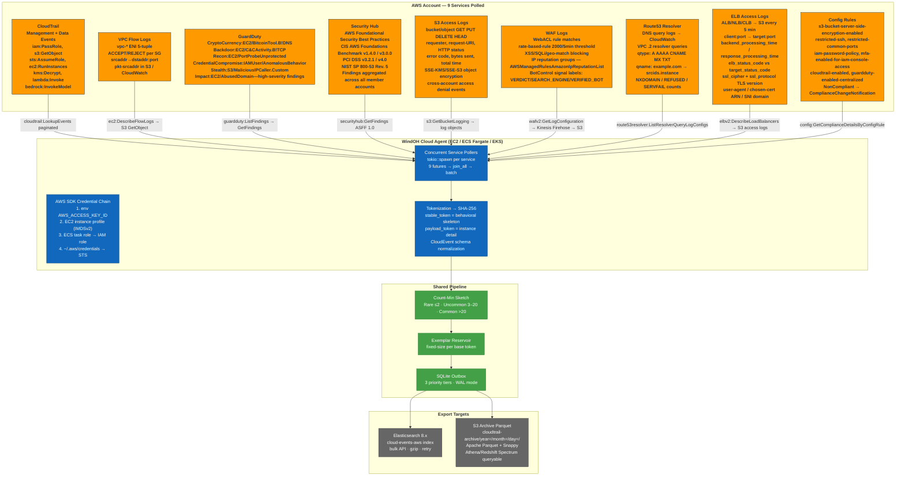
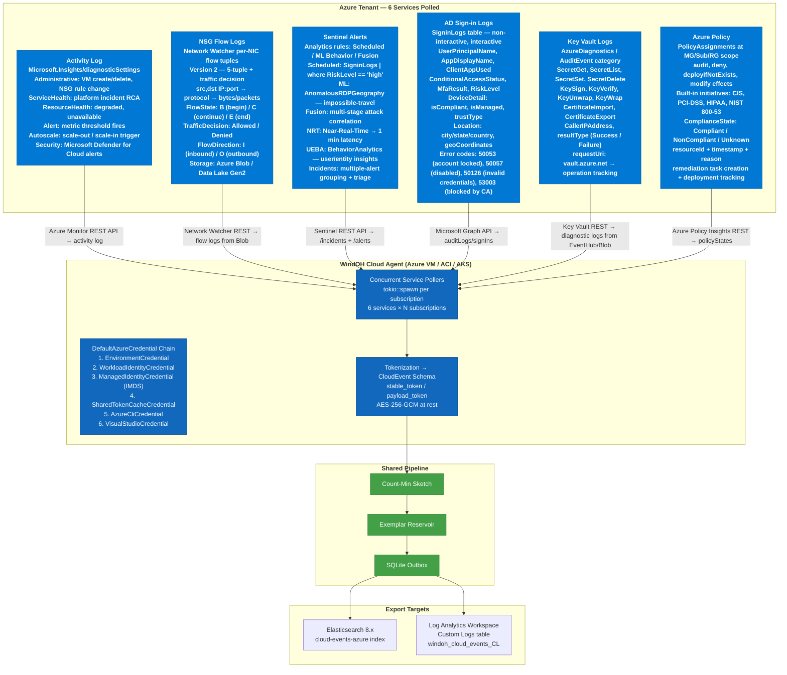
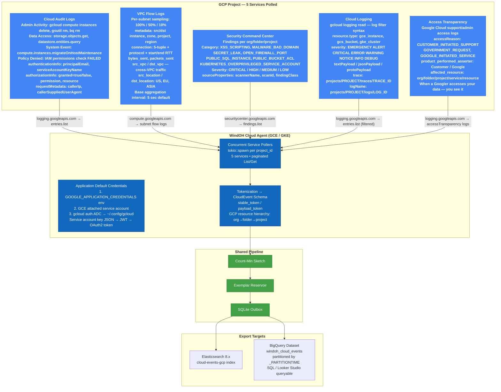
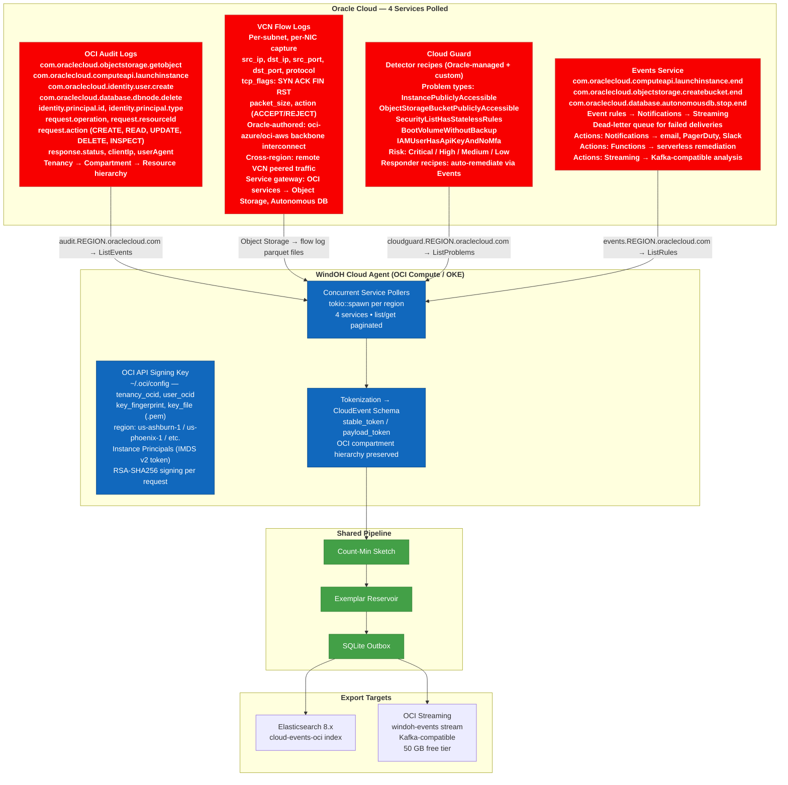
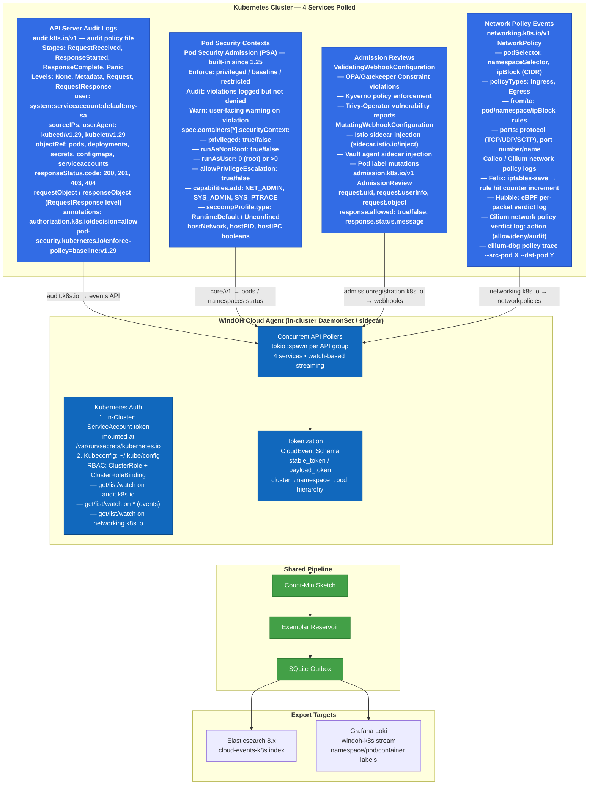
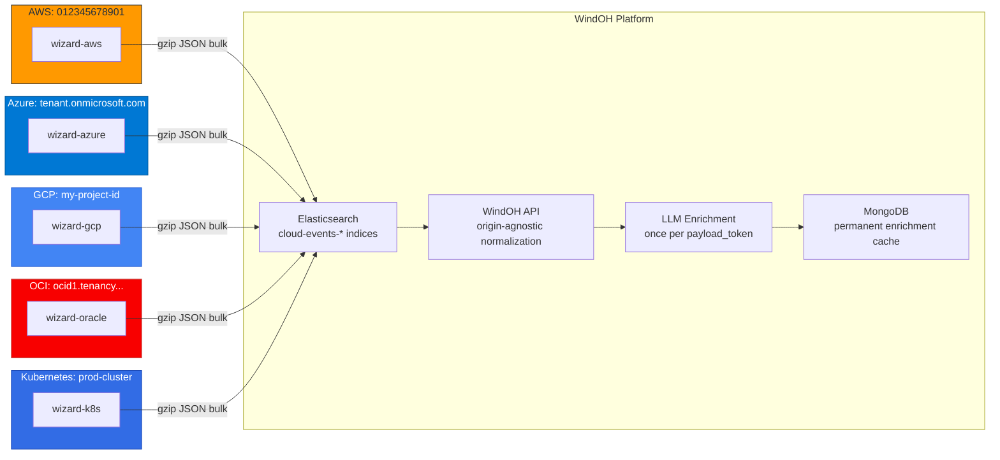

# WindOH Cloud Architecture

## Multi-Cloud Telemetry — One Schema, Five Providers, 24 Services

The LongHorizons cloud agent runs as a lightweight binary inside your cloud environment, polling provider APIs directly. Every event — a CloudTrail management call, a GuardDuty finding, a VPC Flow Log ACCEPT/REJECT, an Azure Sentinel alert, a GCP Security Command Center threat, an OCI Cloud Guard problem — is normalized into the **CloudEvent schema** and fed through the same deterministic tokenization pipeline as Windows ETW and Linux eBPF events.

The agent uses each provider's native credential chain. No long-lived access keys required. No cross-cloud data egress. Your cloud telemetry stays inside the environment that produced it.

---

## Mermaid Diagrams — Per-Provider Architecture

### AWS (9 Services)

### Azure (6 Services)

### GCP (5 Services)

### Oracle OCI (4 Services)

### Kubernetes (4 Services)

---

## CloudEvent Schema — Unified Across All Providers

Every event from every provider converges on this schema before tokenization:

| Category | Fields | AWS Source | Azure Source | GCP Source | Oracle Source |
|----------|--------|-----------|-------------|-----------|---------------|
| **Actor** | principal ARN/ObjectID/email, type, access key ID, MFA, source IP, user agent, invoked-by chain | `userIdentity.arn`, `userIdentity.type` (IAMUser/AssumedRole/AWSAccount/AWSService) | `claims.oid`, `identity` (user/servicePrincipal/managedIdentity) | `authenticationInfo.principalEmail`, `serviceAccountKeyName` | `identity.principal.id`, `identity.principal.type` (User/Instance/Service) |
| **Resource** | ARN/URI, type, name, region, account/sub/project, zone, tags | `resources[0].ARN`, `awsRegion` | `resourceId`, `subscriptionId`, `tenantId` | `resource.name`, `resource.labels.project_id` | `request.resourceId`, `compartmentId` |
| **Network** | 5-tuple (src/dst IP:port, protocol), VPC/subnet/VCN, SG, direction, ACCEPT/REJECT, bytes, packets | `sourceIPAddress`, VPC Flow Log `srcaddr→dstaddr` | `claims.ipaddr`, NSG `src_ip→dst_ip` | `callerIp`, VPC Flow Log `src/dst_instance` | `clientIp`, VCN Flow Log `src_ip→dst_ip` |
| **API** | Service, action, category (Read/Write/Management/Data), status, error code, request ID | `eventSource`, `eventName`, `errorCode` | `operationName`, `status` (Succeeded/Failed) | `serviceName`, `methodName`, `status.code` | `request.operation`, `response.status` |
| **Authorization** | Allow/Deny, policy name/ID, permissions used/missing, condition keys | `errorCode: AccessDenied`, IAM `conditionKeys` | `authorization.action`, `authorization.decision` | `authorizationInfo.granted`, `authorizationInfo.permission` | N/A (IAM in audit log via `request.action`) |
| **Threat** | Finding ID, type, severity 0–10, title, MITRE ATT&CK tactic/technique, indicator type/value, compromised resource | GuardDuty `finding.type` + `finding.severity`, Security Hub `Severity.Normalized` | Sentinel `alert.severity`, Defender for Cloud `properties.severity` | SCC `finding.category`, `finding.severity` | Cloud Guard `problem_type`, `problem.risk` |
| **Compliance** | Framework (CIS/PCI/HIPAA/SOC2/NIST), control ID, status, remediation | Config Rules `complianceType`, Security Hub `Compliance.Status` | Azure Policy `complianceState`, `policyDefinitionId` | SCC `finding.sourceProperties.Recommendation` | Cloud Guard `detector_rule.description` |
| **IP Context** | is_aws_service, is_azure_service, is_gcp_service, TOR exit node, anonymous proxy, GeoIP country/city/ASN | AWS IP ranges JSON + GeoLite2 | Azure IP ranges JSON + GeoLite2 | GCP IP ranges + GeoLite2 | GeoLite2 |

---

## Deployment Patterns

| Pattern | Description | Best For |
|---------|-------------|----------|
| **Sidecar** | Agent runs in same VPC/subnet as monitored resources — polls cloud API endpoints over private link (AWS PrivateLink / Azure Private Link / GCP Private Google Access / OCI Service Gateway) | Single-account, latency-sensitive |
| **Hub-spoke** | One agent per spoke account/project, exports to a centralized Elasticsearch in the hub | Multi-account, least-privilege |
| **DaemonSet (K8s)** | Agent runs on every node or as a cluster-wide singleton | In-cluster observability |
| **Serverless** | AWS: ECS Fargate scheduled task → Lambda poller. Azure: Container Instance → Logic App trigger. GCP: Cloud Run job → Cloud Scheduler | Cost-optimized, intermittent polling |

---

## Token Flow: Multi-Cloud → Single Pane

