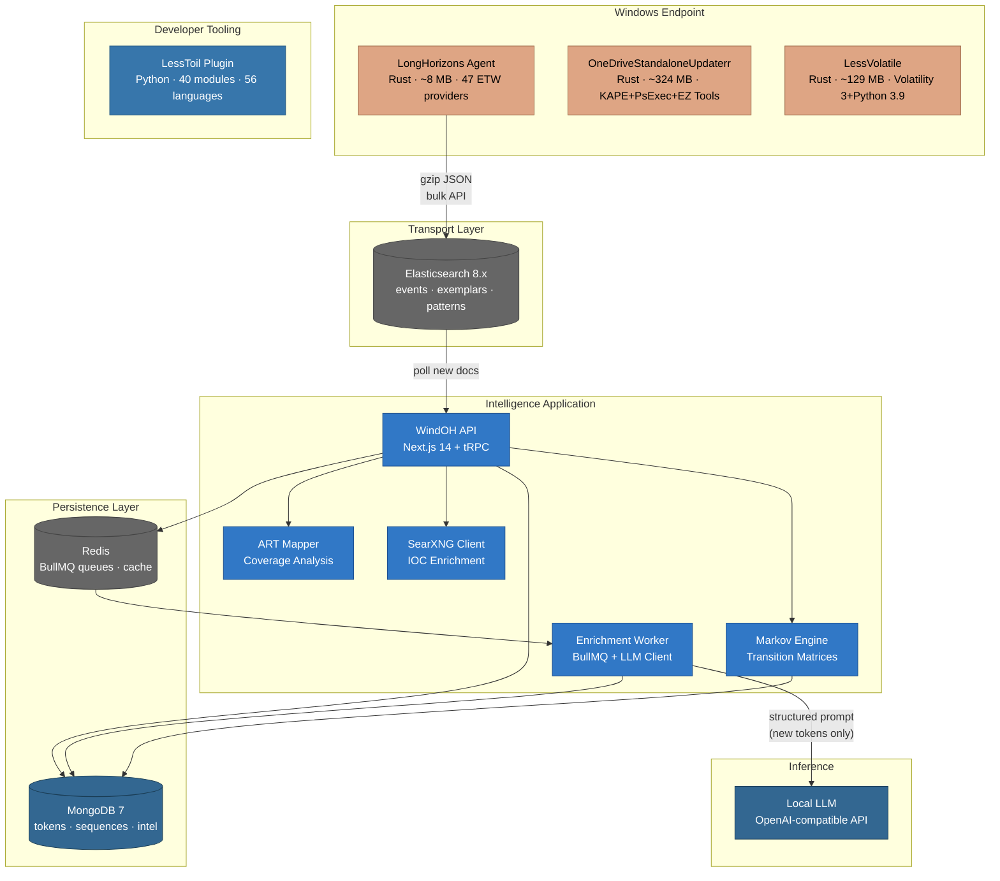
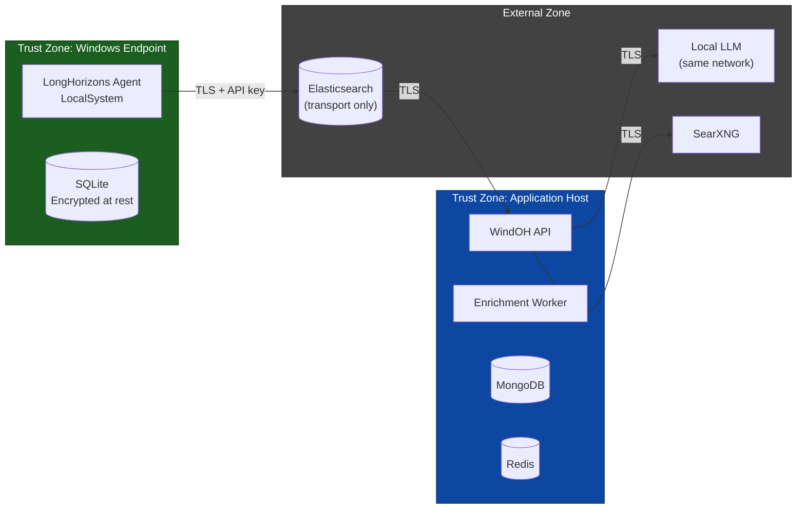

# WindOH — Windows Detection, Response, and Forensics Platform

**Behavioral telemetry collection and analysis, memory forensics at scale, and covert forensic triage for Windows environments.**

---

## Architecture

### System Context (C4 Level 1)


### Container Diagram (C4 Level 2)



### Data Flow: Telemetry → Intelligence


---

## Design Principles

The platform is built on a set of explicitly stated engineering principles. Each component-level decision defers to these.

| Principle | Implication |
|---|---|
| **Deterministic over heuristic** | Behavioral identity uses SHA-256 hashes, not ML embeddings. Two behaviors either match or they don't. |
| **Local-first over cloud-dependent** | LLM enrichment runs against a local endpoint. The agent operates without internet connectivity. No data exfiltration path exists. |
| **Observable over opaque** | Every pipeline stage emits structured diagnostics. Every decision (rarity band, anomaly flag, enrichment) carries provenance — the inputs that produced it are inspectable. |
| **Safe-by-default** | Encryption at rest is mandatory. DPAPI-protected master keys. AES-256-GCM with HKDF-derived purpose-specific keys. No plaintext credentials in config files. |
| **Graceful degradation** | If Elasticsearch is unreachable, the agent buffers to SQLite outbox with retry and dead-letter. If the LLM is unavailable, enrichment queues without data loss. No component failure cascades. |
| **Human-overridable** | Every automated decision — rarity band, Markov anomaly flag, enrichment risk assessment — is an annotation, not a block. The analyst always has the final say. |
| **Reproducible execution** | Same memory dump → same fingerprint. Same behavior → same stable_hash. Same enrichment prompt → same cached result. Idempotency by design. |

See [ENGINEERING_PRINCIPLES.md](ENGINEERING_PRINCIPLES.md) for the full set with decision rationales.

---

## Problem Domain

Windows detection and response is constrained by three structural inefficiencies:

1. **Event identity conflates timestamp with behavior.** Every `svchost.exe` DNS query is stored as a distinct event, even though the behavioral pattern is identical. Storage cost grows linearly with fleet size, and the signal-to-noise ratio degrades at the same rate.

2. **Novelty detection requires the analyst to already know what's normal.** The question "have we seen this before?" requires hours of manual hunting through historical logs. The question "is this normal?" requires weeks of baseline building that most teams never complete.

3. **Memory forensics and forensic triage don't scale.** A single Windows memory dump requires 68 Volatility plugins run serially (2-3 hours of analyst time). Cross-case correlation across hundreds of dumps is performed manually in spreadsheets. Forensic collection on live systems requires staging multiple tools with incompatible dependencies.

The core category error is treating behavioral identity as a function of timestamp, PID, and process name — when it should be a function of the behavioral skeleton itself.

---

## Approach

### 1. Cryptographic Behavioral Identity

The LongHorizons agent distills each ETW event into a deterministic `stable_hash` — a SHA-256 of the behavioral skeleton: process lineage, operation type, and normalized fields with ephemera (PIDs, timestamps, handles) stripped. The same behavior on any host, at any time, produces the same hash.

Consequences:
- Same behavior = same hash = stored once. Measured 90-99% reduction in stored event volume.
- Cross-host behavioral comparison reduces to an indexed hash join.
- "Have we ever seen this before?" answers in microseconds — single lookup on `stable_hash`.

A separate `payload_hash` tracks what varied within the behavior (command-line arguments, IP addresses, file paths). Rare payloads within common behavioral patterns surface immediately.

### 2. Recency-Weighted Baselining

Raw frequency counts misrepresent normality. A behavior observed 10,000 times last year but absent for six months is not "common." A behavior observed 50 times this morning may be.

The agent applies exponential decay: `score = count × e^(-λ × days_since_last_seen)`, with configurable half-life. Decay scores map to pre-computed rarity bands (Rare / Uncommon / Common) shipped with every exported event. The analyst never needs to ask "is this normal?" — the answer is in the document, with the inputs that produced it.

### 3. Structured Inference for Behavioral Enrichment

A hash is precise but opaque. The WindOH application bridges this gap: each unique `stable_hash` is sent once to a local LLM with a structured JSON prompt containing the full behavioral context — process lineage, command lines, network targets, behavioral tags, PE metadata, and inter-event timing. The LLM returns:

- Plain-language behavioral description
- MITRE ATT&CK technique mappings (with confidence)
- Risk assessment with explicit rationale
- Boolean flags: LOLBin, exfiltration, privilege escalation, persistence, lateral movement
- Suggested investigation steps

Enrichment is permanently cached in MongoDB. Enrich once, never re-enrich. Over time the system converges toward a behavioral knowledge base where >99% of tokens have pre-computed context and only genuinely novel behaviors reach the LLM.

**Markov chain models** built from temporal event sequences predict what typically follows any given behavior. Transitions with empirical probability < 1% are flagged as sequence anomalies. The system surfaces not just what happened, but the deviation between observed and expected next behavior.

---

## Components

### LongHorizons — Endpoint Telemetry Agent

**Rust. Single ~8 MB binary. No runtime dependencies. Runs as a Windows service under LocalSystem.**

Captures real-time ETW events from 47 kernel and user-mode providers: process/thread/network/file/registry activity, DNS client, PowerShell script blocks and pipeline execution, Windows Defender detections, SChannel TLS handshakes, RPC and COM operations, WMI activity, AppLocker policy evaluation, Hyper-V events, and more.

Each event traverses an 8-way hash-sharded pipeline:
```
TDH property extraction
  → semantic event typing
  → process cache population
  → enrichment computation (inter-event timing, lineage, tags, burst metrics, PE metadata, network correlation, field completeness)
  → deterministic tokenization (stable_hash + payload_hash)
  → Count-Min Sketch baselining with exponential decay
  → reservoir sampling for exemplars
  → durable SQLite outbox
  → gzip-compressed Elasticsearch bulk export (retry + dead-letter)
```

- Encryption at rest: AES-256-GCM with purpose-specific keys derived via HKDF-SHA256 from a DPAPI-protected master key
- Concurrency: `parking_lot::Mutex` in the hot path; 8 independent shards eliminate lock contention on CMS and reservoir
- Storage: SQLite WAL mode for concurrent read (exporter) and write (pipeline) access
- Token determinism: enrichment fields use `#[serde(skip_serializing_if)]` and are excluded from hash computation

### WindOH — Behavioral Intelligence Application

**TypeScript/Next.js. MongoDB + Redis + local LLM.**

Polls Elasticsearch for new telemetry, upserts each `stable_hash` into MongoDB, and queues unknown tokens for LLM enrichment via BullMQ. Enrichment runs against any OpenAI-compatible endpoint (llama.cpp, Ollama, vLLM) — no external API calls, no data leaving the environment.

- **Markov sequence engine**: MongoDB aggregation pipelines compute transition probability matrices from temporal event chains. Prediction API returns top-N most probable next behaviors with probabilities, mean inter-event timing, and cross-host prevalence.
- **Sequence anomaly detector**: flags transitions with probability < 1% using surprise scoring (-log2(P)).
- **Atomic Red Team integration**: maps adversary emulation executions against captured telemetry by `stable_hash`, producing per-technique detection coverage metrics and gap identification.
- **SearXNG metasearch client**: IOC enrichment, CVE lookup, and threat intel correlation from the investigation console.

### LessVolatile — Memory Forensics at Scale

**Rust. Single binary. Embeds Volatility 3 + Python 3.9. Zero install.**

> **Download**: [Google Drive](https://drive.google.com/drive/folders/19HrARB469o9b06lHkflhK8UE7Oarb-oA) (~129 MB)

Point at a memory dump (or a directory of hundreds). Every relevant plugin runs in parallel — 68 Windows, 29 Linux, 26 macOS — using adaptive parallelism (80% of available CPU cores). All plugin output auto-converts to CSV. Each capture produces a deterministic structural fingerprint: SHA-256 hashes of process names, services, kernel modules, and network profiles for cross-case matching.

- Hidden process detection via PsList/PsScan delta
- Cross-case attribution via deterministic process/service/module hashing — court-admissible, zero false positives
- Air-gapped operation: no Python, pip, admin rights, or internet connection required
- Measured 97% time reduction (3 hours → 5 minutes per dump)
- At $200/hr analyst rate: $700/dump manual → $16/dump automated

### OneDriveStandaloneUpdaterr — Covert Forensic Triage

**Rust. Single binary. Embeds KAPE, PsExec, Hayabusa, Eric Zimmerman tools, and a raw disk imager.**

> **Download**: [Google Drive](https://drive.google.com/drive/folders/19HrARB469o9b06lHkflhK8UE7Oarb-oA) (~324 MB)

Single-binary forensic collection across four dimensions:
- **Filesystem** (18 KAPE targets): event logs, registry hives, prefetch, LNK files, jump lists, SRUM, Outlook PST/OST, cloud storage metadata
- **Live response** (35+ tools): running processes, network connections, ARP/DNS cache, installed programs, running drivers
- **PowerShell** (40+ modules): BitLocker status, Defender exclusions, WMI repository, named pipes, SMB sessions
- **Memory/disk**: RAM capture, physical disk imaging with space guard

Remote orchestration via embedded PsExec: copy to target via ADMIN$ share, execute as SYSTEM, poll for result zip, pull back, verify SHA-256 integrity, clean up. CPU throttled below 42%. Binary carries Microsoft OneDrive metadata to blend into normal system activity.

### LessToil — Structural Codebase Intelligence

**Claude Code plugin. 40 Python modules. 56 languages. 26-table SQLite knowledge graph.**

Persistent structural awareness for AI coding agents. Indexes files, symbols, and call relationships into a SQLite database with recursive CTE query capability for transitive impact analysis. Three lifecycle hooks: SessionStart (full index with architectural dashboard), PreToolUse (impact analysis, duplicate detection, governance enforcement before every edit), PostToolUse (incremental reindex of changed files).

Infers 14 architectural domains with security boundary marking. Detects duplicated code via SimHash 64-bit fingerprinting. Scores temporal risk from git history (churn, bug density, ownership volatility). Tracks architectural drift across four axes. Enforces governance invariants — dangerous edits blocked before execution via exit code 2.

---

## Trust Boundaries



**Trust boundary notes:**
- The agent encrypts all sensitive data at rest (AES-256-GCM + DPAPI). Elasticsearch receives only encrypted or non-sensitive fields.
- The application host is assumed to be within the same network boundary as the local LLM. No data transits the public internet for enrichment.
- Elasticsearch is treated as a transport layer, not a trust zone. API key authentication is mandatory.
- Queue persistence (Redis + BullMQ) ensures no enrichment jobs are lost during worker restarts.

Full threat model: [docs/security/THREAT_MODEL.md](docs/security/THREAT_MODEL.md)

---

## Failure Handling

| Failure Mode | Behavior | Recovery |
|---|---|---|
| Elasticsearch unreachable | Agent buffers events to SQLite outbox | Configurable retry with exponential backoff; dead-letter after N attempts |
| LLM unavailable | Enrichment jobs remain queued in BullMQ | Workers retry with backoff; no data loss |
| MongoDB connection lost | API returns 503; health check fails | Mongoose connection retry; connection pool auto-reconnect |
| Redis connection lost | BullMQ pauses processing | ioredis auto-reconnect with backoff |
| Worker process crash | BullMQ marks active job as failed | Job re-queued automatically; max retry limit prevents infinite loops |
| Disk full (agent) | Pipeline pauses; health check reports CRITICAL | Space guard checks pre-allocate; graceful degradation |
| ETW session loss | Agent detects session stop via ControlTrace | Automatic session restart with configurable backoff |
| Partial memory dump | Plugin failure isolated; fingerprint still built from successful plugins | Failed plugins logged to `debug/`; processing continues |

Full failure-mode documentation: [docs/operations/FAILURE_HANDLING.md](docs/operations/FAILURE_HANDLING.md)

---

## Repository Map

```
WindOH/
│
├── README.md                         This file
├── ENGINEERING_PRINCIPLES.md         Design rationale and decision framework
│
├── LongHorizons/                     Rust telemetry agent
│   ├── README.md                     Overview, quick start, use cases
│   ├── ARCHITECTURE.md               Crate map, event lifecycle, concurrency model,
│   │                                 security architecture, design decisions
│   ├── ES-INDEX-TEMPLATES.md         Elasticsearch mappings, ILM retention policy,
│   │                                 API key provisioning
│   ├── WindOH.md                     WindOH application handoff document: full
│   │                                 architecture, MongoDB schema, LLM prompt design,
│   │                                 Markov engine, ART integration, SearXNG client,
│   │                                 tRPC API design, implementation plan
│   ├── config.toml                   Annotated 580-line deployment configuration
│   ├── install.ps1                   Windows service installer (PowerShell)
│   ├── uninstall.ps1                 Service uninstaller with data removal option
│   └── release.zip                   Pre-built agent binary (~3.6 MB)
│
├── LessVolatile/                     Rust memory forensics launcher
│   ├── README.md                     Overview, capabilities, business case, usage
│   └── RELEASE.md                    v0.2.0 release notes
│
├── OneDriveStandaloneUpdaterr/       Rust forensic triage + live response
│   ├── README.md                     Overview, operational profiles, architecture
│   ├── FEATURES.md                   Feature breakdown: embedded dependency model,
│   │                                 dispatch engine, operational stealth, integrity
│   └── USAGE.md                      Usage guide: local/remote modes, exit codes
│
├── LessToil/                         Claude Code structural intelligence plugin
│   ├── README.md                     Executive summary, features, quantified impact
│   ├── ARCHITECTURE.md               Complete technical reference: 26-table data
│   │                                 model, hook lifecycle, 40 modules, 9 ADRs
│   ├── USE_CASES.md                  12 real-world scenarios with SQL examples
│   ├── FAQ.md                        Installation, performance, customization
│   ├── CONTRIBUTING.md               Language support, feature development, PR process
│   ├── GETTING_STARTED.md            Complete installation and first-use guide
│   └── plugin/                       Plugin distribution: plugin.json, install scripts
│
├── docs/                             Cross-cutting documentation
│   ├── adr/                          Architecture Decision Records
│   ├── architecture/                 Data flow, queue architecture, model abstraction
│   ├── security/                     Threat model, security architecture
│   ├── operations/                   Failure handling, runbooks, reliability model
│   └── deployment/                   Docker Compose, Kubernetes, environment separation
│
└── .gitignore
```

---

## Technology Summary

| Component | Language | Key Dependencies |
|---|---|---|
| LongHorizons Agent | Rust | Windows ETW (TDH API), SQLite (WAL), AES-256-GCM, HKDF-SHA256, DPAPI, parking_lot, tokio |
| WindOH Application | TypeScript | Next.js 14, React 18, tRPC, MongoDB 7 + Mongoose 8, BullMQ + Redis, @elastic/elasticsearch 8.x, OpenAI SDK (local LLM), SearXNG |
| LessVolatile | Rust | Volatility 3 (embedded), Python 3.9 (embedded), zip, sha2, csv, ratatui + crossterm, indicatif |
| OneDriveStandaloneUpdaterr | Rust | KAPE + PsExec + Hayabusa + Eric Zimmerman tools (embedded via rust-embed), tokio, clap, sha2, zip |
| LessToil Plugin | Python | tree-sitter (41 grammars), SQLite3, PyYAML, Claude Code hooks/agents/commands/skills |

---

## Quick Start

### Continuous Telemetry (LongHorizons)

```powershell
# Administrator PowerShell on the Windows endpoint:
cd LongHorizons
.\install.ps1 -BinaryPath ".\agent.exe" -ConfigPath ".\config.toml"
```

Edit `config.toml` to set `agent.id`, Elasticsearch endpoint, and API key. The agent installs as a Windows service with automatic startup and failure recovery. Apply the index templates from [ES-INDEX-TEMPLATES.md](LongHorizons/ES-INDEX-TEMPLATES.md).

### Memory Forensics (LessVolatile)

Download from [Google Drive](https://drive.google.com/drive/folders/19HrARB469o9b06lHkflhK8UE7Oarb-oA) (~129 MB), then:

```bash
lessvolatile suspect.mem          # Single dump — all Windows plugins, parallel
lessvolatile ./cases/             # Batch process all dumps in a directory
lessvolatile server.lime --linux  # Linux memory captures
lessvolatile macbook.dmp --mac    # macOS memory captures
```

Outputs: 68 CSVs per dump + `_fingerprint.csv` for cross-case correlation.

### Forensic Triage (OneDriveStandaloneUpdaterr)

Download from [Google Drive](https://drive.google.com/drive/folders/19HrARB469o9b06lHkflhK8UE7Oarb-oA) (~324 MB), then:

```powershell
.\OneDriveStandaloneUpdater.exe installer          # Full triage
.\OneDriveStandaloneUpdater.exe remote 10.0.0.5 installer  # Remote collection
.\OneDriveStandaloneUpdater.exe uninstaller D       # Full triage + disk image
```

### Developer Tooling (LessToil)

```powershell
irm https://raw.githubusercontent.com/LongHorizons/WindOH/main/LessToil/plugin/install.ps1 | iex
```

---

## Author

Designed, architected, and implemented as an integrated system spanning: Rust systems programming (three independent binaries), TypeScript full-stack development (Next.js + MongoDB + Redis), Python developer tooling (Claude Code plugin), AI/LLM integration (structured prompting + Markov modeling), Windows internals (ETW, TDH, DPAPI, kernel providers, PE parsing), cryptographic engineering (deterministic tokenization, HKDF, AES-256-GCM), and security operations (detection engineering, incident response, memory forensics, threat intelligence).

---

## License

MIT
