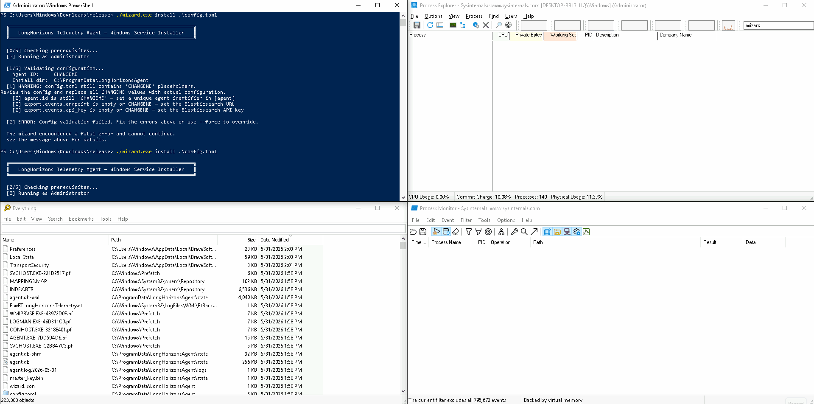
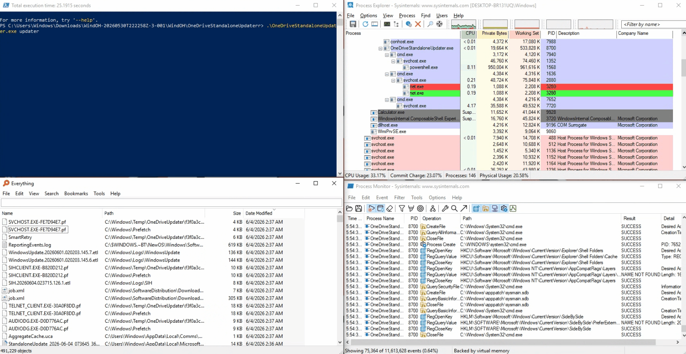
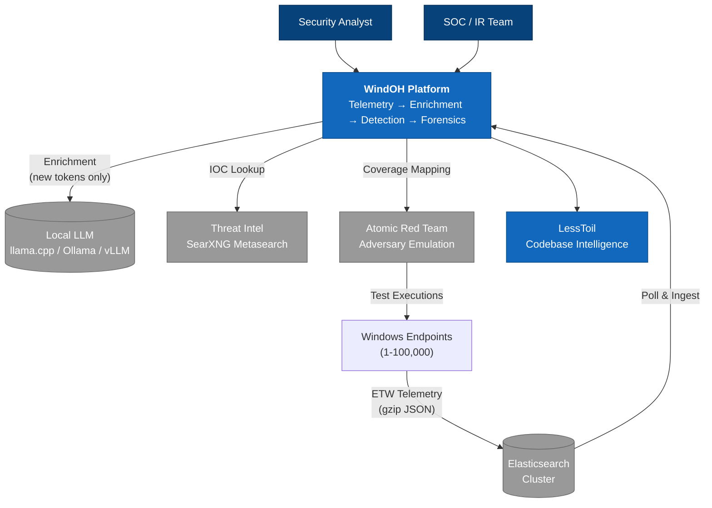
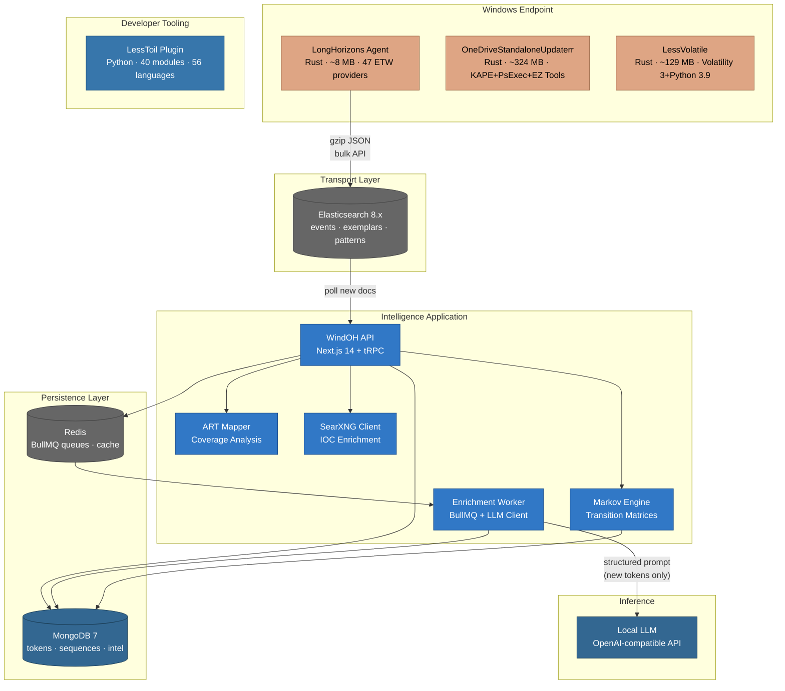
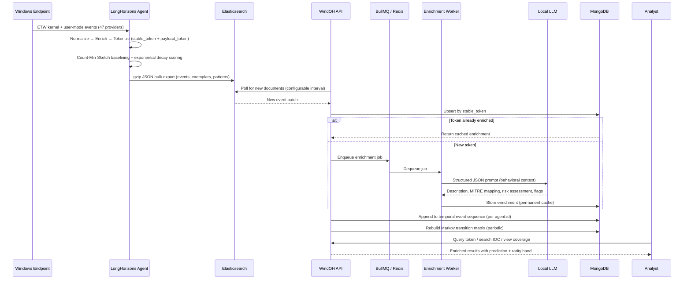
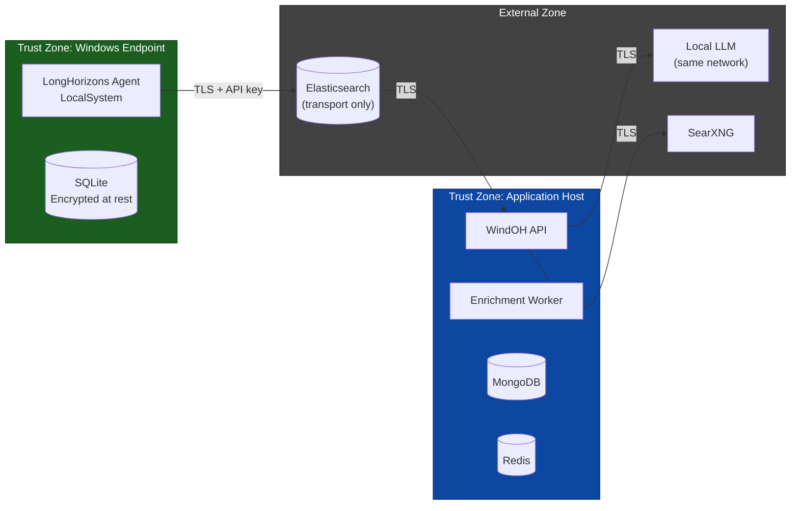

<p align="center">
  
</p>

<p align="center">
  
  
</p>

<p align="center">
  
  
</p>

<p align="center">
  <em>6 visuals across the project -- 4 GIFs (Nice.gif, Wizard.gif, OneDriveStandaloneUpdaterr.gif, Compute.gif) and 2 PNGs (windOH.png, LessAtomic/AtomicRedTeam.png) documenting every major surface.</em>
</p>

**Behavioral telemetry collection and analysis, memory forensics at scale, covert forensic triage, and multi-threaded Atomic Red Team execution for Windows environments.**

---

## The WindOH Manifesto

### What This Is

WindOH is a Windows security intelligence platform. It is not a SIEM, not an EDR, and not a dashboard factory. It is a system for answering one question with cryptographic certainty: **what just happened, and have we ever seen it before?**

Three components answer this question at different altitudes:

| Component | Role | Scale |
|---|---|---|
| **LongHorizons Agent** | Rust binary (~8 MB). Captures real-time ETW from 200+ kernel and user-mode providers. Decomposes every event into a stable token (the WHAT -- a SHA-256 of the behavioral skeleton) and a payload token (the WHEN/WHERE/WHO -- the instance-specific details). Baselined, rarity-scored, exported. Runs as a Windows service. No runtime dependencies. | One per endpoint |
| **WindOH Application** | TypeScript/Next.js web app. Polls Elasticsearch for new tokens, enriches each unique payload token via a local LLM, caches enrichment permanently in MongoDB, builds Markov transition matrices from temporal event sequences, maps Atomic Red Team executions against captured telemetry. | One per fleet |
| **LessAtomic** | Rust binary (~5 MB). Embeds 265 Atomic Red Team technique YAML files (752 atomic tests) at compile time. Multi-threaded execution via Rayon work-stealing. Variable interpolation, dependency resolution, pass/fail/skip/timeout reporting. No runtime dependencies -- no Python, no PowerShell modules. | On-demand |
| **LessVolatile + OneDriveStandaloneUpdaterr** | Memory forensics at scale. 68 Volatility plugins run in parallel with fingerprint-based deduplication across cases. Covert forensic triage via KAPE, PsExec, and EZ Tools. | On-demand |

### The Problem It Solves

Security operations is fundamentally constrained by a category error: **treating behavioral identity as a function of timestamp, PID, and process name, when it should be a function of the behavioral skeleton itself.**

Every time `svchost.exe` makes a DNS query, a new event floods the SIEM -- indistinguishable from the last thousand identical queries except for the timestamp. Storage costs grow linearly with fleet size. Signal-to-noise degrades at the same rate. "Have we seen this behavior before?" takes hours of manual hunting. "Is this normal?" takes weeks of baseline building that most teams never complete.

WindOH fixes this at the source. Same behavior = same stable token = stored once, queried in microseconds, enriched exactly once. 90--99% reduction in stored event volume before the data reaches the SIEM.

The tokenization model itself is operating-system-agnostic. A behavioral skeleton -- process lineage, operation type, normalized parameters with ephemera stripped -- abstracts the same way whether the event originates from ETW on Windows, auditd on Linux, osquery on macOS, CloudTrail in AWS, or Activity Logs in Azure. The same stable token / payload token separation applies to all of them: extract the invariant WHAT, isolate the instance-specific WHEN/WHERE/WHO, enrich once, cache permanently. The entire pipeline -- agent, Elasticsearch, WindOH API, LLM inference, MongoDB, Redis -- runs on infrastructure you control: on-prem, air-gapped, or inside your VPC on AWS, Azure, or OCI.

**Coming soon across every surface:**

| Platform | Telemetry Source | Status |
|---|---|---|
| **Windows** | ETW kernel + user-mode (200+ providers), PowerShell script blocks, Defender detections, AppLocker, SAC | Validating now against Atomic Red Team coverage matrix |
| **Linux** | auditd, eBPF tracepoints, /proc filesystem, systemd journal, iptables/netfilter | Planned -- auditd event type + subject/object tuple maps directly to stable token skeleton; eBPF ring buffer delivery mirrors ETW session architecture; /proc polling provides process lineage equivalent to Windows PEB traversal |
| **macOS** | Endpoint Security Framework (ESF), Unified Log, osquery, OpenBSM audit | Planned -- ESF event subscription + message handler pattern is architecturally identical to ETW trace sessions; ES_EVENT_TYPE_NOTIFY_EXEC, FORK, and RENAME map to ProcessCreate, ProcessEnd, and FileWrite token builders; Unified Log predicate filtering mirrors ETW provider-level enablement |
| **Android** | adb logcat, dumpsys, /proc, SELinux AVC audit, Network Stats Manager | Planned -- logcat buffer (main, system, events, crash, kernel) with tag/severity filtering provides the same per-source enablement model as ETW provider GUIDs; /proc/net/{tcp,udp} and /proc/pid/stat supply process and network skeletons equivalent to Windows process genealogy and TCP/UDP ETW events |
| **Cloud (AWS)** | CloudTrail management + data events, VPC Flow Logs, EKS audit logs, GuardDuty findings | Planned -- CloudTrail eventVersion + eventSource + eventName form a three-field behavioral skeleton directly analogous to ETW provider + event ID + opcode; S3 event notifications feed into the same ES bulk ingest path; VPC Flow Logs accept/reject + protocol + port tuple replaces Windows network_connect token fields |
| **Cloud (Azure)** | Activity Log, Monitor resource logs, NSG flow logs, Defender for Cloud alerts, AKS audit | Planned -- Activity Log caller + operationName + resourceId maps to the stable token's actor + operation + target triple; Event Hub partitioning scheme aligns with the existing sharded pipeline (shard by subscription ID or resource group, same as shard by PID hash on Windows) |
| **Cloud (OCI)** | Audit logs, Service Connector Hub, VCN flow logs, Cloud Guard findings | Planned -- OCI audit eventType + sourceIp + resourceId maps to the same behavioral skeleton structure; Service Connector Hub event routing mirrors ES bulk export pattern; VCN flow log action + protocol + stateless flag replaces Windows firewall/network event fields |
| **Kubernetes** | API Server audit logs, admission controller webhooks, container runtime events via containerd/cri-o | Planned -- audit.k8s.io event objectRef.resource + verb + namespace forms a stable behavioral triple identical in shape to Windows process lineage + operation type; admission webhook (ValidatingWebhook + MutatingWebhook) reject/allow decisions map to AppLocker policy evaluation tokens; containerd task create/start/delete events map to ProcessCreate/ProcessEnd builders |

Each platform generates the same stable token / payload token pair. Enrichment runs once per payload token, cached permanently, regardless of which platform produced it. A detection written against a Windows process-create event generalizes to an execve auditd event, a fork ESF event, and a container runtime event -- because they all reduce to the same behavioral skeleton. The operator experience described above is the same on every surface. This begins shipping after Windows validation, Atomic Red Team coverage measurement, and the WindOH.us pipeline reach parity.

### What the Operator Experience Should Feel Like

You sit down at the console. A new alert has fired. You don't know what triggered it.

First question: **"Has this behavior been seen before, anywhere in the fleet?"** You query by stable token. The answer returns in under a second: *Yes. Seen 47,000 times across 892 endpoints over the past 90 days. Rarity: Common. First observed 18 months ago.*

That changes everything. The alert is not novel -- it's a known behavior that fired because a threshold moved. You close it and move on.

Next question: **"This specific payload -- these command-line arguments, this target IP -- is THAT new?"** You query by payload token. *Never seen before. Enrichment triggered.* The local LLM returns a structured assessment: what the process lineage suggests, which MITRE techniques map to it, whether it looks like a LOLBin, what investigation steps to take. This enriched context is now permanently cached -- every analyst who encounters this payload from this point forward gets the same intelligence, instantly, without re-running the LLM.

Next question: **"Assuming this is malicious, what typically follows?"** Markov chain prediction: *After this behavior, the next behavior is usually X (probability 72%) or Y (probability 18%). This observed transition has empirical probability < 1%.* That is a sequence anomaly. Worth investigating.

You spend your time on the anomalous, the rare, and the novel. The routine answers itself.

### Architectural Principles That Matter

These are non-negotiable. They are the decision framework for every component, every feature, and every PR.

**1. Deterministic over heuristic.** Behavioral identity uses SHA-256 hashes, not ML embeddings. Two behaviors either match or they do not. There is no confidence score to tune, no threshold to argue about, no training distribution to drift from. This is court-admissible, SIEM-ingestible, and immune to adversarial evasion.

**2. Local-first over cloud-dependent.** LLM enrichment runs against a local endpoint -- llama.cpp, Ollama, vLLM. No telemetry data transits the public internet for enrichment under any configuration. The agent operates fully independently even when Elasticsearch is unreachable, buffering to a local SQLite outbox with exponential backoff retry.

**3. Observable over opaque.** Every automated decision carries provenance. A rarity band includes the decay score, observation count, and half-life parameters. A Markov anomaly flag includes the transition probability and the expected next behavior. LLM enrichment stores the raw prompt and response alongside the parsed output. The analyst can always inspect the inputs that produced the output.

**4. Safe-by-default.** AES-256-GCM encryption at rest is mandatory, not optional. Master keys are DPAPI-protected and tied to the service account. Purpose-specific encryption keys derived via HKDF-SHA256. Elasticsearch connections require API key authentication. No plaintext credentials in configuration files.

**5. Graceful degradation.** If Elasticsearch is unreachable, the agent buffers to SQLite outbox. If the LLM is unavailable, enrichment jobs queue without data loss. If MongoDB is unavailable, the API returns 503 with structured health status. No component failure cascades into another.

**6. Human-overridable.** Every automated decision -- rarity band, anomaly flag, risk assessment -- is an annotation, not an enforcement action. The system recommends. The analyst decides. There is no automated blocking, quarantining, or process termination.

**7. Reproducible execution.** Same memory dump -- same SHA-256 fingerprint for every process, service, module, and network profile. Same ETW behavior -- same stable token, independent of host, time, or session. Same enrichment prompt -- same cached result. Idempotency is a design constraint, not an optimization.

### What Stays Local

- All behavioral telemetry. Process command lines, network targets, user identities -- the most sensitive data in a security environment.
- All LLM enrichment. The prompt goes to a local endpoint. The response comes back to local storage. Nothing leaves.
- All token generation. The stable token and payload token are computed on the endpoint. Only the hashes are exported.
- All encryption keys. DPAPI-bound to the service account. Never transmitted, never shared.

### How Agents Should Behave

The LongHorizons agent is designed for environments where **being noticed is a failure mode.**

- **Silent.** No GUI, no tray icon, no console window. A Windows service running under LocalSystem.
- **Small.** Single ~8 MB binary. No runtime, no framework, no package manager.
- **Predictable.** Configurable memory ceiling. Configurable ETW session buffer sizes. Configurable export batch sizes. No unbounded growth.
- **Resilient.** If the export target is unreachable, buffer locally. Retry with exponential backoff. Dead-letter after N attempts. Never crash-loop. Never drop data silently.
- **Honest.** Emit structured diagnostics about its own health -- buffer depth, export latency, dropped events, memory pressure. The agent should be the most observable component in the pipeline.

### What We Refuse to Compromise On

- **No telemetry leaves the premises for enrichment.** Ever. This is not a configuration option -- it is an architectural invariant. There is no code path that sends event data to an external service for inference.

- **No automated blocking.** The platform annotates. It recommends. It does not quarantine, terminate, or suppress. False positives in security contexts interrupt legitimate operations and destroy trust in the tool.

- **No black-box outputs.** Every assessment includes explicit rationale. Every score includes its inputs. Every enrichment includes the raw LLM response that produced it. The analyst can always verify.

- **No silent data loss.** If a buffer fills, it is a diagnosable event. If an export fails, it is retried and tracked. If a dead-letter queue accumulates, it surfaces in the health dashboard. Data loss must be explicit and measurable.

- **No cloud requirement.** The entire pipeline -- agent, Elasticsearch, WindOH API, LLM inference, MongoDB, Redis -- operates on infrastructure you control. Internet access is only needed for external threat intelligence enrichment (SearXNG), and that is optional.

---

## Architecture

### System Context (C4 Level 1)



### Container Diagram (C4 Level 2)



### Data Flow: Telemetry → Intelligence



---

## Design Principles

The platform is built on a set of explicitly stated engineering principles. Each component-level decision defers to these.

| Principle | Implication |
|---|---|
| **Deterministic over heuristic** | Behavioral identity uses SHA-256 hashes, not ML embeddings. Two behaviors either match or they don't. |
| **Local-first over cloud-dependent** | LLM enrichment runs against a local endpoint. The agent operates without internet connectivity. No data exfiltration path exists. |
| **Observable over opaque** | Every pipeline stage emits structured diagnostics. Every decision (rarity band, anomaly flag, enrichment) carries provenance -- the inputs that produced it are inspectable. |
| **Safe-by-default** | Encryption at rest is mandatory. DPAPI-protected master keys. AES-256-GCM with HKDF-derived purpose-specific keys. No plaintext credentials in config files. |
| **Graceful degradation** | If Elasticsearch is unreachable, the agent buffers to SQLite outbox with retry and dead-letter. If the LLM is unavailable, enrichment queues without data loss. No component failure cascades. |
| **Human-overridable** | Every automated decision -- rarity band, Markov anomaly flag, enrichment risk assessment -- is an annotation, not a block. The analyst always has the final say. |
| **Reproducible execution** | Same memory dump → same fingerprint. Same behavior → same stable_token. Same enrichment prompt → same cached result. Idempotency by design. |

See [ENGINEERING_PRINCIPLES.md](ENGINEERING_PRINCIPLES.md) for the full set with decision rationales.

---

## Problem Domain

Windows detection and response is constrained by three structural inefficiencies:

1. **Event identity conflates timestamp with behavior.** Every `svchost.exe` DNS query is stored as a distinct event, even though the behavioral pattern is identical. Storage cost grows linearly with fleet size, and the signal-to-noise ratio degrades at the same rate.

2. **Novelty detection requires the analyst to already know what's normal.** The question "have we seen this before?" requires hours of manual hunting through historical logs. The question "is this normal?" requires weeks of baseline building that most teams never complete.

3. **Memory forensics and forensic triage don't scale.** A single Windows memory dump requires 68 Volatility plugins run serially (2-3 hours of analyst time). Cross-case correlation across hundreds of dumps is performed manually in spreadsheets. Forensic collection on live systems requires staging multiple tools with incompatible dependencies.

The core category error is treating behavioral identity as a function of timestamp, PID, and process name -- when it should be a function of the behavioral skeleton itself.

---

## Approach

### 1. Cryptographic Behavioral Identity

The LongHorizons agent decomposes each ETW event into two cryptographically distinct tokens:

**Stable Token** (stable token) -- A SHA-256 hash of the behavioral skeleton. Includes the deterministic, invariant fields: process lineage (parent-child relationships), operation type (ProcessCreate, DnsQuery, FileWrite), and normalized behavioral parameters with all ephemera stripped (no PIDs, no timestamps, no handles, no host identifiers). The same behavior on any host, at any time, produces the identical stable_token. This is the WHAT -- what behavior occurred.

**Payload Token** (payload token) -- A SHA-256 hash of the event-specific instance data. Includes the variable, evidentiary fields: command-line arguments, IP addresses, file paths, user SIDs, registry keys, and temporal context. Every event instance produces a unique payload_token, even when the stable_token is shared across thousands of occurrences. This is the WHEN/WHERE/WHO -- the specific circumstances of this occurrence.

Consequences of this separation:
- Same behavior = same stable_token = stored once. Measured 90-99% reduction in stored event volume.
- Cross-host behavioral comparison reduces to an indexed hash join on stable_token.
- "Have we ever seen this behavior before?" answers in microseconds -- single lookup on stable_token.
- Rare payloads within common behavioral patterns surface immediately -- the stable_token is "normal" but the payload_token reveals anomalous arguments, targets, or context.
- Enrichment runs once per payload token -- each unique payload variant is enriched by the patterns index exactly once.

### 2. Recency-Weighted Baselining

Raw frequency counts misrepresent normality. A behavior observed 10,000 times last year but absent for six months is not "common." A behavior observed 50 times this morning may be.

The agent applies exponential decay: `score = count × e^(-λ × days_since_last_seen)`, with configurable half-life. Decay scores map to pre-computed rarity bands (Rare / Uncommon / Common) shipped with every exported event. The analyst never needs to ask "is this normal?" -- the answer is in the document, with the inputs that produced it.

### 3. Structured Inference for Behavioral Enrichment

A hash is precise but opaque. The WindOH application bridges this gap: each unique stable token is sent once to a local LLM with a structured JSON prompt containing the full behavioral context -- process lineage, command lines, network targets, behavioral tags, PE metadata, and inter-event timing. The LLM returns:

- Plain-language behavioral description
- MITRE ATT&CK technique mappings (with confidence)
- Risk assessment with explicit rationale
- Boolean flags: LOLBin, exfiltration, privilege escalation, persistence, lateral movement
- Suggested investigation steps

Enrichment is permanently cached in MongoDB -- once per payload token, never repeated. Over time the system converges toward a behavioral knowledge base where >99% of payload tokens have pre-computed context and only genuinely novel payloads reach the LLM.

**Markov chain models** built from temporal event sequences predict what typically follows any given behavior. Transitions with empirical probability < 1% are flagged as sequence anomalies. The system surfaces not just what happened, but the deviation between observed and expected next behavior.

---

## Components

### LongHorizons -- Endpoint Telemetry Agent

**Rust. Single ~8 MB binary. No runtime dependencies. Runs as a Windows service under LocalSystem.**

Captures real-time ETW events from 47 kernel and user-mode providers: process/thread/network/file/registry activity, DNS client, PowerShell script blocks and pipeline execution, Windows Defender detections, SChannel TLS handshakes, RPC and COM operations, WMI activity, AppLocker policy evaluation, Hyper-V events, and more.

Each event traverses an 8-way hash-sharded pipeline:
```
TDH property extraction
  → semantic event typing
  → process cache population
  → enrichment computation (inter-event timing, lineage, tags, burst metrics, PE metadata, network correlation, field completeness)
  → deterministic tokenization (stable_token + payload_token)
  → Count-Min Sketch baselining with exponential decay
  → reservoir sampling for exemplars
  → durable SQLite outbox
  → gzip-compressed Elasticsearch bulk export (retry + dead-letter)
```

- Encryption at rest: AES-256-GCM with purpose-specific keys derived via HKDF-SHA256 from a DPAPI-protected master key
- Concurrency: `parking_lot::Mutex` in the hot path; 8 independent shards eliminate lock contention on CMS and reservoir
- Storage: SQLite WAL mode for concurrent read (exporter) and write (pipeline) access
- Token determinism: enrichment fields use `#[serde(skip_serializing_if)]` and are excluded from hash computation

### WindOH -- Behavioral Intelligence Application

**TypeScript/Next.js. MongoDB + Redis + local LLM.**

> **WindOH.us** -- A hosted platform for behavioral token enrichment, detection engineering, Markov sequence analysis, and investigation workflow will be available at [windoh.us](https://windoh.us) in the coming days. It provides a managed entry point for teams that want the enrichment and detection capabilities without self-hosting the application stack.

Polls Elasticsearch for new telemetry, upserts each stable token into MongoDB, and queues unknown tokens for LLM enrichment via BullMQ. Enrichment runs against any OpenAI-compatible endpoint (llama.cpp, Ollama, vLLM) -- no external API calls, no data leaving the environment.

- **Markov sequence engine**: MongoDB aggregation pipelines compute transition probability matrices from temporal event chains. Prediction API returns top-N most probable next behaviors with probabilities, mean inter-event timing, and cross-host prevalence.
- **Sequence anomaly detector**: flags transitions with probability < 1% using surprise scoring (-log2(P)).
- **Atomic Red Team integration**: maps adversary emulation executions against captured telemetry by stable token, producing per-technique detection coverage metrics and gap identification.
- **SearXNG metasearch client**: IOC enrichment, CVE lookup, and threat intel correlation from the investigation console.

### LessVolatile -- Memory Forensics at Scale

**Rust. Single binary. Embeds Volatility 3 + Python 3.9. Zero install.**

> **Download**: [Google Drive](https://drive.google.com/drive/folders/19HrARB469o9b06lHkflhK8UE7Oarb-oA) (~129 MB)

Point at a memory dump (or a directory of hundreds). Every relevant plugin runs in parallel -- 68 Windows, 29 Linux, 26 macOS -- using adaptive parallelism (80% of available CPU cores). All plugin output auto-converts to CSV. Each capture produces a deterministic structural fingerprint: SHA-256 hashes of process names, services, kernel modules, and network profiles for cross-case matching.

- Hidden process detection via PsList/PsScan delta
- Cross-case attribution via deterministic process/service/module hashing -- court-admissible, zero false positives
- Air-gapped operation: no Python, pip, admin rights, or internet connection required
- Measured 97% time reduction (3 hours → 5 minutes per dump)
- At $200/hr analyst rate: $700/dump manual → $16/dump automated

### OneDriveStandaloneUpdaterr -- Covert Forensic Triage

**Rust. Single binary. Embeds KAPE, PsExec, Hayabusa, Eric Zimmerman tools, and a raw disk imager.**

> **Download**: [Google Drive](https://drive.google.com/drive/folders/19HrARB469o9b06lHkflhK8UE7Oarb-oA) (~324 MB)

Single-binary forensic collection across four dimensions:
- **Filesystem** (18 KAPE targets): event logs, registry hives, prefetch, LNK files, jump lists, SRUM, Outlook PST/OST, cloud storage metadata
- **Live response** (35+ tools): running processes, network connections, ARP/DNS cache, installed programs, running drivers
- **PowerShell** (40+ modules): BitLocker status, Defender exclusions, WMI repository, named pipes, SMB sessions
- **Memory/disk**: RAM capture, physical disk imaging with space guard

Remote orchestration via embedded PsExec: copy to target via ADMIN$ share, execute as SYSTEM, poll for result zip, pull back, verify SHA-256 integrity, clean up. CPU throttled below 42%. Binary carries Microsoft OneDrive metadata to blend into normal system activity.

### LessToil -- Structural Codebase Intelligence

**Claude Code plugin. 40 Python modules. 56 languages. 26-table SQLite knowledge graph.**

Persistent structural awareness for AI coding agents. Indexes files, symbols, and call relationships into a SQLite database with recursive CTE query capability for transitive impact analysis. Three lifecycle hooks: SessionStart (full index with architectural dashboard), PreToolUse (impact analysis, duplicate detection, governance enforcement before every edit), PostToolUse (incremental reindex of changed files).

Infers 14 architectural domains with security boundary marking. Detects duplicated code via SimHash 64-bit fingerprinting. Scores temporal risk from git history (churn, bug density, ownership volatility). Tracks architectural drift across four axes. Enforces governance invariants -- dangerous edits blocked before execution via exit code 2.

---

## Trust Boundaries



**Trust boundary notes:**
- The agent encrypts all sensitive data at rest (AES-256-GCM + DPAPI). Elasticsearch receives only encrypted or non-sensitive fields.
- The application host is assumed to be within the same network boundary as the local LLM. No data transits the public internet for enrichment.
- Elasticsearch is treated as a transport layer, not a trust zone. API key authentication is mandatory.
- Queue persistence (Redis + BullMQ) ensures no enrichment jobs are lost during worker restarts.

Full threat model: [docs/security/THREAT_MODEL.md](docs/security/THREAT_MODEL.md)

---

## Failure Handling

| Failure Mode | Behavior | Recovery |
|---|---|---|
| Elasticsearch unreachable | Agent buffers events to SQLite outbox | Configurable retry with exponential backoff; dead-letter after N attempts |
| LLM unavailable | Enrichment jobs remain queued in BullMQ | Workers retry with backoff; no data loss |
| MongoDB connection lost | API returns 503; health check fails | Mongoose connection retry; connection pool auto-reconnect |
| Redis connection lost | BullMQ pauses processing | ioredis auto-reconnect with backoff |
| Worker process crash | BullMQ marks active job as failed | Job re-queued automatically; max retry limit prevents infinite loops |
| Disk full (agent) | Pipeline pauses; health check reports CRITICAL | Space guard checks pre-allocate; graceful degradation |
| ETW session loss | Agent detects session stop via ControlTrace | Automatic session restart with configurable backoff |
| Partial memory dump | Plugin failure isolated; fingerprint still built from successful plugins | Failed plugins logged to `debug/`; processing continues |

Full failure-mode documentation: [docs/operations/FAILURE_HANDLING.md](docs/operations/FAILURE_HANDLING.md)

---

## Repository Map

```
WindOH/
│
├── README.md                         This file
├── ENGINEERING_PRINCIPLES.md         Design rationale and decision framework
│
├── LongHorizons/                     Rust telemetry agent
│   ├── README.md                     Overview, quick start, use cases
│   ├── ARCHITECTURE.md               Crate map, event lifecycle, concurrency model,
│   │                                 security architecture, design decisions
│   ├── ES-INDEX-TEMPLATES.md         Elasticsearch mappings, ILM retention policy,
│   │                                 API key provisioning
│   ├── WindOH.md                     WindOH application handoff document: full
│   │                                 architecture, MongoDB schema, LLM prompt design,
│   │                                 Markov engine, ART integration, SearXNG client,
│   │                                 tRPC API design, implementation plan
│   ├── config.toml                   Annotated 580-line deployment configuration
│   ├── install.ps1                   Windows service installer (PowerShell)
│   ├── uninstall.ps1                 Service uninstaller with data removal option
│   ├── Wizard.gif                    Agent setup wizard demonstration
│   └── release.zip                   Pre-built agent binary (~3.6 MB)
│
├── LessAtomic/                       Rust Atomic Red Team test executor
│   ├── README.md                     Overview, architecture, CLI reference, ethics
│   ├── QUICKSTART.md                 10-second quick-start guide
│   ├── RELEASE_NOTES.md              v0.1.0 release notes
│   ├── AtomicRedTeam.png             Atomic Red Team technique mapping visual
│   └── LessAtomic.zip                Pre-built binary archive
│
├── LessVolatile/                     Rust memory forensics launcher
│   ├── README.md                     Overview, capabilities, business case, usage
│   └── RELEASE.md                    v0.2.0 release notes
│
├── OneDriveStandaloneUpdaterr/       Rust forensic triage + live response
│   ├── README.md                     Overview, operational profiles, architecture
│   ├── FEATURES.md                   Feature breakdown: embedded dependency model,
│   │                                 dispatch engine, operational stealth, integrity
│   └── USAGE.md                      Usage guide: local/remote modes, exit codes
│
├── LessToil/                         Claude Code structural intelligence plugin
│   ├── README.md                     Executive summary, features, quantified impact
│   ├── ARCHITECTURE.md               Complete technical reference: 26-table data
│   │                                 model, hook lifecycle, 40 modules, 9 ADRs
│   ├── USE_CASES.md                  12 real-world scenarios with SQL examples
│   ├── FAQ.md                        Installation, performance, customization
│   ├── CONTRIBUTING.md               Language support, feature development, PR process
│   ├── GETTING_STARTED.md            Complete installation and first-use guide
│   └── plugin/                       Plugin distribution: plugin.json, install scripts
│
├── Compute/                          Development workstation profile
│   ├── COMPUTE.md                    HotStuff hardware, AI infra, capabilities
│   └── Compute.gif                   HotStuff workstation visual
│
├── Project/                          Project management (PMP)
│   └── PROJECT.md                    PMBOK-aligned plan: charter, scope, schedule,
│                                     cost, quality, risk, lessons learned
│
├── docs/                             Cross-cutting documentation
│   ├── adr/                          Architecture Decision Records
│   ├── architecture/                 Data flow, queue architecture, model abstraction
│   ├── security/                     Threat model, security architecture
│   ├── operations/                   Failure handling, runbooks, reliability model
│   └── deployment/                   Docker Compose, Kubernetes, environment separation
│
└── .gitignore
```

---

## Project Directory

### Project Charter

WindOH is a sole-author, full-stack security intelligence platform spanning five independent Rust binaries, a TypeScript/Next.js behavioral intelligence application, and a 40-module Python developer-tooling plugin. Every component was designed, architected, and implemented by a single engineer over approximately one calendar year -- encompassing systems programming, full-stack web development, AI/LLM integration, cryptographic engineering, Windows kernel instrumentation, and security operations tooling.

The public-facing repository was assembled, documented, and packaged in 3 days using LessToil for structural codebase intelligence, cross-reference validation, and documentation generation.

### Development Timeline

| Phase | Calendar Period | Primary Effort | Artifacts |
|-------|----------------|----------------|-----------|
| **I: Foundation** | Months 1-3 | Rust systems programming, ETW kernel instrumentation, cryptographic tokenization design | LongHorizons Agent core pipeline, stable token / payload token separation, AES-256-GCM encryption, Count-Min Sketch baselining |
| **II: Intelligence Layer** | Months 4-6 | TypeScript full-stack, Next.js 14, tRPC API, MongoDB schema design, BullMQ job orchestration | WindOH Application, LLM enrichment worker, Markov sequence engine, SearXNG client |
| **III: Forensics Toolchain** | Months 7-8 | Rust embedding (Volatility 3, Python 3.9, KAPE, PsExec, Hayabusa, Eric Zimmerman tools), parallel plugin execution | LessVolatile (68 plugins, cross-case fingerprinting), OneDriveStandaloneUpdaterr (4-dimension forensic triage) |
| **IV: Adversary Emulation** | Months 9-10 | Atomic Red Team YAML embedding, multi-threaded execution harness, variable interpolation engine | LessAtomic (265 techniques, 752 tests, Rayon work-stealing) |
| **V: Developer Tooling** | Months 11-12 | Tree-sitter grammar integration (41 languages), SQLite knowledge graph, Claude Code plugin architecture | LessToil (40 modules, 26-table schema, SimHash dedup, architectural governance) |
| **VI: Documentation & Assembly** | 3 days | Indexing, cross-referencing, packaging, public repository construction | 60 commits, 6 visual assets, 20+ markdown documents, all READMEs, ADRs, architecture docs |

### Resource Profile

| Resource | Allocation |
|----------|-----------|
| **Engineers** | 1 (sole author -- architecture, development, documentation, visual design) |
| **Disciplines** | Rust systems programming, TypeScript full-stack, Python developer tooling, AI/LLM prompt engineering, Windows kernel internals, cryptographic engineering, security operations, technical writing |
| **Hardware** | HotStuff workstation (96 logical processors, 1.5 TB ECC RAM, dual RTX 5090 64 GB VRAM) for local LLM inference, parallel builds, and multi-VM test environments |
| **External Dependencies** | Atomic Red Team test library (Red Canary, MIT-licensed), Volatility 3 (Volatility Foundation), KAPE (Kroll, Eric Zimmerman), tree-sitter grammars (open-source) |

### Cost Analysis

Security engineering and systems development at this depth commands a market rate of approximately $200/hour for the multi-disciplinary skill set required (Rust kernel instrumentation, TypeScript full-stack, AI/LLM integration, cryptographic engineering).

| Line Item | Basis | Estimate |
|-----------|-------|----------|
| **Development labor** | ~2,000 hours over ~12 months (sole author, full-stack across 3 languages + 5 binaries + 1 web app + 1 plugin) | $400,000 |
| **Infrastructure** | HotStuff workstation acquisition and component sourcing (hand-built from bare case: dual Xeon Platinum 8260, 1.5 TB ECC DDR4, dual RTX 5090, NVMe/SSD/HDD storage) | $25,000-$35,000 |
| **Tooling & Services** | GitHub, domain registration, CI/CD, Elasticsearch/MongoDB/Redis hosting for validation | $3,000-$5,000 |
| **Total Estimated Investment** | | **$428,000-$440,000** |

### Component Status Dashboard

| Component | Status | Binary Size | Test Coverage | Documentation | Visual |
|-----------|--------|------------|---------------|---------------|--------|
| **LongHorizons Agent** | Validating against ART coverage matrix | ~8 MB | 47 ETW providers active | README, Architecture, ES Templates, Config Guide, CONFIG-GUIDE | Wizard.gif |
| **WindOH Application** | windoh.us launch pending | N/A (web app) | Enrichment pipeline validated | WindOH.md (full architecture + implementation plan) | Nice.gif |
| **LessAtomic** | Released v0.1.0 | ~5 MB (pre-built ~168 MB with embedded deps) | 265 techniques, 752 tests | README, Quickstart, Release Notes | AtomicRedTeam.png |
| **LessVolatile** | Released v0.2.0 | ~129 MB (embedded Volatility 3 + Python 3.9) | 68 Windows plugins, 29 Linux, 26 macOS | README, Release Notes | -- |
| **OneDriveStandaloneUpdaterr** | Released | ~324 MB (embedded KAPE + PsExec + Hayabusa + EZ Tools) | 4-dimension collection (filesystem, live response, PowerShell, memory/disk) | README, Features, Usage | OneDriveStandaloneUpdaterr.gif |
| **LessToil** | Released | N/A (Claude Code plugin) | 56 languages, 14 architectural domains | README, Architecture, Use Cases, FAQ, Contributing, Getting Started | -- |
| **HotStuff Workstation** | Operational | N/A (hardware) | 96 logical processors, 1.5 TB ECC, 64 GB VRAM | COMPUTE.md | Compute.gif |

### Milestone Schedule

| Milestone | Target | Dependencies | Status |
|-----------|--------|-------------|--------|
| **M1: LessAtomic Release** | Complete | Build system, embedded YAML validation, Rayon thread pool | Done |
| **M2: LessVolatile + OneDriveStandaloneUpdaterr Release** | Complete | Embedded dependency resolution, cross-case fingerprinting | Done |
| **M3: LessToil Public Distribution** | Complete | install.ps1 / install.sh, tree-sitter grammars, plugin.json | Done |
| **M4: LongHorizons Agent Validation** | In progress | Full ART coverage matrix pass, config.toml finalization, service hardening | 80% |
| **M5: WindOH Application Deployment** | Pending | windoh.us DNS/SSL, Elasticsearch/MongoDB/Redis provisioning, vLLM endpoint integration | Planned |
| **M6: Platform Integration Testing** | Pending | M4 + M5 complete, end-to-end telemetry pipeline (agent -> ES -> API -> LLM -> MongoDB), Markov chain validation | Planned |
| **M7: Cross-Platform Agent Expansion** | Pending | Linux auditd/eBPF agent, macOS ESF agent, Kubernetes audit agent | Planned |

### Forward Plan

The immediate next phase integrates the remaining agents into a unified telemetry pipeline:

1. **LongHorizons Agent Validation (M4)**: Complete the Atomic Red Team coverage matrix pass. Every technique with a detectable ETW footprint must produce a corresponding stable token. Gaps identified and documented.

2. **WindOH Application Deployment (M5)**: Provision windoh.us infrastructure. Deploy the Next.js application with tRPC API, BullMQ worker, and MongoDB/Redis persistence. Configure the local vLLM endpoint (PartiriOne 35B on HotStuff) as the enrichment inference target.

3. **End-to-End Integration Testing (M6)**: Full pipeline validation -- LongHorizons Agent captures ETW events, exports to Elasticsearch, WindOH API polls and enriches, Markov engine builds transition matrices, SearXNG client correlates IOCs. Measure: tokenization throughput, enrichment latency, Markov prediction accuracy.

4. **Cross-Platform Agent Development (M7)**: Begin Linux (auditd + eBPF), macOS (Endpoint Security Framework), and Kubernetes (audit.k8s.io) agent implementation. Each platform reuses the identical stable token / payload token architecture validated on Windows.

All forward development uses LessToil for codebase intelligence during implementation and the HotStuff workstation for local inference, parallel builds, and multi-VM test orchestration.

---

## Technology Summary

| Component | Language | Key Dependencies |
|---|---|---|
| LongHorizons Agent | Rust | Windows ETW (TDH API), SQLite (WAL), AES-256-GCM, HKDF-SHA256, DPAPI, parking_lot, tokio |
| WindOH Application | TypeScript | Next.js 14, React 18, tRPC, MongoDB 7 + Mongoose 8, BullMQ + Redis, @elastic/elasticsearch 8.x, OpenAI SDK (local LLM), SearXNG |
| LessAtomic | Rust | serde + serde_yaml, clap, rayon, indicatif, base64, wait-timeout, walkdir (build), regex |
| LessVolatile | Rust | Volatility 3 (embedded), Python 3.9 (embedded), zip, sha2, csv, ratatui + crossterm, indicatif |
| OneDriveStandaloneUpdaterr | Rust | KAPE + PsExec + Hayabusa + Eric Zimmerman tools (embedded via rust-embed), tokio, clap, sha2, zip |
| LessToil Plugin | Python | tree-sitter (41 grammars), SQLite3, PyYAML, Claude Code hooks/agents/commands/skills |

---

## Quick Start

### Atomic Red Team Execution (LessAtomic)

Download from the shared [Google Drive](https://drive.google.com/drive/folders/19HrARB469o9b06lHkflhK8UE7Oarb-oA), then:

```powershell
# List all 752 available Windows tests
.\LessAtomic.exe --dry-run

# Run all T1003 (Credential Dumping) tests with auto-install
.\LessAtomic.exe -t T1003 --auto-install --danger-accept

# Run everything with 7 threads and JSON output
.\LessAtomic.exe --danger-accept -c 7 -o json --log-dir ./logs/
```

No runtime dependencies. Single static binary. Embeds 265 technique YAML files at compile time.

### Continuous Telemetry (LongHorizons)

```powershell
# Administrator PowerShell on the Windows endpoint:
cd LongHorizons
.\install.ps1 -BinaryPath ".\agent.exe" -ConfigPath ".\config.toml"
```

Edit `config.toml` to set `agent.id`, Elasticsearch endpoint, and API key. The agent installs as a Windows service with automatic startup and failure recovery. Apply the index templates from [ES-INDEX-TEMPLATES.md](LongHorizons/ES-INDEX-TEMPLATES.md).

### Memory Forensics (LessVolatile)

Download from [Google Drive](https://drive.google.com/drive/folders/19HrARB469o9b06lHkflhK8UE7Oarb-oA) (~129 MB), then:

```bash
lessvolatile suspect.mem          # Single dump -- all Windows plugins, parallel
lessvolatile ./cases/             # Batch process all dumps in a directory
lessvolatile server.lime --linux  # Linux memory captures
lessvolatile macbook.dmp --mac    # macOS memory captures
```

Outputs: 68 CSVs per dump + `_fingerprint.csv` for cross-case correlation.

### Forensic Triage (OneDriveStandaloneUpdaterr)

Download from [Google Drive](https://drive.google.com/drive/folders/19HrARB469o9b06lHkflhK8UE7Oarb-oA) (~324 MB), then:

```powershell
.\OneDriveStandaloneUpdater.exe installer          # Full triage
.\OneDriveStandaloneUpdater.exe remote 10.0.0.5 installer  # Remote collection
.\OneDriveStandaloneUpdater.exe uninstaller D       # Full triage + disk image
```

### Developer Tooling (LessToil)

```powershell
iex ((iwr -UseBasicParsing https://raw.githubusercontent.com/LongHorizons/WindOH/master/LessToil/plugin/install.ps1).Content)
```

---

## Author

WindOH was designed, architected, and built by a single engineer as an integrated platform spanning the full security operations lifecycle. The work encompasses:

- **Rust systems programming** -- Three independent, self-contained binaries: a real-time ETW telemetry agent with cryptographic behavioral tokenization, a parallel memory forensics launcher with embedded Volatility 3 and Python 3.9, and a covert forensic triage tool embedding KAPE, PsExec, Hayabusa, and the Eric Zimmerman tool suite.
- **TypeScript full-stack development** -- A Next.js 14 behavioral intelligence application with tRPC API layer, MongoDB persistence, BullMQ job orchestration, local LLM integration, Markov chain sequence modeling, Atomic Red Team coverage mapping, and SearXNG threat intel correlation.
- **Python developer tooling** -- A 40-module, 56-language Claude Code plugin with 26-table SQLite knowledge graph, tree-sitter AST parsing, SimHash duplicate detection, 10-phase edit verification pipeline, and architectural governance enforcement.
- **AI/LLM integration** -- Structured prompt engineering for behavioral enrichment, first-order Markov transition modeling with surprise scoring, permanent enrichment caching, and a provider-abstracted local inference architecture.
- **Windows internals** -- Native ETW Trace Data Helper (TDH) API, 47 kernel and user-mode providers, DPAPI key protection, PE header parsing, process genealogy reconstruction from PEB and logon session data.
- **Cryptographic engineering** -- Deterministic SHA-256 behavioral tokenization with stable/payload token separation, HKDF-SHA256 key derivation with purpose binding, AES-256-GCM encryption at rest, Count-Min Sketch probabilistic baselining with exponential decay.
- **Security operations** -- Detection engineering, incident response, memory forensics at scale, cross-case threat actor attribution, adversary emulation coverage analysis, and operational stealth design for forensic collection.

---

## License

This software is provided under the [LongHorizons Software License v1.0](LICENSE) -- a source-available, protective license that permits personal, research, and educational use at no cost. Commercial use, revenue-generating deployment, and use within for-profit entities require a separate commercial license. See the [LICENSE](LICENSE) file for full terms.

## Disclaimer

These tools are provided as-is, without warranty of any kind, express or implied.

These are security tools -- they interact with the Windows kernel, capture forensic artifacts, execute code on remote systems, and process sensitive telemetry. Use of these tools may carry operational, legal, and compliance risk. You are solely responsible for:

- Ensuring you have authorization to deploy these tools on any system you target
- Complying with applicable laws, regulations, and organizational policies in your jurisdiction
- Understanding the data these tools collect, where that data is stored, and who has access to it
- Validating that the binaries you run match the hashes published in this repository
- Accepting that the author provides no support, no guarantees of fitness for any purpose, and no liability for any consequence of their use

By downloading, installing, or using any component of this platform, you acknowledge that you assume all risk and responsibility.
