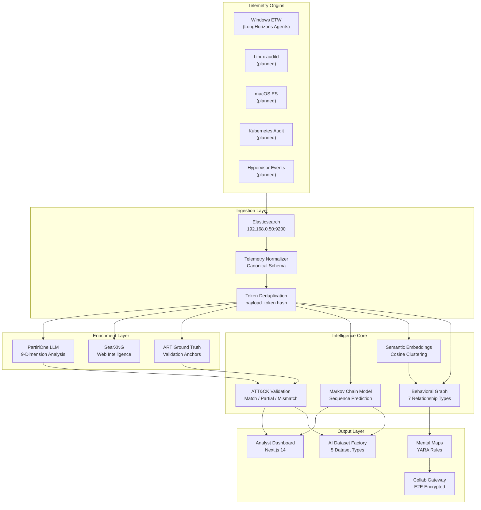

# WindOH: Behavioral Telemetry Intelligence Platform

**windoh.us**

---

## What WindOH Is

WindOH is a production-grade behavioral telemetry intelligence platform. It ingests endpoint telemetry from diverse sources, normalizes every observation into a canonical token, enriches each token with LLM-powered threat intelligence and web-search context, validates findings against the MITRE ATT&CK framework, models behavioral sequences as Markov chains for anomaly detection and next-event prediction, generates semantic embeddings and behavioral clusters, builds multi-relational behavioral graphs, produces analyst mental maps, and exports structured AI training datasets.

In short: WindOH turns raw endpoint telemetry into structured, validated, queryable, and trainable behavioral intelligence.

---

## What WindOH Is Trying to Accomplish

The platform pursues five primary goals:

1. **Universal Behavioral Fingerprinting.** Every observable action on an endpoint hashes into a deterministic, stable `payload_token`. This token is the atomic unit of identity throughout the entire system. No matter the origin, no matter the format, every event resolves to a token that can be enriched, validated, compared, and sequenced.

2. **Origin-Agnostic Telemetry.** The platform was born on Windows ETW data but is architected to ingest telemetry from any operating system, hypervisor, container runtime, or hardware source that produces structured event streams. The canonical schema is deliberately origin-neutral, and the normalizer is designed with extension points for new event providers. Linux auditd, macOS Endpoint Security, Kubernetes audit logs, and hypervisor-level events are all first-class targets.

3. **Prediction Through Markov Modeling.** First-order Markov chains model every observed behavioral transition across every host. When an event fires, the model computes the probability of what comes next and flags transitions that deviate from established norms. Over time, this becomes a prediction engine: given a partial sequence, the model forecasts the most likely continuation. This is not static -- the model rebuilds continuously as new data arrives.

4. **Token Link as a Training Ground.** Every `payload_token` accumulates a permanent, growing record: LLM enrichment, ATT&CK validation results, semantic embedding, cluster membership, graph relationships, and analyst feedback. This linked record is a training artifact. As analysts review, correct, and annotate tokens, the linked data improves. The dataset factory exports this as structured training corpora for downstream models. The platform is designed so that engineers and analysts jointly refine the token link records -- enrichment quality, sequence ground truth, and technique mapping improve with every review cycle.

5. **Shared Mental Maps.** Analysts build mental models of the behavioral landscape. WindOH formalizes these as mental maps -- structured, queryable representations of what behaviors are normal, what is suspicious, what co-occurs with what, and what the most likely explanation is for a given observation. These maps are shared across the team via the collaboration gateway, so insight compounds instead of staying siloed.

---

## Core Concepts

| Concept | Description |
|---|---|
| **Payload Token** | Deterministic behavioral hash. The immutable identity of an observed event pattern. |
| **Token Link** | The complete record orbiting a payload token: enrichment, validation, sequence context, embedding, cluster, graph edges, and analyst annotations. |
| **Enrich Once, Cache Forever** | Each unique payload token goes through LLM enrichment exactly once. The result is cached permanently and reused on every subsequent encounter. |
| **Observed Over Inferred** | Telemetry data (process info, command lines, network connections) takes precedence over LLM inference. The model advises; the data decides. |
| **Provenance Required** | Every enrichment result carries traceable provenance: source, model version, confidence, and validation method. |
| **ART as Ground Truth** | Atomic Red Team test executions produce known-technique telemetry. These are behavioral truth anchors used to calibrate enrichment accuracy. |
| **Mental Map** | A formalized analyst mental model covering normal behavior baselines, anomaly signatures, cross-host correlations, and predictive patterns. |

---

## Platform at a Glance

---

## Stack

| Layer | Technology |
|---|---|
| Frontend | Next.js 14, React 18, TypeScript, TailwindCSS, tRPC v11 |
| API | tRPC server-authoritative procedures, JWT + session auth |
| Queues | BullMQ + Redis (8 named queues) |
| Database | MongoDB 7 (30+ collections) |
| Telemetry Store | Elasticsearch 8.x (remote) |
| LLM | OpenAI-compatible endpoint, PartiriOne model |
| Web Search | SearXNG (self-hosted metasearch) |
| E2E Encryption | Libsodium (X25519/Ed25519) |
| Container Runtime | Docker Compose (dev), Kubernetes (prod) |
| Registry | ghcr.io/windoh/* |

---

## Next in This Deck

- `01-Architecture-and-Data-Pipeline.md` -- full data flow, queue architecture, normalization
- `02-Telemetry-Origins.md` -- origin-agnostic design, extending beyond Windows
- `03-Token-Link-and-Markov-Prediction.md` -- the token link as a training ground, Markov prediction engine
- `04-Mental-Maps-and-Collaboration.md` -- shared mental models, analyst-engineer refinement loop
- `05-AI-Datasets-and-Deployment.md` -- dataset factory, security model, production deployment
