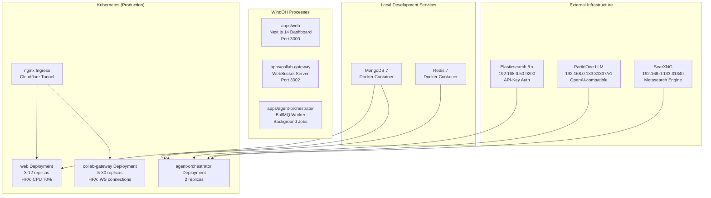
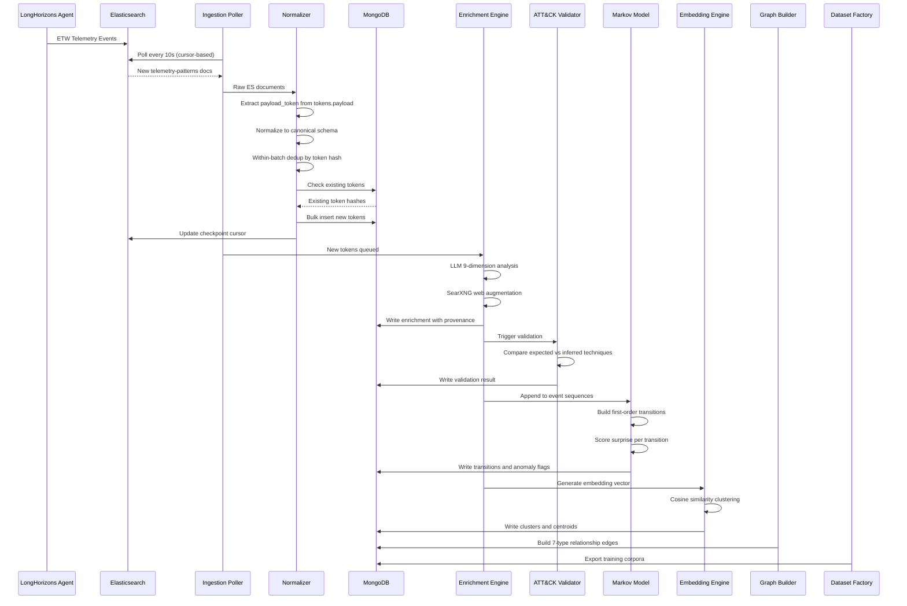
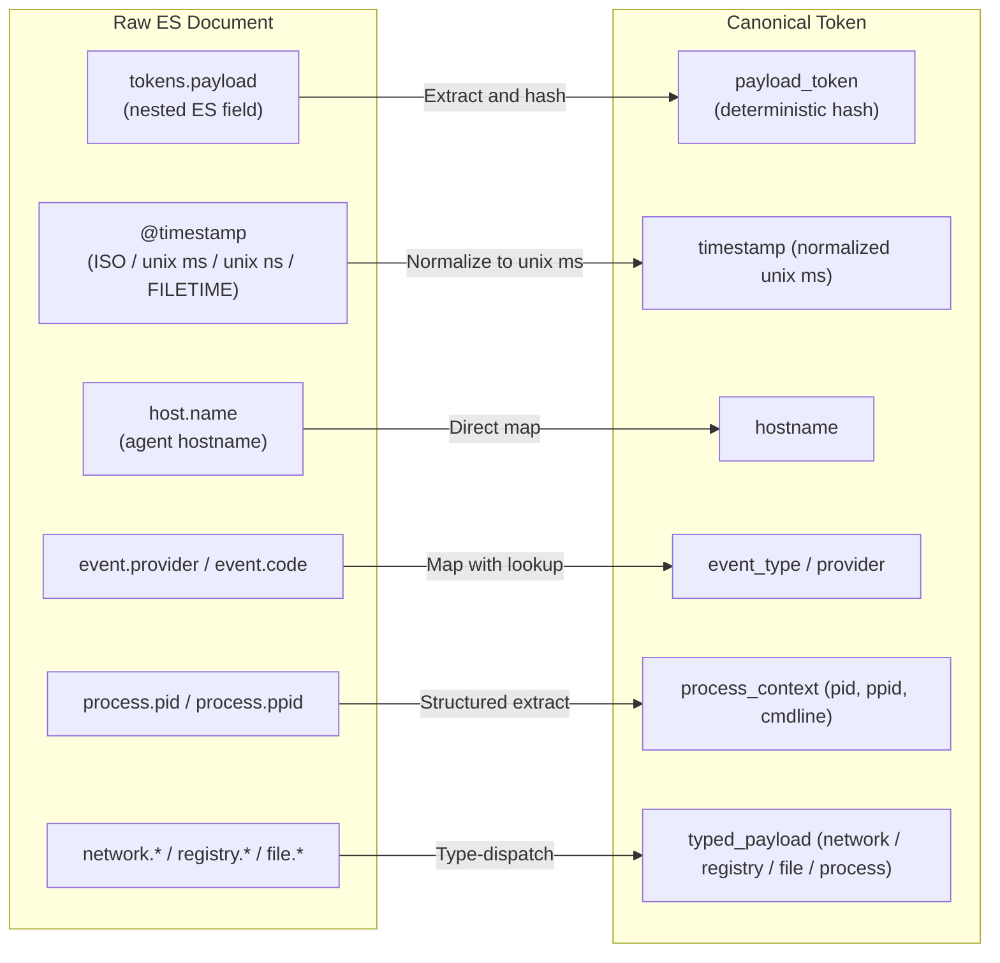
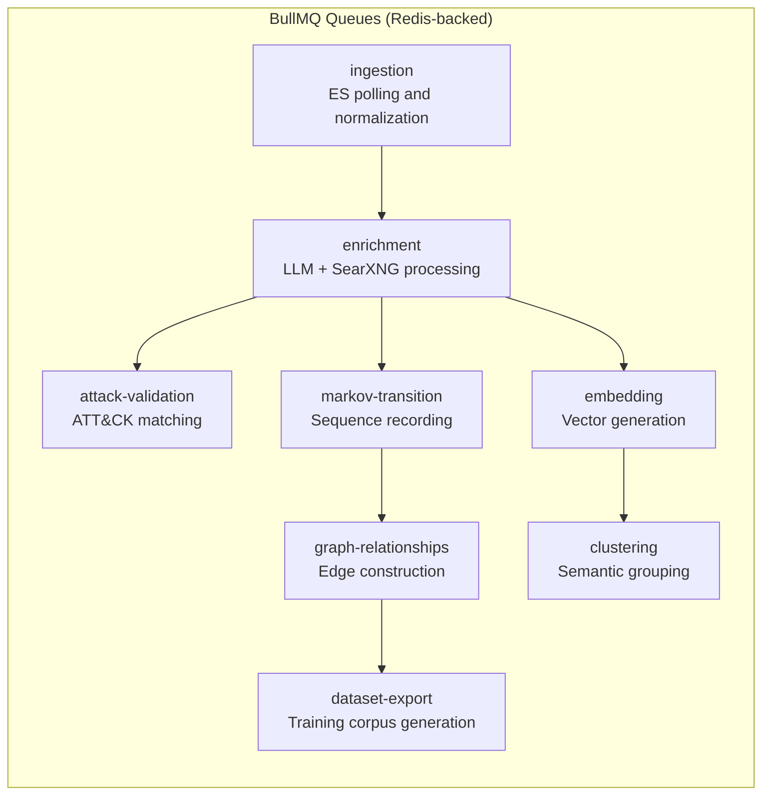
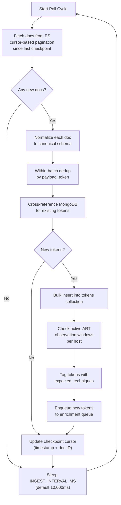
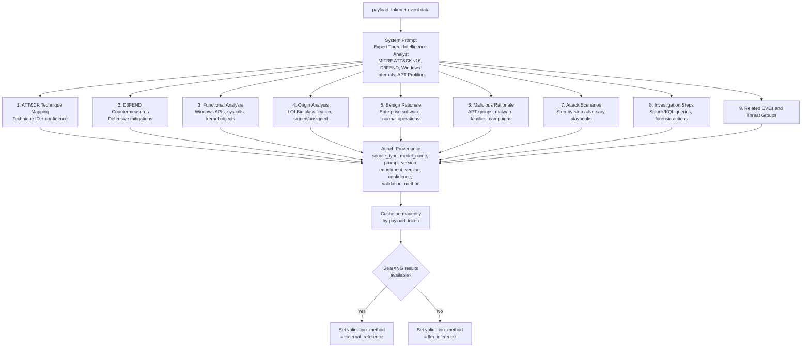

# Architecture and Data Pipeline

---

## System Topology

---

## Data Pipeline: Ingest to Insight

---

## Canonical Normalization

Every incoming telemetry document passes through the normalizer (`@windoh/telemetry/normalizer.ts`). This is the critical bridge between raw, origin-specific event formats and the platform's unified token model.

The `payload_token` is drawn from `tokens.payload` -- this is the ES canonical fingerprint field. The normalizer handles multiple timestamp formats (ISO 8601 strings, unix milliseconds, unix nanoseconds, Windows FILETIME), multiple event provider schemas, and partial or malformed documents without crashing.

---

## Queue Architecture

Eight named BullMQ queues drive all background work:

Each queue has its own concurrency, retry policy, and failure handling. The queues form a directed pipeline where ingestion feeds enrichment, enrichment fans out to validation, sequencing, and embedding, and those converge into graph construction and dataset export.

---

## MongoDB Collections

The platform maintains 30+ collections. The core operational collections are:

| Collection | Purpose |
|---|---|
| `tokens` | Normalized telemetry with full enrichment |
| `event_sequences` | Ordered behavioral sequences per host per session |
| `markov_transitions` | First-order transition probabilities |
| `attack_validations` | ATT&CK validation results per token |
| `behavioral_clusters` | Semantic clusters with centroids |
| `embedding_cache` | Deterministic embedding cache |
| `telemetry_relationships` | Multi-relational graph edges |
| `search_cache` | SearXNG query result cache |
| `art_observation_windows` | Active ART test windows per host |
| `ingestion_checkpoints` | ES polling cursor state per index |
| `mental_maps` | Analyst mental map artifacts |
| `analyst_feedback` | Analyst corrections and annotations |
| `training_corpus` | Exported dataset metadata |

---

## Ingestion Polling Loop

---

## Enrichment Detail

Each token flowing through enrichment receives a 9-dimension analysis from the PartiriOne LLM:

---

## Ingestion Timings

| Parameter | Default | Description |
|---|---|---|
| `INGEST_INTERVAL_MS` | 10,000ms | ES poll interval |
| `MARKOV_REBUILD_INTERVAL_MS` | 3,600,000ms | Full Markov model rebuild |
| `MARKOV_ORDER` | 1 | Markov chain memory depth |
| `ANOMALY_THRESHOLD` | 3.0 bits | Surprise score threshold |
| `SEQUENCE_TIMEOUT_MS` | 300,000ms | Sequence break on inactivity |
