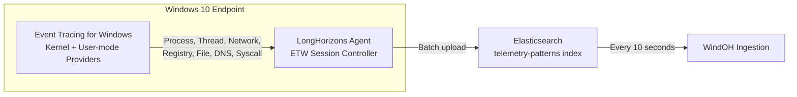
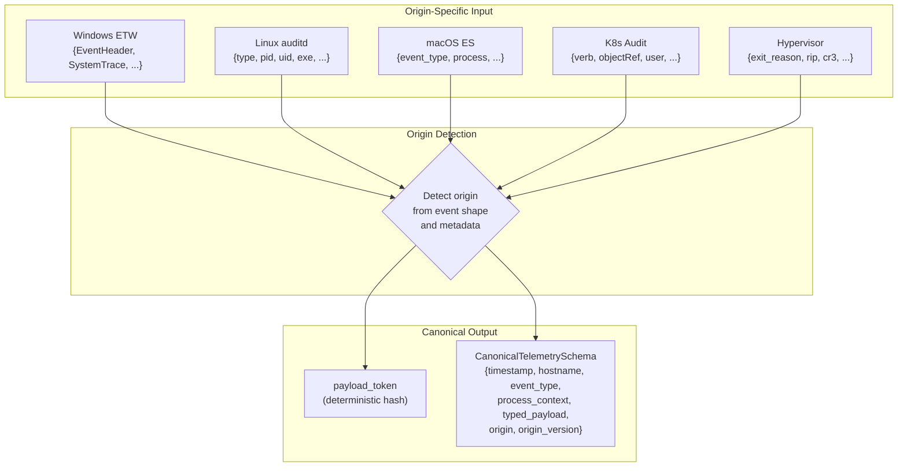
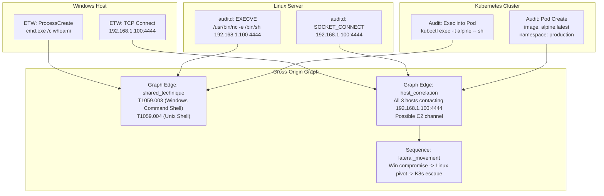

# Telemetry Origins: Beyond Windows

---

## The Origin-Agnostic Thesis

WindOH launched on Windows ETW telemetry because Windows endpoints produce the richest structured event stream available today. But the platform was never designed to be Windows-only. The canonical schema, the normalizer architecture, the token model, the Markov sequencer, the enrichment prompt -- every layer is deliberately origin-agnostic.

The thesis is simple: **a behavioral event is a behavioral event.** A process spawn, a network connection, a file write, a registry modification, a syscall pattern, a kernel hook invocation -- these are universal concepts across operating systems. The origin matters for interpretation but not for ingestion. Once an event is normalized into a `payload_token`, it enters the same enrichment, validation, sequencing, and prediction pipeline regardless of where it came from.

---

## Current Origin: Windows ETW via LongHorizons



The LongHorizons agent runs on Windows 10 endpoints and manages ETW trace sessions across kernel and user-mode providers. It captures process creation and termination, thread activity, TCP/UDP connections, registry operations, filesystem operations, DNS queries, and syscall patterns. Events are batched and pushed to Elasticsearch as structured documents, where WindOH polls them into the pipeline.

---

## Planned and Designed-For Origins

Each of these origins has a concrete normalization path defined in the platform architecture. The canonical schema already carries the fields needed to represent them.

### Linux auditd

The Linux audit subsystem produces structured event records via `auditd`. Every execve, socket connect, file open, and capability check generates an audit record with PID, PPID, UID, GID, syscall number, path arguments, and socket addresses.

```
auditd EXECVE record --> Normalizer --> payload_token (hash of syscall + path + args + UID + session)
                              --> event_type: "process_start"
                              --> process_context: { pid, ppid, cmdline, uid, gid, session_id }
                              --> typed_payload: { execve: { path, argv, envp } }
```

**Value:** Linux server and container workloads generate fundamentally different behavioral patterns from Windows desktops. Adding Linux telemetry brings server-side attack techniques (reverse shells, credential access via /proc, container escapes, persistence via systemd timers and cron) into the same enrichment and prediction pipeline.

### macOS Endpoint Security

macOS Endpoint Security (ES) is Apple's modern replacement for the deprecated kauth KPI. It provides a userspace framework for monitoring process executions, file operations, network connections, and kernel extension loads with fields directly analogous to Windows ETW providers.

```
ES event (ES_EVENT_TYPE_NOTIFY_EXEC) --> Normalizer --> payload_token
                                         --> event_type: "process_start"
                                         --> process_context: { pid, ppid, cmdline, signing_id, team_id, cdhash }
```

**Value:** macOS is prevalent in development and creative environments. Its security model (SIP, notarization, TCC, XProtect, Gatekeeper) produces a unique set of behavioral signals. Adding macOS telemetry brings XProtect alerts, TCC denials, and notarization checks into the behavioral corpus alongside Windows and Linux events.

### Kubernetes Audit Logs

Kubernetes audit logging records every API server request with user identity, resource type, namespace, request verb, and response code. These are structured JSON events with a well-defined schema.

```
k8s audit event --> Normalizer --> payload_token (hash of verb + resource + namespace + user + userAgent)
                    --> event_type: "k8s_api_request"
                    --> typed_payload: { verb, resource, namespace, user, userAgent, source_ip, response_code }
```

**Value:** Container orchestration behaviors (pod creation from unexpected images, RBAC escalation, secret access patterns, port-forward creation, exec into running pods) are high-signal telemetry for detecting lateral movement and persistence in cloud-native environments.

### Hypervisor-Level Events

Hypervisors (KVM, Xen, Hyper-V, VMware ESXi) sit below the guest kernel and observe VM exits, memory page violations, MSR reads/writes, and I/O port access. These events are invisible to in-guest telemetry and are inherently tamper-proof from the guest perspective.

```
VM exit event --> Normalizer --> payload_token (hash of exit_reason + guest_rip + cr3 + vcpu_id)
                  --> event_type: "vm_exit"
                  --> typed_payload: { exit_reason, guest_rip, guest_cr3, vcpu_id, qualification }
```

**Value:** Hypervisor telemetry is the hardest to tamper with and the richest in low-level signal. VM exit patterns reveal rootkit activity, hypervisor breakout attempts, and kernel-mode implants that would never appear in guest-level telemetry.

### Additional Planned Origins

| Origin | Event Types | Signal |
|---|---|---|
| **Docker/containerd runtime** | Container create, start, exec, network attach | Container escape, image tampering |
| **Systemd/journald** | Service start/stop, unit file changes | Persistence, privileged service abuse |
| **eBPF probes** | Syscall tracepoints, network packet samples | Custom kernel-level observability |
| **CloudTrail / GCP Audit** | API calls, IAM changes, storage access | Cloud control-plane telemetry |
| **WAF / reverse proxy logs** | HTTP request patterns, auth failures | Web-layer attack surface |
| **DNS resolver logs** | Query names, query types, response IPs | C2 beaconing, data exfiltration |

---

## How the Normalizer Stays Origin-Agnostic



The normalizer uses an origin-detection dispatch pattern. Each origin has a dedicated extractor that maps origin-specific fields to the canonical schema. The `origin` and `origin_version` fields in the canonical schema track provenance so downstream enrichment can interpret the event in its proper context. The `typed_payload` field is a tagged union -- the specific payload type (process, network, registry, file, k8s_api, vm_exit, etc.) is indicated by the payload discriminator, and the enrichment LLM reads both the event type and the typed payload to produce an informed analysis.

---

## Multi-Origin Behavioral Correlation

The real power emerges when events from different origins are correlated:



A single attack campaign that moves from a Windows desktop to a Linux server to a Kubernetes cluster leaves telemetry traces in three different event formats. With all three origins normalized into the same canonical schema and sequenced into the same Markov model, the full campaign becomes visible as a single behavioral arc. The graph builder connects events across origins via `host_correlation` (shared network targets), `shared_technique` (same ATT&CK technique on different platforms), and `sequence_transition` (temporal adjacency across hosts).

This is the destination. Windows ETW is the first origin. The architecture is ready for the rest.
