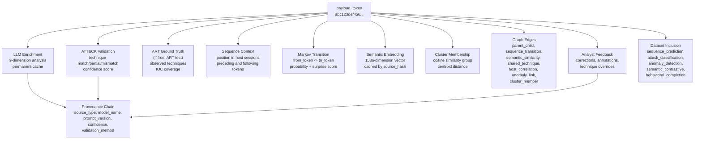
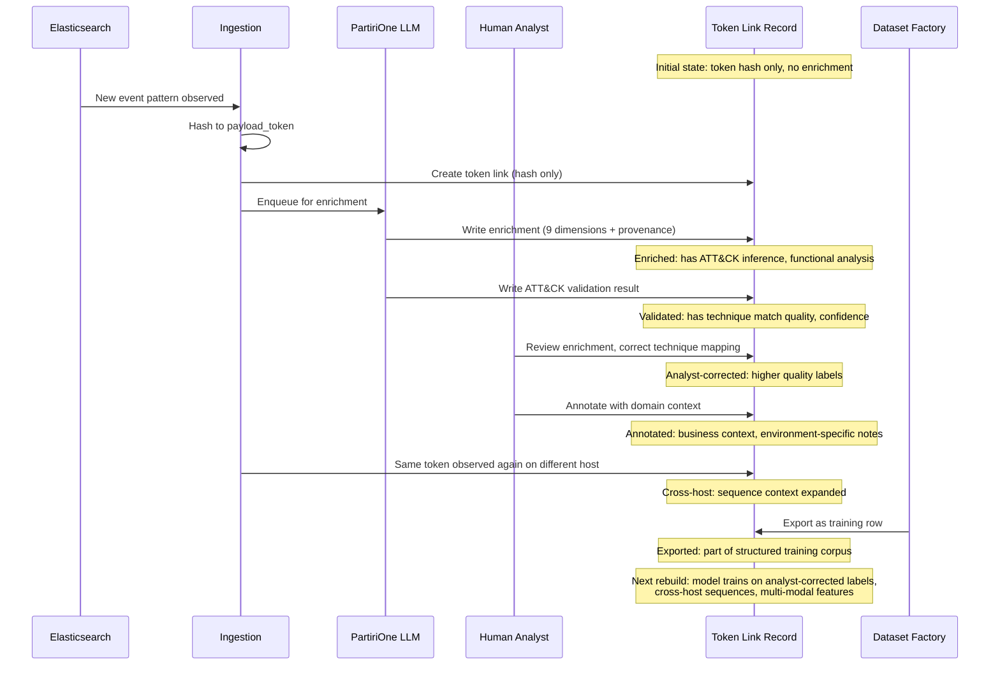
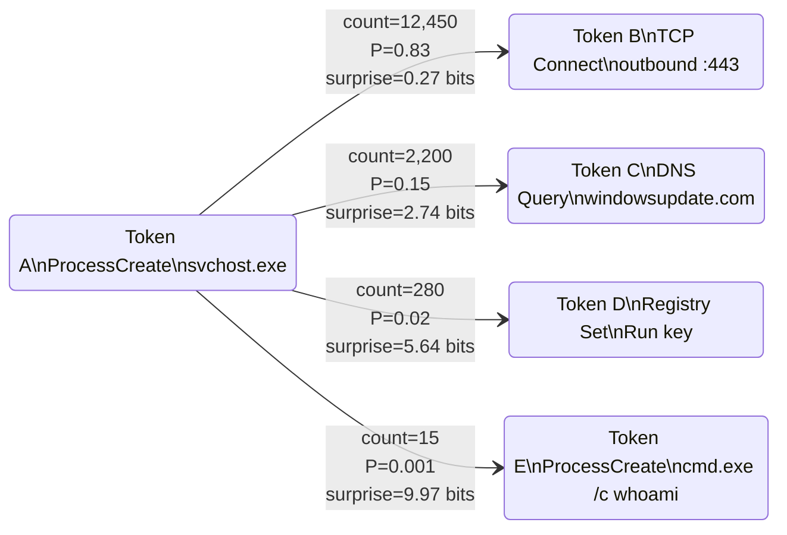
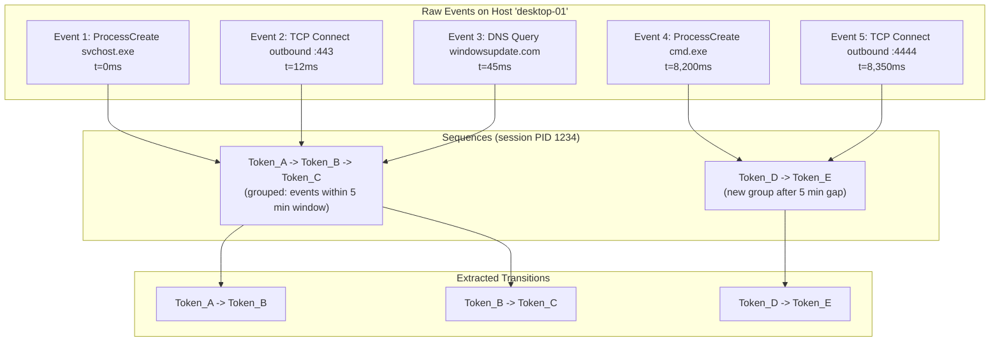
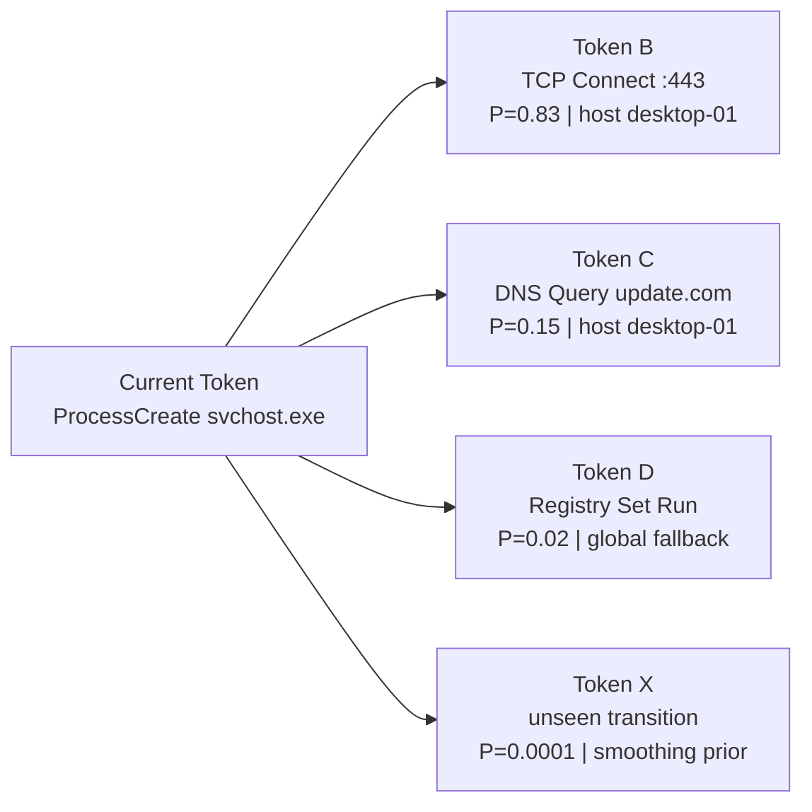
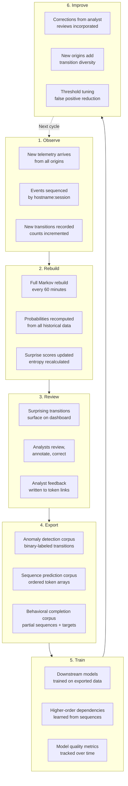

# Token Link and Markov Prediction

---

## The Payload Token: Atomic Unit of Identity

Every observable action on an endpoint hashes into a deterministic, stable `payload_token`. This is not a random UUID. It is a content-addressable fingerprint derived from the normalized event fields: event type, provider, process context, and payload data. The same behavioral pattern on two different hosts produces the same token. The same pattern at two different times produces the same token. This is the property that makes the entire platform cohere.

```
payload_token = hash(
    event_type || provider_name || process_context_hash || payload_signature
)
```

The token is drawn from `tokens.payload` in the Elasticsearch document at ingest time. It is validated to be present and non-empty before the document enters the pipeline.

---

## The Token Link: Everything Orbiting a Single Token



The Token Link is the complete, permanently accumulating record orbiting a single `payload_token`. Every time the platform encounters a token -- whether on its first observation or its ten-thousandth -- it consults and augments this record.

**This is the training ground.**

Each token link is a self-contained training artifact. The enrichment is a label. The ATT&CK validation is a ground-truth calibration. The sequence context is a temporal label. The embedding is a semantic feature vector. The analyst feedback is a human correction signal. The cluster membership is a weak supervision signal. Together, these form a richly annotated behavioral dataset where each row is a token and each column is a different modality of intelligence.

---

## How the Token Link Improves Over Time



The token link is never finished. It starts as a bare hash, acquires LLM enrichment on first observation, gets validation against ATT&CK, receives analyst review and correction, accumulates cross-host sequence data with each new observation, and eventually feeds into dataset exports. Each cycle through the pipeline -- each new observation, each analyst review, each model rebuild -- tightens the quality of the linked data.

---

## Markov Chain Modeling

### First-Order Transitions

WindOH models behavioral sequences as first-order Markov chains. The order is configurable (`MARKOV_ORDER`), and the current production setting is 1-state memory. This means the model tracks the probability of transitioning from any observed token A to any observed token B.



Each transition records:
- `count` -- how many times A led to B
- `probability` -- count(A->B) / sum of all transitions from A
- `entropy` -- Shannon entropy of the distribution from A
- `surprise_score` -- -log2(probability) -- the information content of this specific transition

A transition that happens 83% of the time carries 0.27 bits of surprise. A transition that happens 0.1% of the time carries nearly 10 bits. The anomaly threshold is set at 3.0 bits of surprise -- anything rarer than a 1-in-8 occurrence is flagged.

### Sequence Construction



Events are grouped into sequences keyed by `hostname:sessionOrPid`. A sequence breaks when no events are observed for 5 minutes (configurable via `SEQUENCE_TIMEOUT_MS`). Within a sequence, every adjacent pair of tokens generates a transition record. The `hostname` is stored on the transition so the model can compute per-host statistics and global fallbacks.

### Prediction: What Comes Next



Given a current token, `getNextTokenPredictions()` returns the most likely next tokens ranked by probability. The model first looks for per-host transitions (host-specific behavior is a stronger signal) and falls back to global transitions if the host has no data for this token.

This is a prediction engine. As the model accumulates transitions across all hosts and all origins, it learns what normally follows what. When an event fires, the model forecasts the continuation. When the actual next event diverges from the forecast, the surprise score quantifies the anomaly.

---

## Markov as a Prediction and Training Ground

The Markov model serves two purposes that compound each other:

### 1. Real-Time Anomaly Detection

Every new event is scored against the current model. Transitions with surprise >= 3.0 bits surface on the dashboard as "Surprising Transitions." This is the operational detection use case: flagging behavior that deviates from the established norm.

### 2. Training Data Generation

Markov transitions are exported as two dataset types:
- **anomaly_detection**: Each transition is a row with features (from_token, to_token, count, probability, entropy, surprise_score) and a binary label (anomalous/normal at the 3.0 bit threshold).
- **sequence_prediction**: Each sequence is a row with an ordered token array. Models learn to predict the next token in a sequence.

The prediction task is: given a prefix sequence [T1, T2, ... Tn-1], predict Tn. The Markov model provides a strong baseline (first-order transition probabilities). Downstream models trained on the exported datasets can learn higher-order dependencies, cross-host patterns, and multi-origin correlations that a first-order Markov model cannot capture.

### Model Refinement Cycle



Each cycle through this loop tightens the model. New telemetry adds transition data. Rebuilds incorporate the latest counts. Analyst reviews correct enrichment labels, which improves technique mapping on the tokens that feed transition features. Dataset exports capture the current state. Downstream training produces better models. Corrections and threshold tuning reduce noise. Then the next cycle begins.

---

## Cross-Origin Markov Sequences

When telemetry arrives from multiple origins, the Markov model captures transitions that span operating system boundaries:

```
[Windows ETW: ProcessCreate cmd.exe] --> [Windows ETW: TCP Connect 192.168.1.100:445]
                                    --> [Linux auditd: SOCKET_ACCEPT 192.168.1.100:445]
                                    --> [Linux auditd: EXECVE /bin/bash]
                                    --> [K8s Audit: Pod Create alpine:latest]
```

A lateral movement campaign that starts on Windows, pivots through a Linux jump host, and lands in a Kubernetes cluster generates a single behavioral sequence in the Markov model. The transitions from a Windows token to a Linux token to a K8s token are recorded with probabilities and surprise scores just like any other transition. Over time, cross-origin transitions that are common (legitimate cross-platform services) become low-surprise baselines, while rare cross-origin transitions (unusual lateral movement paths) remain high-surprise anomalies.

This is the destination of the multi-origin architecture. The Markov model becomes a cross-platform behavioral prediction engine that learns what is normal across the entire infrastructure, not just within a single OS silo.

---

## Token Link + Markov: The Compound Effect

The Token Link and the Markov model reinforce each other:

| Token Link Provides | Markov Model Uses |
|---|---|
| ATT&CK technique labels | Labels on transition nodes (technique-aware prediction) |
| Analyst corrections | Higher-quality ground truth for anomaly labels |
| Enrichment behavioral descriptions | Features for similarity-aware transition grouping |
| Embedding vectors | Cosine distance between tokens in transition space |
| Cross-origin provenance | Multi-origin transition probability estimation |
| ART ground truth validation | Known-technique transitions (calibration set) |

The Markov model, in turn, enriches the token link:
- Sequence position (where this token sits in behavioral flows)
- Transition probabilities (what normally precedes and follows this token)
- Surprise score (how unusual this token is in its current context)
- Predicted next tokens (what the model expects to see next)

Each token link grows richer with every cycle. Each Markov rebuild produces better predictions. The platform is a flywheel.

---

## Engineers and Analysts: The Human Layer

The refinement cycle depends on human judgment at the review stage:

- **Engineers** maintain the model: tuning thresholds, adjusting sequence timeouts, verifying transition integrity, monitoring rebuild performance, and ensuring the normalizer correctly maps new origin events into canonical tokens.

- **Analysts** review the output: inspecting surprising transitions, determining whether a flagged anomaly is a true positive or a benign but rare event, correcting enrichment labels when the LLM misclassifies a technique, and annotating token links with domain context.

- **Both agree** on the mental map: the shared understanding of what behaviors are normal, what is suspicious, what co-occurs with what, and what the most likely explanation is. This shared mental map is formalized and persisted, so the next analyst who encounters a similar pattern benefits from the previous analyst's reasoning.

The Markov model is a statistical engine. The token link is a data record. The mental map is the human layer that interprets, corrects, and guides both. Together, they form a system that gets better with every observation and every review.
