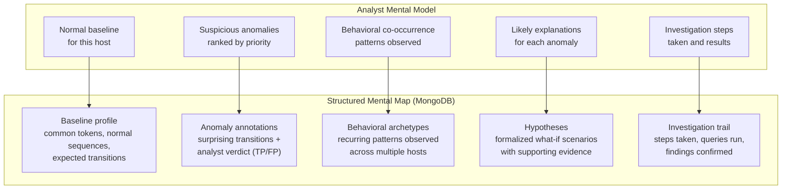
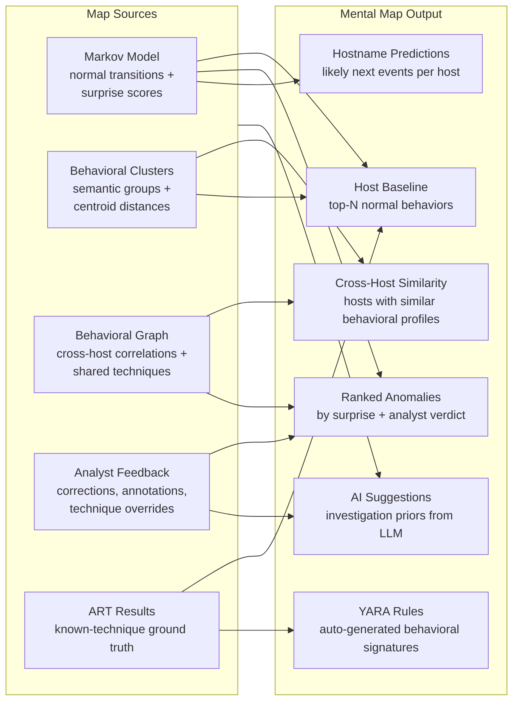
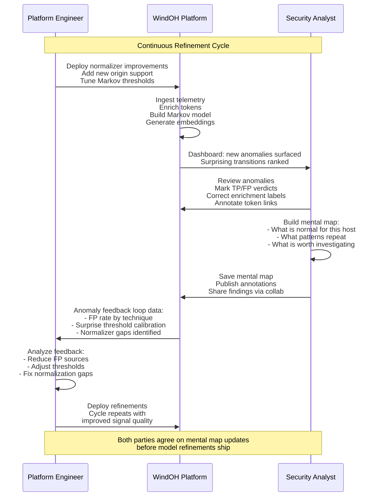
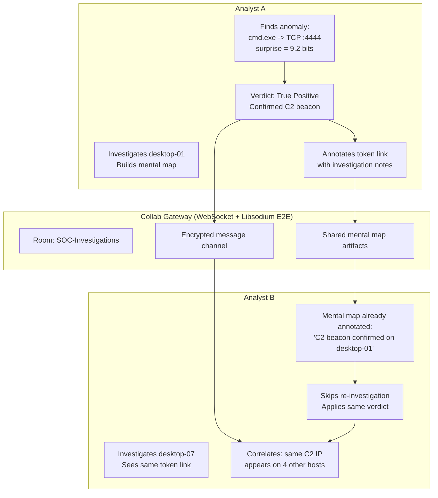
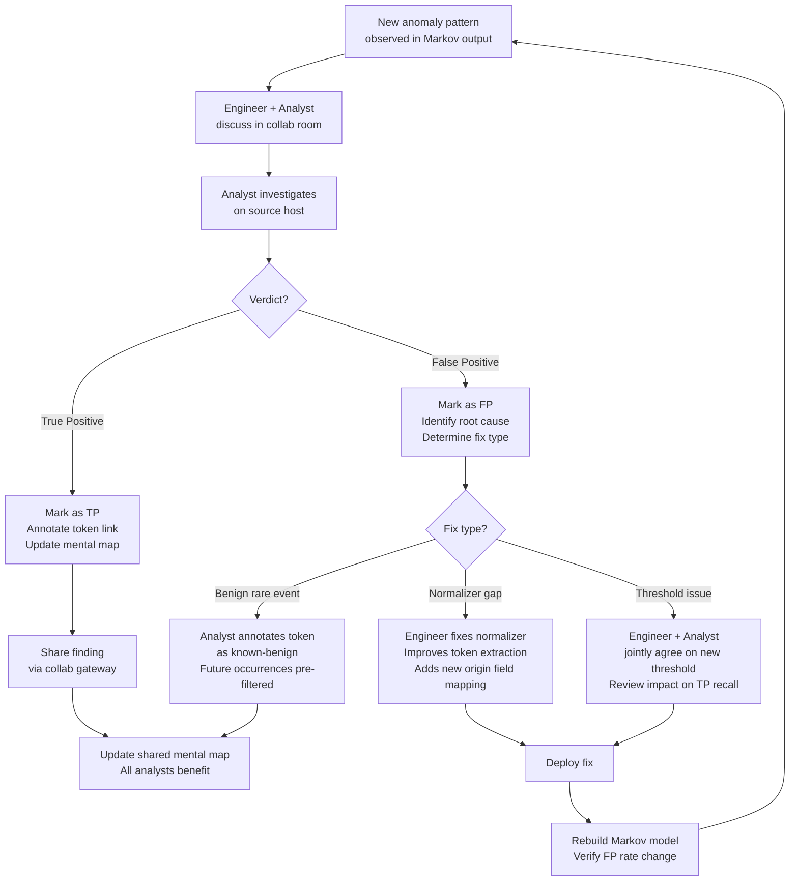

# Mental Maps and Collaborative Refinement

---

## What a Mental Map Is

An analyst investigating a host builds a mental model: which behaviors are normal for this machine, which are suspicious, what co-occurs with what, what the most likely explanation is, and what to investigate next. This mental model is usually ephemeral -- it lives in the analyst's head, gets partially written into case notes, and is lost when the analyst moves on.

WindOH formalizes this as a **mental map**: a structured, queryable, shareable representation of an analyst's behavioral understanding.

---

## Mental Map Generation

The `@windoh/mental-map` package generates and maintains structured mental maps. It draws from multiple sources:

### Components of a Mental Map

**Host Baseline.** The top N most frequent tokens and transitions for a specific host, annotated with enrichment context. This answers: "What does this machine normally do?"

**Ranked Anomalies.** Surprising transitions sorted by surprise score, with analyst verdicts (true positive, false positive, under investigation). Each anomaly carries the full token link context for both the source and destination tokens.

**Cross-Host Similarity.** Hosts that share behavioral clusters, common tokens, or similar Markov transition profiles. This answers: "What other machines behave like this one?" and "Is this anomaly unique to this host or widespread?"

**Hostname Predictions.** Given a host's recent sequence history, what tokens are most likely to come next, ranked by Markov probability with the host's specific transition distribution.

**YARA Rules.** Auto-generated behavioral signatures derived from ART ground truth and analyst-confirmed anomaly patterns. These rules encode known-malicious or known-suspicious behavioral sequences in a format that can be shared and applied to other telemetry sources.

**AI-Powered Suggestions.** The LLM, given the host's baseline, recent anomalies, and cross-host context, suggests investigation priors: which anomalies to investigate first, what additional data to collect, and which ATT&CK techniques to prioritize.

---

## The Analyst-Engineer Refinement Loop

The platform is designed around a shared refinement cycle between engineers and analysts:

**Engineers** own the pipeline: normalization quality, Markov model parameters, embedding configuration, dataset export schedules, and infrastructure health. They tune the machinery.

**Analysts** own the interpretation: behavioral baselines, anomaly verdicts, technique corrections, cross-host correlations, and investigation priorities. They supply the ground truth.

**Both agree on the mental map.** This is the critical collaboration point. When an analyst identifies a recurrent false positive pattern (for example, a particular svchost.exe transition that looks anomalous but is actually a normal Windows Update behavior), the engineer can adjust the normalizer to tag it as known-benign, or the analyst can annotate the token link so future occurrences are pre-marked as expected. When an engineer proposes a surprise threshold change, the analyst reviews the impact on the set of flagged anomalies. Neither side operates in isolation.

---

## Collaboration Gateway: Sharing Mental Maps

The collaboration gateway enables real-time, end-to-end encrypted sharing of mental map artifacts. When Analyst A confirms a true positive and annotates the token link, Analyst B sees that annotation when encountering the same token on a different host. Insight compounds instead of being rediscovered from scratch.

The gateway supports:
- **Rooms** for team-based investigation contexts
- **Presence** showing which analysts are active
- **Key distribution messages** for E2E encryption handshakes (X25519/Ed25519 via libsodium)
- **Shared mental map artifacts** persisted to MongoDB and referenced in real-time

---

## The Agreement Layer

The phrase "agreed upon by engineers and analysts" is not aspirational. It is a concrete workflow:

Every correction -- whether a code fix, a threshold adjustment, or a token annotation -- feeds back into the pipeline. The next rebuild reflects the agreed-upon change. The mental map is the durable artifact of that agreement.

---

## Mental Maps as Organizational Memory

Over time, the accumulated mental maps become organizational memory:

- A new analyst onboarding can load the mental map for a host and immediately understand its behavioral baseline, recent anomalies, and what has already been investigated and resolved.
- An engineer optimizing the Markov threshold can query all analyst FP verdicts across all mental maps to understand the current FP rate per technique, per origin, and per host.
- A team lead auditing investigation quality can trace the investigation trail in the mental map: what was flagged, what was investigated, what was concluded.
- A red team designing a new ART test can query mental maps to find behavioral gaps -- patterns that analysts have noted as suspicious but that have no existing ART test coverage.

The mental map is not just a tool for the current investigation. It is the durable, queryable artifact of analyst reasoning that persists across investigations, across analysts, and across time.
