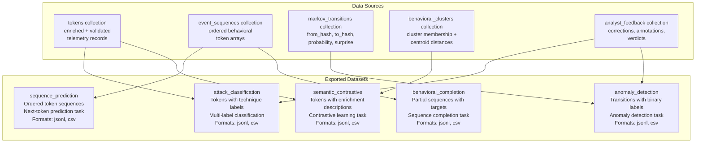
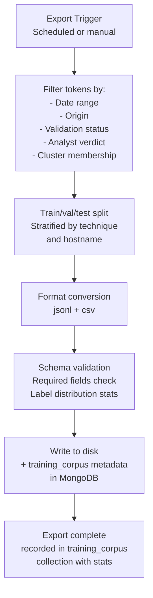
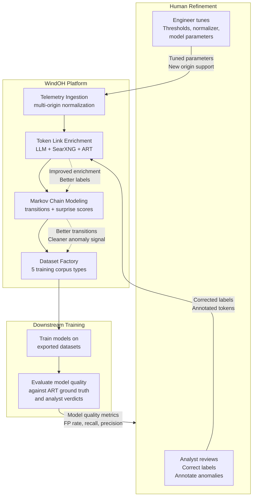
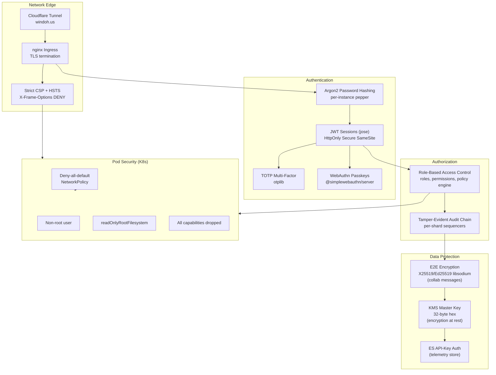
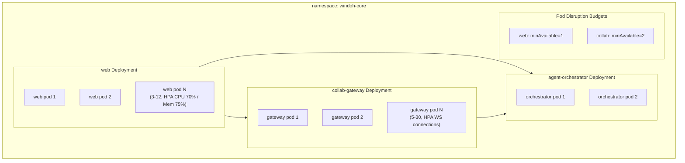

# AI Datasets and Production Deployment

---

## The Dataset Factory

WindOH is not just an operations platform. It is a training data factory. Every token link, every Markov transition, every ATT&CK validation, every semantic embedding, and every analyst correction is structured for export as machine learning training corpora.

The `@windoh/datasets` package generates five dataset types:



---

## Dataset Details

### 1. Sequence Prediction

**Task:** Given a prefix sequence of tokens [T1, T2, ... Tn-1], predict the next token Tn.

**Format:**
```json
{
  "sequence_id": "desktop-01:session-1234",
  "hostname": "desktop-01",
  "origin": "windows_etw",
  "tokens": ["abc123", "def456", "ghi789", "jkl012"],
  "token_labels": ["ProcessCreate svchost.exe", "TCP Connect :443", "DNS Query", "ProcessCreate cmd.exe"],
  "techniques": ["T1055.012", null, null, "T1059.003"],
  "timestamp_start": 1717000000000,
  "timestamp_end": 1717000300000,
  "sequence_length": 4
}
```

### 2. Attack Classification

**Task:** Given token features (event type, process context, payload), predict the ATT&CK technique(s) in play.

**Format:**
```json
{
  "payload_token": "abc123",
  "features": {
    "event_type": "process_start",
    "provider": "Microsoft-Windows-Sysmon",
    "process_name": "cmd.exe",
    "command_line": "cmd.exe /c whoami",
    "parent_process": "explorer.exe",
    "enrichment_text": "The event shows a Windows command shell...",
    "embedding_vector": [0.012, -0.034, ...]
  },
  "labels": ["T1059.003"],
  "label_confidence": 0.94,
  "validation_status": "validated",
  "analyst_correction": null
}
```

### 3. Anomaly Detection

**Task:** Given a transition (from_token, to_token) with features, predict whether it is anomalous.

**Format:**
```json
{
  "from_token": "abc123",
  "to_token": "def456",
  "features": {
    "count": 15,
    "probability": 0.001,
    "entropy": 6.8,
    "surprise_score": 9.97,
    "from_technique": "T1055.012",
    "to_technique": "T1059.003",
    "hostname": "desktop-01",
    "origin_from": "windows_etw",
    "origin_to": "windows_etw"
  },
  "label": "anomalous",
  "label_source": "threshold_3.0_bits",
  "analyst_verdict": "true_positive"
}
```

### 4. Semantic Contrastive

**Task:** Learn semantically similar token representations from pairs of tokens and their enrichment descriptions.

**Format:**
```json
{
  "anchor_token": "abc123",
  "anchor_text": "Windows command shell execution by svchost.exe...",
  "positive_token": "def456",
  "positive_text": "Suspicious parent-child process relationship...",
  "negative_token": "xyz999",
  "negative_text": "Normal DNS resolution for Windows Update...",
  "anchor_cluster": "cluster_042",
  "similarity_anchor_positive": 0.89,
  "similarity_anchor_negative": 0.12
}
```

### 5. Behavioral Completion

**Task:** Given a partial sequence with a gap, predict the missing token(s).

**Format:**
```json
{
  "sequence_id": "desktop-01:session-1234",
  "prefix": ["abc123", "def456"],
  "target": "ghi789",
  "suffix": ["jkl012"],
  "hostname": "desktop-01",
  "origin": "windows_etw",
  "target_technique": "T1071.001",
  "context_length": 5
}
```

---

## Dataset Export Pipeline



Dataset exports are reproducible. The metadata written to the `training_corpus` collection records the exact filter parameters, split ratios, source collection states, and token counts so any export can be recreated or audited.

---

## The Training Flywheel



This is the long-term thesis. The platform ingests telemetry, enriches it, models it, and exports it. Downstream models train on the exports. Their quality metrics flow back to analysts and engineers, who refine the platform. Better enrichment produces better models. Better models produce better anomaly detection. Better anomaly detection produces fewer false positives for analysts. Analyst feedback improves enrichment. The cycle accelerates.

---

## Security Architecture



---

## Kubernetes Deployment



Images are pinned by SHA256 digest from `ghcr.io/windoh/*`. Each process carries a distinct `WINDOH_AUDIT_SHARD` (web, collab, agent) so audit event sequencers never race across process boundaries.

---

## Operational Dashboard

The Next.js 14 analyst dashboard at **windoh.us** provides:

| Panel | Content |
|---|---|
| **Intelligence Overview** | Tokens indexed, enrichment rate, sequences, transitions |
| **ATT&CK Validation** | validated / partial / mismatch / unknown breakdown |
| **Technique Heatmap** | Top 20 most common ATT&CK techniques |
| **Pipeline Status** | Docs fetched, persisted, duplicates, errors, last run |
| **Queue Health** | Waiting, active, completed, failed, delayed per queue |
| **Recent Telemetry** | Latest tokens with hostname, event type, confidence, status |
| **Surprising Transitions** | Highest surprise score Markov transitions |
| **Connection Indicators** | MongoDB, Redis, Elasticsearch status badges |

All metrics refresh every 15 seconds. The dashboard is dark-themed, built with TailwindCSS, and includes a sidebar, command palette, session/security HUD, and AI agent collaboration panel.

---

## Summary

WindOH is a platform for turning raw endpoint telemetry into structured, validated, and trainable behavioral intelligence. It operates at **windoh.us**.

It is architected around five principles:

1. **Universal behavioral fingerprinting** via deterministic payload tokens.
2. **Origin-agnostic ingestion** designed for Windows, Linux, macOS, Kubernetes, and hypervisor telemetry.
3. **Markov chain prediction** that models behavioral sequences, detects anomalies, and forecasts next events.
4. **Token links as a training ground** where enrichment, validation, embeddings, and analyst feedback accumulate into richly annotated training artifacts, refined over time through joint engineer-analyst review.
5. **Shared mental maps** that formalize analyst understanding into durable, queryable, collaborative artifacts so insight compounds across investigations and across time.
