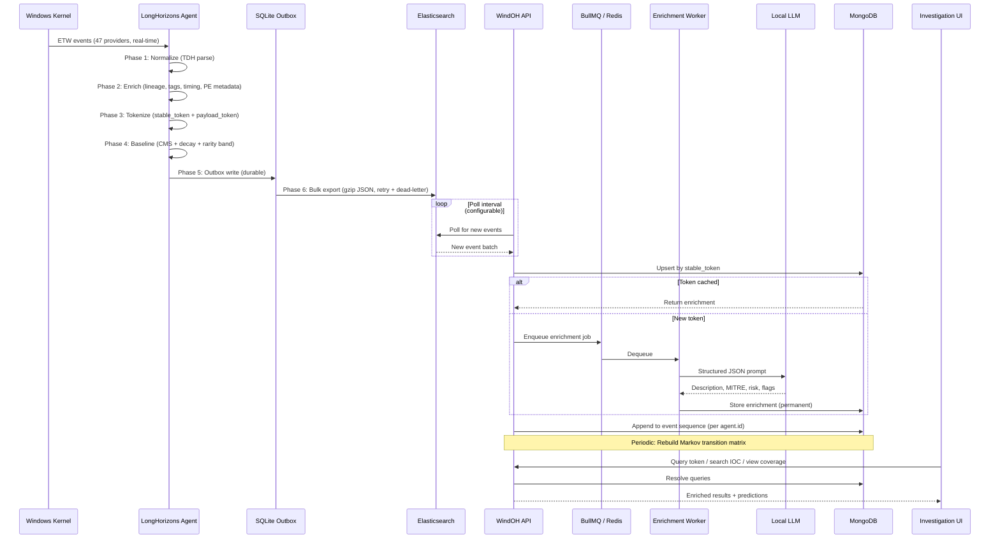

# Data Flow Architecture

## System-Level Data Flow



## Pipeline Detail: Agent Event Processing

```
ETW EVENT_RECORD
    │
    ▼
┌─────────────────────────────────────────────────────────────────┐
│ PHASE 1: NORMALIZATION (agent-etw)                              │
│                                                                  │
│ TdhGetEventInformation()  →  event schema (provider, opcode)     │
│ TdhGetProperty() × N      →  property map                       │
│ mapping.rs::map_event()   →  NormalizedEvent {                  │
│     event_type: ProcessStart | NetworkConnect | DnsQuery | ...  │
│     fields: HashMap<String, Value>                              │
│ }                                                                │
└──────────────────────┬──────────────────────────────────────────┘
                       │
                       ▼
┌─────────────────────────────────────────────────────────────────┐
│ PHASE 2: ENRICHMENT (agent-core/sharded_pipeline.rs)            │
│                                                                  │
│ 2a. populate_process_cache_inner()                               │
│     PID → (image, command_line, modules, parent, logon_session)  │
│                                                                  │
│ 2b. compute_enrichments()                                       │
│     • inter_event_delta_ms       • ancestor_chain_hash           │
│     • tree_depth                 • behavior_tags [11 bools]      │
│     • burst_5s / burst_60s       • first_seen_binary             │
│     • is_signed / is_microsoft   • pe_metadata                   │
│     • network_correlation        • field_completeness_score       │
│     • logon_session_metadata                                    │
└──────────────────────┬──────────────────────────────────────────┘
                       │
                       ▼
┌─────────────────────────────────────────────────────────────────┐
│ PHASE 3: TOKENIZATION (agent-core/pipeline.rs)                  │
│                                                                  │
│ build_tokens(event, enrichments):                                │
│                                                                  │
│   stable_fields = {                                              │
│     event_type, operation, category,                             │
│     image_path, parent_image_path,                               │
│     ancestor_chain_hash, tree_depth,                             │
│     behavior_tags, is_signed, is_microsoft,                      │
│     logon_type, integrity_level                                  │
│     // Excludes: timestamps, PIDs, command lines,                │
│     //           IP addresses, file paths                        │
│   }                                                              │
│                                                                  │
│   stable_token = SHA-256(serialize(stable_fields))                │
│                                                                  │
│   payload_fields = { command_line, dest_ip, dest_port,           │
│                      file_path, registry_key, dns_query }        │
│                                                                  │
│   payload_token = SHA-256(serialize(payload_fields))              │
└──────────────────────┬──────────────────────────────────────────┘
                       │
                       ▼
┌─────────────────────────────────────────────────────────────────┐
│ PHASE 4: BASELINING (agent-core/pipeline.rs)                    │
│                                                                  │
│ 4a. shard_id = stable_token[0..8]  →  pick_shard()               │
│                                                                  │
│ 4b. db.upsert_stable_token(stable_token):                        │
│     → upsert into tokens table                                   │
│     → compute: decay_score = count × e^(-λ × days_since_last)   │
│     → assign rarity_band from decay_score thresholds             │
│     → return (is_new_stable, decay_score, rarity_band, count)    │
│                                                                  │
│ 4c. cms.observe(stable_token):                                    │
│     → increment Count-Min Sketch counters                        │
│                                                                  │
│ 4d. reservoir.offer(stable_token, event):                         │
│     → sample with richness scoring for exemplar export           │
└──────────────────────┬──────────────────────────────────────────┘
                       │
                       ▼
┌─────────────────────────────────────────────────────────────────┐
│ PHASE 5: OUTBOX (agent-core/db.rs)                              │
│                                                                  │
│ INSERT INTO outbox (payload, created_at) VALUES (json, now())    │
│                                                                  │
│ Events, exemplars, patterns, diagnostics → separate tables      │
│ All writes in same transaction for atomicity                     │
└──────────────────────┬──────────────────────────────────────────┘
                       │
                       ▼
┌─────────────────────────────────────────────────────────────────┐
│ PHASE 6: EXPORT (agent-exporter/shipper.rs)                     │
│                                                                  │
│ Loop:                                                            │
│   SELECT batch FROM outbox ORDER BY created_at LIMIT 500         │
│   gzip compress                                                  │
│   ES bulk API POST                                               │
│   On success: DELETE FROM outbox WHERE id IN (batch)             │
│   On failure: retry with backoff; dead-letter after max attempts │
└─────────────────────────────────────────────────────────────────┘
```

## WindOH Application Data Flow

```
┌──────────────────────────────────────────────────────────────────┐
│                        WINDOH APPLICATION                        │
│                                                                   │
│  ┌─────────────────┐                                             │
│  │ ES Polling Loop  │  Cron: every N seconds                     │
│  │ (Cron)           │                                             │
│  └────────┬────────┘                                             │
│           │                                                       │
│           ▼                                                       │
│  ┌─────────────────┐   upsert by stable_token                     │
│  │ Token Ingestor   │─────────────────────────────► ┌──────────┐ │
│  └────────┬────────┘                               │ MongoDB  │ │
│           │                                         │ tokens   │ │
│           │ new token?                              └────┬─────┘ │
│           ▼                                              │       │
│  ┌─────────────────┐                                     │       │
│  │ Enrichment      │  enqueue job (stable_token only)     │       │
│  │ Queue (BullMQ)  │──────────────────────────────────►  │       │
│  └────────┬────────┘                                     │       │
│           │                                              │       │
│           ▼                                              │       │
│  ┌─────────────────┐  POST /v1/chat/completions          │       │
│  │ Enrichment      │────────────────────► ┌──────────┐  │       │
│  │ Worker          │                      │ Local LLM│  │       │
│  │                 │◄─────────────────────│          │  │       │
│  └────────┬────────┘  JSON response      └──────────┘  │       │
│           │                                              │       │
│           │ store enrichment                             │       │
│           ▼                                              ▼       │
│  ┌──────────────────────────────────────────────────────────────┤
│  │                    MongoDB Collections                       │
│  │                                                              │
│  │  tokens           events           event_sequences           │
│  │  ┌──────────┐     ┌──────────┐     ┌──────────┐             │
│  │  │stable_token│     │agent.id  │     │agent.id  │             │
│  │  │payloads[] │     │timestamp │     │sequence[]│             │
│  │  │enrichment │     │stable_h. │     │updated_at│             │
│  │  │rarity     │     │payload_h.│     └──────────┘             │
│  │  │count      │     │rarity    │                              │
│  │  └──────────┘     │fields    │     markov_transitions        │
│  │                   └──────────┘     ┌──────────┐             │
│  │  atomic_tests                     │from_hash │             │
│  │  ┌──────────┐                     │to_hash   │             │
│  │  │technique │                     │count     │             │
│  │  │test_name │                     │prob      │             │
│  │  │hashes[]  │                     │avg_delta │             │
│  │  └──────────┘                     └──────────┘             │
│  │                                                              │
│  │  search_cache                                               │
│  │  ┌──────────┐                                              │
│  │  │query_hash│                                              │
│  │  │results   │                                              │
│  │  │ttl       │                                              │
│  │  └──────────┘                                              │
│  └──────────────────────────────────────────────────────────────┘
│                                                                   │
│  ┌─────────────────────────────────────────────────────────────┐ │
│  │ Investigation UI (Next.js)                                   │ │
│  │                                                              │ │
│  │  Token Browser    IOC Lookup    Coverage Dashboard           │ │
│  │  ┌──────────┐     ┌──────────┐  ┌──────────┐                │ │
│  │  │Search by │     │IP/Domain │  │Technique │                │ │
│  │  │hash/desc │     │→ SearXNG │  │→ Covered │                │ │
│  │  │→ tokens  │     │→ cache   │  │→ Gaps    │                │ │
│  │  └──────────┘     └──────────┘  └──────────┘                │ │
│  └─────────────────────────────────────────────────────────────┘ │
└──────────────────────────────────────────────────────────────────┘
```

## Key Design Constraints

1. **Agent-side tokenization is one-way.** The agent produces stable token and payload token, never the reverse. Only the WindOH application (with the LLM) provides semantic interpretation.

2. **Enrichment is idempotent and cached permanently.** A token is enriched exactly once. The raw prompt and raw response are stored for audit. Re-enrichment requires explicit operator action.

3. **Markov models are computed offline.** Transition matrices are rebuilt periodically (configurable, default hourly) via MongoDB aggregation pipeline. The online prediction API reads the pre-computed matrix.

4. **SearXNG results are cached with TTL.** Identical IOC queries return cached results within the TTL window. Rate limiting prevents excessive external searches.
